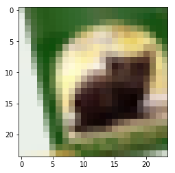
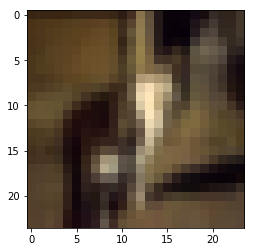
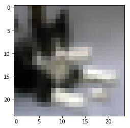

#### Results:


| Accuracy |                            Params                            |      |
| :------: | :----------------------------------------------------------: | :--: |
|  92.74   | 913k(3 dense blocks, depth 48, growth in each dense block: 16, 32, 24) |      |
|   91.3   |              830k(4 dense blocks w/o winograd)               |      |
|   91.2   |              990k(4 dense blocks with winograd)              |      |
|   ~88    |             0.8M (Many unsuccessfully attempts)              |      |


#### The approaches taken/understood while trying to get the required valition accuracy:


- Reducing the number of **dense blocks** (~~four~~) to **three** since the feature map gets very small till it reaches the fourth block
- Adopt **more filters** and **<u>less depth(40-48)</u>** initially since increasing number of layers and dense block increase **compute requirements(have to decrease batch size a lot)** 
- Keeping ***learning rate*** high more for most number of epochs and then slow close in
- Use ***smaller images 24x24 to train faster*** and hopefully more important features and then train on 32x32
- Use ***Global Averaging Pool*** to train on multiple size images instead of Flatten
- Used combinations of multiple ***Augmentation techniques***(rotation:16, width shift: 0.125, horizontal flip)
- ***Winograd's minimal filtering algorithm*** to have more filters, reduce params and execution time
- Use ***Global Contrast Normalization***. What I saw specially for 24x24 is that the borders were more clearly visible and not merge(mixed) into each other thus giving sharper features
- Used dropout in dense block as well


#### **Things learnt from class used here**


-  **Winograd filtering algortithm**[ (3x1) followed by (1x3)]
- **Data is very important**: Importance of varied data from existing to train better(dat augmentation)
- How **SGD converges visually** and thus reducing lr to make the rolling ball move slowly at the end
- **Normalize data** (Assignment 3)
- Regularization using **<u>dropout<**/u> and image aigmentation
- **1x1** Conv to **reduce inputs** also mentioned as Bottleneck layer in paper

#### Things learnt from paper:


- Adopt **Bottleneck layers** which allowed to have more params with same depth and filters
- **Random cropping**(width shift) 4 pixel padding 4/32= 0.125 and also **Horizontal Flip**
- *Global Average Pooling*
- 0.2 Dropout and 0.5 Compression
- ***DenseNet-BC*** has better peformance with **less params** *than DenseNet*

#### Architecture

------

​							Input (None, None, 3)			

------

Convolution  					(5*1,64)

​								(1*5,64)

------

Dense Block						[1*1] x 16

​	(1)							[3*1] x 16

​								[1*3] x 16

------

Transition Layer					[1*1] x 16

​	(1)							Avergaing Pool

------

Dense Block						[1*1] x 32

​	(2)							[3*1] x 32

​								[1*3] x 32

------

Transition Layer					[1*1] x 16

​	(2)							Avergaing Pool

------

Dense Block						[1*1] x 24

​	(3)							[3*1] x 24

​								[1*3] x 24

------

Classifiction	 				GlobalAveragePooling2D

​     Layer						10(number of classes)D Fully Connected

------


#### And finally the code:


```python
import keras
```

    Using TensorFlow backend.


```python
import keras
from keras.datasets import cifar10
from keras.models import Model
from keras.layers import Dense, Dropout, Flatten, Input, AveragePooling2D, merge, Activation
from keras.layers import Conv2D, MaxPooling2D, BatchNormalization, GlobalMaxPooling2D, GlobalAveragePooling2D
from keras.layers import Concatenate
from keras.preprocessing.image import ImageDataGenerator
from matplotlib import pyplot
from scipy.misc import toimage
import numpy as np
```


```python
# this part will prevent tensorflow to allocate all the avaliable GPU Memory
# backend
import tensorflow as tf
from keras import backend as k

# Don't pre-allocate memory; allocate as-needed
config = tf.ConfigProto()
config.gpu_options.allow_growth = True

# Create a session with the above options specified.
k.tensorflow_backend.set_session(tf.Session(config=config))
```


```python
# Hyperparameters
batch_size = 128
num_classes = 10
epochs = 50
l = 48
num_filter = 32
compression = 0.5
dropout_rate = 0.2
```


```python
import scipy
```


```python
# Load CIFAR10 Data
(x_train, y_train), (x_test, y_test) = cifar10.load_data()
img_height, img_width, channel = x_train.shape[1],x_train.shape[2],x_train.shape[3]

# convert to one hot encoing 
y_train = keras.utils.to_categorical(y_train, num_classes)
y_test = keras.utils.to_categorical(y_test, num_classes)
```


```python
def global_contrast_normalization(X, s, lmda, epsilon):

    # replacement for the loop
    X_average = np.mean(X)
    X = X - X_average

    # `su` is here the mean, instead of the sum
    contrast = np.sqrt(lmda + np.mean(X**2))

    X = s * X / max(contrast, epsilon)
    return X
```


```python
# Normalize data.
# Normalize data.
x_train = x_train.astype('float32') / 255
x_test = x_test.astype('float32') / 255

x_train_denormalized = x_train
x_train = np.empty(shape=(x_train.shape))
for idx in range(x_train.shape[0]):
    x_train[idx] = global_contrast_normalization(x_train_denormalized[idx],1, 10, 0.000000001)

x_test_denormalized = x_test
x_test = np.empty(shape=(x_test.shape))
for idx in range(x_test.shape[0]):
    x_test[idx] = global_contrast_normalization(x_test_denormalized[idx],1, 10, 0.000000001)
```


```python
smaller_shape = (24,24,3)
```


```python
import numpy as np
from skimage import transform
x_train_small = np.empty(shape=(x_train.shape[0],)+smaller_shape)
```


```python
for idx in range(x_train.shape[0]):
    x_train_small[idx] = transform.resize(x_train[idx], smaller_shape)
```

    /home/uderanikaran/miniconda3/lib/python3.6/site-packages/skimage/transform/_warps.py:105: UserWarning: The default mode, 'constant', will be changed to 'reflect' in skimage 0.15.
      warn("The default mode, 'constant', will be changed to 'reflect' in "
    /home/uderanikaran/miniconda3/lib/python3.6/site-packages/skimage/transform/_warps.py:110: UserWarning: Anti-aliasing will be enabled by default in skimage 0.15 to avoid aliasing artifacts when down-sampling images.
      warn("Anti-aliasing will be enabled by default in skimage 0.15 to "


```python
datagen = ImageDataGenerator(
        featurewise_center=False,  # set input mean to 0 over the dataset
        samplewise_center=False,  # set each sample mean to 0
        featurewise_std_normalization=False,  # divide inputs by std of the dataset
        samplewise_std_normalization=False,  # divide each input by its std
        zca_whitening=False,  # apply ZCA whitening
        rotation_range=16,  # randomly rotate images in the range (degrees, 0 to 180)
        zoom_range = 0, # Randomly zoom image 
        width_shift_range=0.125,  # randomly shift images horizontally (fraction of total width)
        height_shift_range=0.125,  # randomly shift images vertically (fraction of total height)
        horizontal_flip=True,  # randomly flip images
        vertical_flip=False, # randomly flip images
      )
datagen.fit(x_train_small, augment=True)
for X_batch, y_batch in datagen.flow(x_train_small, y_train, batch_size=9):
    for X in X_batch:
        pyplot.figure(1)
        pyplot.imshow(toimage(X))
        # show the plot
        pyplot.show()
    break
```

    /home/uderanikaran/miniconda3/lib/python3.6/site-packages/ipykernel_launcher.py:18: DeprecationWarning: `toimage` is deprecated!
    `toimage` is deprecated in SciPy 1.0.0, and will be removed in 1.2.0.
    Use Pillow's ``Image.fromarray`` directly instead.





```python
mrsa_initializer = keras.initializers.VarianceScaling(scale=1.0, mode='fan_in', distribution='normal', seed=None)
```


```python
# Dense Block
def add_denseblock(input, num_filter = 12, dropout_rate = 0.2):
    global compression
    temp = input
    for _ in range(l):
        BatchNorm1 = BatchNormalization()(temp)
        relu1 = Activation('relu')(BatchNorm1)
        Conv2D_1_1 = Conv2D(int(num_filter*compression), (1,1), use_bias=False ,padding='same')(relu1)
        if dropout_rate>0:
          Conv2D_1_1 = Dropout(dropout_rate)(Conv2D_1_1)
        
        
        BatchNorm = BatchNormalization()(Conv2D_1_1)
        relu = Activation('relu')(BatchNorm)
        Conv2D_3_3 = Conv2D(int(num_filter*compression), (3,1), use_bias=False ,padding='same')(relu)
        Conv2D_3_3 = Conv2D(int(num_filter*compression), (1,3), use_bias=False ,padding='same')(Conv2D_3_3)
        
        if dropout_rate>0:
          Conv2D_3_3 = Dropout(dropout_rate)(Conv2D_3_3)
        concat = Concatenate(axis=-1)([temp,Conv2D_3_3])
        
        temp = concat
        
    return temp
```


```python
def add_transition(input, num_filter = 12, dropout_rate = 0.2):
    global compression
    BatchNorm = BatchNormalization()(input)
    relu = Activation('relu')(BatchNorm)
    Conv2D_BottleNeck = Conv2D(int(num_filter*compression), (1,1), use_bias=False ,padding='same')(relu)
    if dropout_rate>0:
      Conv2D_BottleNeck = Dropout(dropout_rate)(Conv2D_BottleNeck)
    avg = AveragePooling2D(pool_size=(2,2))(Conv2D_BottleNeck)
    
    return avg
```


```python
def output_layer(input):
    global compression
    BatchNorm = BatchNormalization()(input)
    relu = Activation('relu')(BatchNorm)
    AvgPooling = GlobalAveragePooling2D()(relu)
#     flat = Flatten()(AvgPooling)
    output = Dense(num_classes, activation='softmax')(AvgPooling)
    
    return output
```


```python
input = Input(shape=(None, None, channel,))
First_Conv2D = Conv2D(64, (5,1), strides=1, kernel_initializer=mrsa_initializer, use_bias=False ,padding='same')(input)
Second_Conv2D = Conv2D(64, (1,5), strides=1, use_bias=False ,padding='same')(First_Conv2D)

First_Block = add_denseblock(First_Conv2D, 16, dropout_rate/2)
First_Transition = add_transition(First_Block, 16, dropout_rate)

Second_Block = add_denseblock(First_Transition, 32, dropout_rate/2)
Second_Transition = add_transition(Second_Block, 32, dropout_rate)

Third_Block = add_denseblock(Second_Transition, 24, dropout_rate/2)
# Third_Transition = add_transition(Third_Block, 8, dropout_rate)

# Last_Block = add_denseblock(Third_Transition,  12, dropout_rate/2)
output = output_layer(Third_Block)
```


```python
model = Model(inputs=[input], outputs=[output])
model.summary()
```

    __________________________________________________________________________________________________
    Layer (type)                    Output Shape         Param #     Connected to                     
    ==================================================================================================
    input_13 (InputLayer)           (None, None, None, 3 0                                            
    __________________________________________________________________________________________________
    conv2d_4360 (Conv2D)            (None, None, None, 6 960         input_13[0][0]                   
    __________________________________________________________________________________________________
    batch_normalization_2911 (Batch (None, None, None, 6 256         conv2d_4360[0][0]                
    __________________________________________________________________________________________________
    activation_2910 (Activation)    (None, None, None, 6 0           batch_normalization_2911[0][0]   
    __________________________________________________________________________________________________
    conv2d_4362 (Conv2D)            (None, None, None, 8 512         activation_2910[0][0]            
    __________________________________________________________________________________________________
    dropout_2899 (Dropout)          (None, None, None, 8 0           conv2d_4362[0][0]                
    __________________________________________________________________________________________________
    batch_normalization_2912 (Batch (None, None, None, 8 32          dropout_2899[0][0]               
    __________________________________________________________________________________________________
    activation_2911 (Activation)    (None, None, None, 8 0           batch_normalization_2912[0][0]   
    __________________________________________________________________________________________________
    conv2d_4363 (Conv2D)            (None, None, None, 8 192         activation_2911[0][0]            
    __________________________________________________________________________________________________
    conv2d_4364 (Conv2D)            (None, None, None, 8 192         conv2d_4363[0][0]                
    __________________________________________________________________________________________________
    dropout_2900 (Dropout)          (None, None, None, 8 0           conv2d_4364[0][0]                
    __________________________________________________________________________________________________
    concatenate_1438 (Concatenate)  (None, None, None, 7 0           conv2d_4360[0][0]                
                                                                     dropout_2900[0][0]               
    __________________________________________________________________________________________________
    batch_normalization_2913 (Batch (None, None, None, 7 288         concatenate_1438[0][0]           
    __________________________________________________________________________________________________
    activation_2912 (Activation)    (None, None, None, 7 0           batch_normalization_2913[0][0]   
    __________________________________________________________________________________________________
    conv2d_4365 (Conv2D)            (None, None, None, 8 576         activation_2912[0][0]            
    __________________________________________________________________________________________________
    dropout_2901 (Dropout)          (None, None, None, 8 0           conv2d_4365[0][0]                
    __________________________________________________________________________________________________
    batch_normalization_2914 (Batch (None, None, None, 8 32          dropout_2901[0][0]               
    __________________________________________________________________________________________________
    activation_2913 (Activation)    (None, None, None, 8 0           batch_normalization_2914[0][0]   
    __________________________________________________________________________________________________
    conv2d_4366 (Conv2D)            (None, None, None, 8 192         activation_2913[0][0]            
    __________________________________________________________________________________________________
    conv2d_4367 (Conv2D)            (None, None, None, 8 192         conv2d_4366[0][0]                
    __________________________________________________________________________________________________
    dropout_2902 (Dropout)          (None, None, None, 8 0           conv2d_4367[0][0]                
    __________________________________________________________________________________________________
    concatenate_1439 (Concatenate)  (None, None, None, 8 0           concatenate_1438[0][0]           
                                                                     dropout_2902[0][0]               
    __________________________________________________________________________________________________
    batch_normalization_2915 (Batch (None, None, None, 8 320         concatenate_1439[0][0]           
    __________________________________________________________________________________________________
    activation_2914 (Activation)    (None, None, None, 8 0           batch_normalization_2915[0][0]   
    __________________________________________________________________________________________________
    conv2d_4368 (Conv2D)            (None, None, None, 8 640         activation_2914[0][0]            
    __________________________________________________________________________________________________
    dropout_2903 (Dropout)          (None, None, None, 8 0           conv2d_4368[0][0]                
    __________________________________________________________________________________________________
    batch_normalization_2916 (Batch (None, None, None, 8 32          dropout_2903[0][0]               
    __________________________________________________________________________________________________
    activation_2915 (Activation)    (None, None, None, 8 0           batch_normalization_2916[0][0]   
    __________________________________________________________________________________________________
    conv2d_4369 (Conv2D)            (None, None, None, 8 192         activation_2915[0][0]            
    __________________________________________________________________________________________________
    conv2d_4370 (Conv2D)            (None, None, None, 8 192         conv2d_4369[0][0]                
    __________________________________________________________________________________________________
    dropout_2904 (Dropout)          (None, None, None, 8 0           conv2d_4370[0][0]                
    __________________________________________________________________________________________________
    concatenate_1440 (Concatenate)  (None, None, None, 8 0           concatenate_1439[0][0]           
                                                                     dropout_2904[0][0]               
    __________________________________________________________________________________________________
    batch_normalization_2917 (Batch (None, None, None, 8 352         concatenate_1440[0][0]           
    __________________________________________________________________________________________________
    activation_2916 (Activation)    (None, None, None, 8 0           batch_normalization_2917[0][0]   
    __________________________________________________________________________________________________
    conv2d_4371 (Conv2D)            (None, None, None, 8 704         activation_2916[0][0]            
    __________________________________________________________________________________________________
    dropout_2905 (Dropout)          (None, None, None, 8 0           conv2d_4371[0][0]                
    __________________________________________________________________________________________________
    batch_normalization_2918 (Batch (None, None, None, 8 32          dropout_2905[0][0]               
    __________________________________________________________________________________________________
    activation_2917 (Activation)    (None, None, None, 8 0           batch_normalization_2918[0][0]   
    __________________________________________________________________________________________________
    conv2d_4372 (Conv2D)            (None, None, None, 8 192         activation_2917[0][0]            
    __________________________________________________________________________________________________
    conv2d_4373 (Conv2D)            (None, None, None, 8 192         conv2d_4372[0][0]                
    __________________________________________________________________________________________________
    dropout_2906 (Dropout)          (None, None, None, 8 0           conv2d_4373[0][0]                
    __________________________________________________________________________________________________
    concatenate_1441 (Concatenate)  (None, None, None, 9 0           concatenate_1440[0][0]           
                                                                     dropout_2906[0][0]               
    __________________________________________________________________________________________________
    batch_normalization_2919 (Batch (None, None, None, 9 384         concatenate_1441[0][0]           
    __________________________________________________________________________________________________
    activation_2918 (Activation)    (None, None, None, 9 0           batch_normalization_2919[0][0]   
    __________________________________________________________________________________________________
    conv2d_4374 (Conv2D)            (None, None, None, 8 768         activation_2918[0][0]            
    __________________________________________________________________________________________________
    dropout_2907 (Dropout)          (None, None, None, 8 0           conv2d_4374[0][0]                
    __________________________________________________________________________________________________
    batch_normalization_2920 (Batch (None, None, None, 8 32          dropout_2907[0][0]               
    __________________________________________________________________________________________________
    activation_2919 (Activation)    (None, None, None, 8 0           batch_normalization_2920[0][0]   
    __________________________________________________________________________________________________
    conv2d_4375 (Conv2D)            (None, None, None, 8 192         activation_2919[0][0]            
    __________________________________________________________________________________________________
    conv2d_4376 (Conv2D)            (None, None, None, 8 192         conv2d_4375[0][0]                
    __________________________________________________________________________________________________
    dropout_2908 (Dropout)          (None, None, None, 8 0           conv2d_4376[0][0]                
    __________________________________________________________________________________________________
    concatenate_1442 (Concatenate)  (None, None, None, 1 0           concatenate_1441[0][0]           
                                                                     dropout_2908[0][0]               
    __________________________________________________________________________________________________
    batch_normalization_2921 (Batch (None, None, None, 1 416         concatenate_1442[0][0]           
    __________________________________________________________________________________________________
    activation_2920 (Activation)    (None, None, None, 1 0           batch_normalization_2921[0][0]   
    __________________________________________________________________________________________________
    conv2d_4377 (Conv2D)            (None, None, None, 8 832         activation_2920[0][0]            
    __________________________________________________________________________________________________
    dropout_2909 (Dropout)          (None, None, None, 8 0           conv2d_4377[0][0]                
    __________________________________________________________________________________________________
    batch_normalization_2922 (Batch (None, None, None, 8 32          dropout_2909[0][0]               
    __________________________________________________________________________________________________
    activation_2921 (Activation)    (None, None, None, 8 0           batch_normalization_2922[0][0]   
    __________________________________________________________________________________________________
    conv2d_4378 (Conv2D)            (None, None, None, 8 192         activation_2921[0][0]            
    __________________________________________________________________________________________________
    conv2d_4379 (Conv2D)            (None, None, None, 8 192         conv2d_4378[0][0]                
    __________________________________________________________________________________________________
    dropout_2910 (Dropout)          (None, None, None, 8 0           conv2d_4379[0][0]                
    __________________________________________________________________________________________________
    concatenate_1443 (Concatenate)  (None, None, None, 1 0           concatenate_1442[0][0]           
                                                                     dropout_2910[0][0]               
    __________________________________________________________________________________________________
    batch_normalization_2923 (Batch (None, None, None, 1 448         concatenate_1443[0][0]           
    __________________________________________________________________________________________________
    activation_2922 (Activation)    (None, None, None, 1 0           batch_normalization_2923[0][0]   
    __________________________________________________________________________________________________
    conv2d_4380 (Conv2D)            (None, None, None, 8 896         activation_2922[0][0]            
    __________________________________________________________________________________________________
    dropout_2911 (Dropout)          (None, None, None, 8 0           conv2d_4380[0][0]                
    __________________________________________________________________________________________________
    batch_normalization_2924 (Batch (None, None, None, 8 32          dropout_2911[0][0]               
    __________________________________________________________________________________________________
    activation_2923 (Activation)    (None, None, None, 8 0           batch_normalization_2924[0][0]   
    __________________________________________________________________________________________________
    conv2d_4381 (Conv2D)            (None, None, None, 8 192         activation_2923[0][0]            
    __________________________________________________________________________________________________
    conv2d_4382 (Conv2D)            (None, None, None, 8 192         conv2d_4381[0][0]                
    __________________________________________________________________________________________________
    dropout_2912 (Dropout)          (None, None, None, 8 0           conv2d_4382[0][0]                
    __________________________________________________________________________________________________
    concatenate_1444 (Concatenate)  (None, None, None, 1 0           concatenate_1443[0][0]           
                                                                     dropout_2912[0][0]               
    __________________________________________________________________________________________________
    batch_normalization_2925 (Batch (None, None, None, 1 480         concatenate_1444[0][0]           
    __________________________________________________________________________________________________
    activation_2924 (Activation)    (None, None, None, 1 0           batch_normalization_2925[0][0]   
    __________________________________________________________________________________________________
    conv2d_4383 (Conv2D)            (None, None, None, 8 960         activation_2924[0][0]            
    __________________________________________________________________________________________________
    dropout_2913 (Dropout)          (None, None, None, 8 0           conv2d_4383[0][0]                
    __________________________________________________________________________________________________
    batch_normalization_2926 (Batch (None, None, None, 8 32          dropout_2913[0][0]               
    __________________________________________________________________________________________________
    activation_2925 (Activation)    (None, None, None, 8 0           batch_normalization_2926[0][0]   
    __________________________________________________________________________________________________
    conv2d_4384 (Conv2D)            (None, None, None, 8 192         activation_2925[0][0]            
    __________________________________________________________________________________________________
    conv2d_4385 (Conv2D)            (None, None, None, 8 192         conv2d_4384[0][0]                
    __________________________________________________________________________________________________
    dropout_2914 (Dropout)          (None, None, None, 8 0           conv2d_4385[0][0]                
    __________________________________________________________________________________________________
    concatenate_1445 (Concatenate)  (None, None, None, 1 0           concatenate_1444[0][0]           
                                                                     dropout_2914[0][0]               
    __________________________________________________________________________________________________
    batch_normalization_2927 (Batch (None, None, None, 1 512         concatenate_1445[0][0]           
    __________________________________________________________________________________________________
    activation_2926 (Activation)    (None, None, None, 1 0           batch_normalization_2927[0][0]   
    __________________________________________________________________________________________________
    conv2d_4386 (Conv2D)            (None, None, None, 8 1024        activation_2926[0][0]            
    __________________________________________________________________________________________________
    dropout_2915 (Dropout)          (None, None, None, 8 0           conv2d_4386[0][0]                
    __________________________________________________________________________________________________
    batch_normalization_2928 (Batch (None, None, None, 8 32          dropout_2915[0][0]               
    __________________________________________________________________________________________________
    activation_2927 (Activation)    (None, None, None, 8 0           batch_normalization_2928[0][0]   
    __________________________________________________________________________________________________
    conv2d_4387 (Conv2D)            (None, None, None, 8 192         activation_2927[0][0]            
    __________________________________________________________________________________________________
    conv2d_4388 (Conv2D)            (None, None, None, 8 192         conv2d_4387[0][0]                
    __________________________________________________________________________________________________
    dropout_2916 (Dropout)          (None, None, None, 8 0           conv2d_4388[0][0]                
    __________________________________________________________________________________________________
    concatenate_1446 (Concatenate)  (None, None, None, 1 0           concatenate_1445[0][0]           
                                                                     dropout_2916[0][0]               
    __________________________________________________________________________________________________
    batch_normalization_2929 (Batch (None, None, None, 1 544         concatenate_1446[0][0]           
    __________________________________________________________________________________________________
    activation_2928 (Activation)    (None, None, None, 1 0           batch_normalization_2929[0][0]   
    __________________________________________________________________________________________________
    conv2d_4389 (Conv2D)            (None, None, None, 8 1088        activation_2928[0][0]            
    __________________________________________________________________________________________________
    dropout_2917 (Dropout)          (None, None, None, 8 0           conv2d_4389[0][0]                
    __________________________________________________________________________________________________
    batch_normalization_2930 (Batch (None, None, None, 8 32          dropout_2917[0][0]               
    __________________________________________________________________________________________________
    activation_2929 (Activation)    (None, None, None, 8 0           batch_normalization_2930[0][0]   
    __________________________________________________________________________________________________
    conv2d_4390 (Conv2D)            (None, None, None, 8 192         activation_2929[0][0]            
    __________________________________________________________________________________________________
    conv2d_4391 (Conv2D)            (None, None, None, 8 192         conv2d_4390[0][0]                
    __________________________________________________________________________________________________
    dropout_2918 (Dropout)          (None, None, None, 8 0           conv2d_4391[0][0]                
    __________________________________________________________________________________________________
    concatenate_1447 (Concatenate)  (None, None, None, 1 0           concatenate_1446[0][0]           
                                                                     dropout_2918[0][0]               
    __________________________________________________________________________________________________
    batch_normalization_2931 (Batch (None, None, None, 1 576         concatenate_1447[0][0]           
    __________________________________________________________________________________________________
    activation_2930 (Activation)    (None, None, None, 1 0           batch_normalization_2931[0][0]   
    __________________________________________________________________________________________________
    conv2d_4392 (Conv2D)            (None, None, None, 8 1152        activation_2930[0][0]            
    __________________________________________________________________________________________________
    dropout_2919 (Dropout)          (None, None, None, 8 0           conv2d_4392[0][0]                
    __________________________________________________________________________________________________
    batch_normalization_2932 (Batch (None, None, None, 8 32          dropout_2919[0][0]               
    __________________________________________________________________________________________________
    activation_2931 (Activation)    (None, None, None, 8 0           batch_normalization_2932[0][0]   
    __________________________________________________________________________________________________
    conv2d_4393 (Conv2D)            (None, None, None, 8 192         activation_2931[0][0]            
    __________________________________________________________________________________________________
    conv2d_4394 (Conv2D)            (None, None, None, 8 192         conv2d_4393[0][0]                
    __________________________________________________________________________________________________
    dropout_2920 (Dropout)          (None, None, None, 8 0           conv2d_4394[0][0]                
    __________________________________________________________________________________________________
    concatenate_1448 (Concatenate)  (None, None, None, 1 0           concatenate_1447[0][0]           
                                                                     dropout_2920[0][0]               
    __________________________________________________________________________________________________
    batch_normalization_2933 (Batch (None, None, None, 1 608         concatenate_1448[0][0]           
    __________________________________________________________________________________________________
    activation_2932 (Activation)    (None, None, None, 1 0           batch_normalization_2933[0][0]   
    __________________________________________________________________________________________________
    conv2d_4395 (Conv2D)            (None, None, None, 8 1216        activation_2932[0][0]            
    __________________________________________________________________________________________________
    dropout_2921 (Dropout)          (None, None, None, 8 0           conv2d_4395[0][0]                
    __________________________________________________________________________________________________
    batch_normalization_2934 (Batch (None, None, None, 8 32          dropout_2921[0][0]               
    __________________________________________________________________________________________________
    activation_2933 (Activation)    (None, None, None, 8 0           batch_normalization_2934[0][0]   
    __________________________________________________________________________________________________
    conv2d_4396 (Conv2D)            (None, None, None, 8 192         activation_2933[0][0]            
    __________________________________________________________________________________________________
    conv2d_4397 (Conv2D)            (None, None, None, 8 192         conv2d_4396[0][0]                
    __________________________________________________________________________________________________
    dropout_2922 (Dropout)          (None, None, None, 8 0           conv2d_4397[0][0]                
    __________________________________________________________________________________________________
    concatenate_1449 (Concatenate)  (None, None, None, 1 0           concatenate_1448[0][0]           
                                                                     dropout_2922[0][0]               
    __________________________________________________________________________________________________
    batch_normalization_2935 (Batch (None, None, None, 1 640         concatenate_1449[0][0]           
    __________________________________________________________________________________________________
    activation_2934 (Activation)    (None, None, None, 1 0           batch_normalization_2935[0][0]   
    __________________________________________________________________________________________________
    conv2d_4398 (Conv2D)            (None, None, None, 8 1280        activation_2934[0][0]            
    __________________________________________________________________________________________________
    dropout_2923 (Dropout)          (None, None, None, 8 0           conv2d_4398[0][0]                
    __________________________________________________________________________________________________
    batch_normalization_2936 (Batch (None, None, None, 8 32          dropout_2923[0][0]               
    __________________________________________________________________________________________________
    activation_2935 (Activation)    (None, None, None, 8 0           batch_normalization_2936[0][0]   
    __________________________________________________________________________________________________
    conv2d_4399 (Conv2D)            (None, None, None, 8 192         activation_2935[0][0]            
    __________________________________________________________________________________________________
    conv2d_4400 (Conv2D)            (None, None, None, 8 192         conv2d_4399[0][0]                
    __________________________________________________________________________________________________
    dropout_2924 (Dropout)          (None, None, None, 8 0           conv2d_4400[0][0]                
    __________________________________________________________________________________________________
    concatenate_1450 (Concatenate)  (None, None, None, 1 0           concatenate_1449[0][0]           
                                                                     dropout_2924[0][0]               
    __________________________________________________________________________________________________
    batch_normalization_2937 (Batch (None, None, None, 1 672         concatenate_1450[0][0]           
    __________________________________________________________________________________________________
    activation_2936 (Activation)    (None, None, None, 1 0           batch_normalization_2937[0][0]   
    __________________________________________________________________________________________________
    conv2d_4401 (Conv2D)            (None, None, None, 8 1344        activation_2936[0][0]            
    __________________________________________________________________________________________________
    dropout_2925 (Dropout)          (None, None, None, 8 0           conv2d_4401[0][0]                
    __________________________________________________________________________________________________
    batch_normalization_2938 (Batch (None, None, None, 8 32          dropout_2925[0][0]               
    __________________________________________________________________________________________________
    activation_2937 (Activation)    (None, None, None, 8 0           batch_normalization_2938[0][0]   
    __________________________________________________________________________________________________
    conv2d_4402 (Conv2D)            (None, None, None, 8 192         activation_2937[0][0]            
    __________________________________________________________________________________________________
    conv2d_4403 (Conv2D)            (None, None, None, 8 192         conv2d_4402[0][0]                
    __________________________________________________________________________________________________
    dropout_2926 (Dropout)          (None, None, None, 8 0           conv2d_4403[0][0]                
    __________________________________________________________________________________________________
    concatenate_1451 (Concatenate)  (None, None, None, 1 0           concatenate_1450[0][0]           
                                                                     dropout_2926[0][0]               
    __________________________________________________________________________________________________
    batch_normalization_2939 (Batch (None, None, None, 1 704         concatenate_1451[0][0]           
    __________________________________________________________________________________________________
    activation_2938 (Activation)    (None, None, None, 1 0           batch_normalization_2939[0][0]   
    __________________________________________________________________________________________________
    conv2d_4404 (Conv2D)            (None, None, None, 8 1408        activation_2938[0][0]            
    __________________________________________________________________________________________________
    dropout_2927 (Dropout)          (None, None, None, 8 0           conv2d_4404[0][0]                
    __________________________________________________________________________________________________
    batch_normalization_2940 (Batch (None, None, None, 8 32          dropout_2927[0][0]               
    __________________________________________________________________________________________________
    activation_2939 (Activation)    (None, None, None, 8 0           batch_normalization_2940[0][0]   
    __________________________________________________________________________________________________
    conv2d_4405 (Conv2D)            (None, None, None, 8 192         activation_2939[0][0]            
    __________________________________________________________________________________________________
    conv2d_4406 (Conv2D)            (None, None, None, 8 192         conv2d_4405[0][0]                
    __________________________________________________________________________________________________
    dropout_2928 (Dropout)          (None, None, None, 8 0           conv2d_4406[0][0]                
    __________________________________________________________________________________________________
    concatenate_1452 (Concatenate)  (None, None, None, 1 0           concatenate_1451[0][0]           
                                                                     dropout_2928[0][0]               
    __________________________________________________________________________________________________
    batch_normalization_2941 (Batch (None, None, None, 1 736         concatenate_1452[0][0]           
    __________________________________________________________________________________________________
    activation_2940 (Activation)    (None, None, None, 1 0           batch_normalization_2941[0][0]   
    __________________________________________________________________________________________________
    conv2d_4407 (Conv2D)            (None, None, None, 8 1472        activation_2940[0][0]            
    __________________________________________________________________________________________________
    dropout_2929 (Dropout)          (None, None, None, 8 0           conv2d_4407[0][0]                
    __________________________________________________________________________________________________
    batch_normalization_2942 (Batch (None, None, None, 8 32          dropout_2929[0][0]               
    __________________________________________________________________________________________________
    activation_2941 (Activation)    (None, None, None, 8 0           batch_normalization_2942[0][0]   
    __________________________________________________________________________________________________
    conv2d_4408 (Conv2D)            (None, None, None, 8 192         activation_2941[0][0]            
    __________________________________________________________________________________________________
    conv2d_4409 (Conv2D)            (None, None, None, 8 192         conv2d_4408[0][0]                
    __________________________________________________________________________________________________
    dropout_2930 (Dropout)          (None, None, None, 8 0           conv2d_4409[0][0]                
    __________________________________________________________________________________________________
    concatenate_1453 (Concatenate)  (None, None, None, 1 0           concatenate_1452[0][0]           
                                                                     dropout_2930[0][0]               
    __________________________________________________________________________________________________
    batch_normalization_2943 (Batch (None, None, None, 1 768         concatenate_1453[0][0]           
    __________________________________________________________________________________________________
    activation_2942 (Activation)    (None, None, None, 1 0           batch_normalization_2943[0][0]   
    __________________________________________________________________________________________________
    conv2d_4410 (Conv2D)            (None, None, None, 8 1536        activation_2942[0][0]            
    __________________________________________________________________________________________________
    dropout_2931 (Dropout)          (None, None, None, 8 0           conv2d_4410[0][0]                
    __________________________________________________________________________________________________
    batch_normalization_2944 (Batch (None, None, None, 8 32          dropout_2931[0][0]               
    __________________________________________________________________________________________________
    activation_2943 (Activation)    (None, None, None, 8 0           batch_normalization_2944[0][0]   
    __________________________________________________________________________________________________
    conv2d_4411 (Conv2D)            (None, None, None, 8 192         activation_2943[0][0]            
    __________________________________________________________________________________________________
    conv2d_4412 (Conv2D)            (None, None, None, 8 192         conv2d_4411[0][0]                
    __________________________________________________________________________________________________
    dropout_2932 (Dropout)          (None, None, None, 8 0           conv2d_4412[0][0]                
    __________________________________________________________________________________________________
    concatenate_1454 (Concatenate)  (None, None, None, 2 0           concatenate_1453[0][0]           
                                                                     dropout_2932[0][0]               
    __________________________________________________________________________________________________
    batch_normalization_2945 (Batch (None, None, None, 2 800         concatenate_1454[0][0]           
    __________________________________________________________________________________________________
    activation_2944 (Activation)    (None, None, None, 2 0           batch_normalization_2945[0][0]   
    __________________________________________________________________________________________________
    conv2d_4413 (Conv2D)            (None, None, None, 8 1600        activation_2944[0][0]            
    __________________________________________________________________________________________________
    dropout_2933 (Dropout)          (None, None, None, 8 0           conv2d_4413[0][0]                
    __________________________________________________________________________________________________
    batch_normalization_2946 (Batch (None, None, None, 8 32          dropout_2933[0][0]               
    __________________________________________________________________________________________________
    activation_2945 (Activation)    (None, None, None, 8 0           batch_normalization_2946[0][0]   
    __________________________________________________________________________________________________
    conv2d_4414 (Conv2D)            (None, None, None, 8 192         activation_2945[0][0]            
    __________________________________________________________________________________________________
    conv2d_4415 (Conv2D)            (None, None, None, 8 192         conv2d_4414[0][0]                
    __________________________________________________________________________________________________
    dropout_2934 (Dropout)          (None, None, None, 8 0           conv2d_4415[0][0]                
    __________________________________________________________________________________________________
    concatenate_1455 (Concatenate)  (None, None, None, 2 0           concatenate_1454[0][0]           
                                                                     dropout_2934[0][0]               
    __________________________________________________________________________________________________
    batch_normalization_2947 (Batch (None, None, None, 2 832         concatenate_1455[0][0]           
    __________________________________________________________________________________________________
    activation_2946 (Activation)    (None, None, None, 2 0           batch_normalization_2947[0][0]   
    __________________________________________________________________________________________________
    conv2d_4416 (Conv2D)            (None, None, None, 8 1664        activation_2946[0][0]            
    __________________________________________________________________________________________________
    dropout_2935 (Dropout)          (None, None, None, 8 0           conv2d_4416[0][0]                
    __________________________________________________________________________________________________
    batch_normalization_2948 (Batch (None, None, None, 8 32          dropout_2935[0][0]               
    __________________________________________________________________________________________________
    activation_2947 (Activation)    (None, None, None, 8 0           batch_normalization_2948[0][0]   
    __________________________________________________________________________________________________
    conv2d_4417 (Conv2D)            (None, None, None, 8 192         activation_2947[0][0]            
    __________________________________________________________________________________________________
    conv2d_4418 (Conv2D)            (None, None, None, 8 192         conv2d_4417[0][0]                
    __________________________________________________________________________________________________
    dropout_2936 (Dropout)          (None, None, None, 8 0           conv2d_4418[0][0]                
    __________________________________________________________________________________________________
    concatenate_1456 (Concatenate)  (None, None, None, 2 0           concatenate_1455[0][0]           
                                                                     dropout_2936[0][0]               
    __________________________________________________________________________________________________
    batch_normalization_2949 (Batch (None, None, None, 2 864         concatenate_1456[0][0]           
    __________________________________________________________________________________________________
    activation_2948 (Activation)    (None, None, None, 2 0           batch_normalization_2949[0][0]   
    __________________________________________________________________________________________________
    conv2d_4419 (Conv2D)            (None, None, None, 8 1728        activation_2948[0][0]            
    __________________________________________________________________________________________________
    dropout_2937 (Dropout)          (None, None, None, 8 0           conv2d_4419[0][0]                
    __________________________________________________________________________________________________
    batch_normalization_2950 (Batch (None, None, None, 8 32          dropout_2937[0][0]               
    __________________________________________________________________________________________________
    activation_2949 (Activation)    (None, None, None, 8 0           batch_normalization_2950[0][0]   
    __________________________________________________________________________________________________
    conv2d_4420 (Conv2D)            (None, None, None, 8 192         activation_2949[0][0]            
    __________________________________________________________________________________________________
    conv2d_4421 (Conv2D)            (None, None, None, 8 192         conv2d_4420[0][0]                
    __________________________________________________________________________________________________
    dropout_2938 (Dropout)          (None, None, None, 8 0           conv2d_4421[0][0]                
    __________________________________________________________________________________________________
    concatenate_1457 (Concatenate)  (None, None, None, 2 0           concatenate_1456[0][0]           
                                                                     dropout_2938[0][0]               
    __________________________________________________________________________________________________
    batch_normalization_2951 (Batch (None, None, None, 2 896         concatenate_1457[0][0]           
    __________________________________________________________________________________________________
    activation_2950 (Activation)    (None, None, None, 2 0           batch_normalization_2951[0][0]   
    __________________________________________________________________________________________________
    conv2d_4422 (Conv2D)            (None, None, None, 8 1792        activation_2950[0][0]            
    __________________________________________________________________________________________________
    dropout_2939 (Dropout)          (None, None, None, 8 0           conv2d_4422[0][0]                
    __________________________________________________________________________________________________
    batch_normalization_2952 (Batch (None, None, None, 8 32          dropout_2939[0][0]               
    __________________________________________________________________________________________________
    activation_2951 (Activation)    (None, None, None, 8 0           batch_normalization_2952[0][0]   
    __________________________________________________________________________________________________
    conv2d_4423 (Conv2D)            (None, None, None, 8 192         activation_2951[0][0]            
    __________________________________________________________________________________________________
    conv2d_4424 (Conv2D)            (None, None, None, 8 192         conv2d_4423[0][0]                
    __________________________________________________________________________________________________
    dropout_2940 (Dropout)          (None, None, None, 8 0           conv2d_4424[0][0]                
    __________________________________________________________________________________________________
    concatenate_1458 (Concatenate)  (None, None, None, 2 0           concatenate_1457[0][0]           
                                                                     dropout_2940[0][0]               
    __________________________________________________________________________________________________
    batch_normalization_2953 (Batch (None, None, None, 2 928         concatenate_1458[0][0]           
    __________________________________________________________________________________________________
    activation_2952 (Activation)    (None, None, None, 2 0           batch_normalization_2953[0][0]   
    __________________________________________________________________________________________________
    conv2d_4425 (Conv2D)            (None, None, None, 8 1856        activation_2952[0][0]            
    __________________________________________________________________________________________________
    dropout_2941 (Dropout)          (None, None, None, 8 0           conv2d_4425[0][0]                
    __________________________________________________________________________________________________
    batch_normalization_2954 (Batch (None, None, None, 8 32          dropout_2941[0][0]               
    __________________________________________________________________________________________________
    activation_2953 (Activation)    (None, None, None, 8 0           batch_normalization_2954[0][0]   
    __________________________________________________________________________________________________
    conv2d_4426 (Conv2D)            (None, None, None, 8 192         activation_2953[0][0]            
    __________________________________________________________________________________________________
    conv2d_4427 (Conv2D)            (None, None, None, 8 192         conv2d_4426[0][0]                
    __________________________________________________________________________________________________
    dropout_2942 (Dropout)          (None, None, None, 8 0           conv2d_4427[0][0]                
    __________________________________________________________________________________________________
    concatenate_1459 (Concatenate)  (None, None, None, 2 0           concatenate_1458[0][0]           
                                                                     dropout_2942[0][0]               
    __________________________________________________________________________________________________
    batch_normalization_2955 (Batch (None, None, None, 2 960         concatenate_1459[0][0]           
    __________________________________________________________________________________________________
    activation_2954 (Activation)    (None, None, None, 2 0           batch_normalization_2955[0][0]   
    __________________________________________________________________________________________________
    conv2d_4428 (Conv2D)            (None, None, None, 8 1920        activation_2954[0][0]            
    __________________________________________________________________________________________________
    dropout_2943 (Dropout)          (None, None, None, 8 0           conv2d_4428[0][0]                
    __________________________________________________________________________________________________
    batch_normalization_2956 (Batch (None, None, None, 8 32          dropout_2943[0][0]               
    __________________________________________________________________________________________________
    activation_2955 (Activation)    (None, None, None, 8 0           batch_normalization_2956[0][0]   
    __________________________________________________________________________________________________
    conv2d_4429 (Conv2D)            (None, None, None, 8 192         activation_2955[0][0]            
    __________________________________________________________________________________________________
    conv2d_4430 (Conv2D)            (None, None, None, 8 192         conv2d_4429[0][0]                
    __________________________________________________________________________________________________
    dropout_2944 (Dropout)          (None, None, None, 8 0           conv2d_4430[0][0]                
    __________________________________________________________________________________________________
    concatenate_1460 (Concatenate)  (None, None, None, 2 0           concatenate_1459[0][0]           
                                                                     dropout_2944[0][0]               
    __________________________________________________________________________________________________
    batch_normalization_2957 (Batch (None, None, None, 2 992         concatenate_1460[0][0]           
    __________________________________________________________________________________________________
    activation_2956 (Activation)    (None, None, None, 2 0           batch_normalization_2957[0][0]   
    __________________________________________________________________________________________________
    conv2d_4431 (Conv2D)            (None, None, None, 8 1984        activation_2956[0][0]            
    __________________________________________________________________________________________________
    dropout_2945 (Dropout)          (None, None, None, 8 0           conv2d_4431[0][0]                
    __________________________________________________________________________________________________
    batch_normalization_2958 (Batch (None, None, None, 8 32          dropout_2945[0][0]               
    __________________________________________________________________________________________________
    activation_2957 (Activation)    (None, None, None, 8 0           batch_normalization_2958[0][0]   
    __________________________________________________________________________________________________
    conv2d_4432 (Conv2D)            (None, None, None, 8 192         activation_2957[0][0]            
    __________________________________________________________________________________________________
    conv2d_4433 (Conv2D)            (None, None, None, 8 192         conv2d_4432[0][0]                
    __________________________________________________________________________________________________
    dropout_2946 (Dropout)          (None, None, None, 8 0           conv2d_4433[0][0]                
    __________________________________________________________________________________________________
    concatenate_1461 (Concatenate)  (None, None, None, 2 0           concatenate_1460[0][0]           
                                                                     dropout_2946[0][0]               
    __________________________________________________________________________________________________
    batch_normalization_2959 (Batch (None, None, None, 2 1024        concatenate_1461[0][0]           
    __________________________________________________________________________________________________
    activation_2958 (Activation)    (None, None, None, 2 0           batch_normalization_2959[0][0]   
    __________________________________________________________________________________________________
    conv2d_4434 (Conv2D)            (None, None, None, 8 2048        activation_2958[0][0]            
    __________________________________________________________________________________________________
    dropout_2947 (Dropout)          (None, None, None, 8 0           conv2d_4434[0][0]                
    __________________________________________________________________________________________________
    batch_normalization_2960 (Batch (None, None, None, 8 32          dropout_2947[0][0]               
    __________________________________________________________________________________________________
    activation_2959 (Activation)    (None, None, None, 8 0           batch_normalization_2960[0][0]   
    __________________________________________________________________________________________________
    conv2d_4435 (Conv2D)            (None, None, None, 8 192         activation_2959[0][0]            
    __________________________________________________________________________________________________
    conv2d_4436 (Conv2D)            (None, None, None, 8 192         conv2d_4435[0][0]                
    __________________________________________________________________________________________________
    dropout_2948 (Dropout)          (None, None, None, 8 0           conv2d_4436[0][0]                
    __________________________________________________________________________________________________
    concatenate_1462 (Concatenate)  (None, None, None, 2 0           concatenate_1461[0][0]           
                                                                     dropout_2948[0][0]               
    __________________________________________________________________________________________________
    batch_normalization_2961 (Batch (None, None, None, 2 1056        concatenate_1462[0][0]           
    __________________________________________________________________________________________________
    activation_2960 (Activation)    (None, None, None, 2 0           batch_normalization_2961[0][0]   
    __________________________________________________________________________________________________
    conv2d_4437 (Conv2D)            (None, None, None, 8 2112        activation_2960[0][0]            
    __________________________________________________________________________________________________
    dropout_2949 (Dropout)          (None, None, None, 8 0           conv2d_4437[0][0]                
    __________________________________________________________________________________________________
    batch_normalization_2962 (Batch (None, None, None, 8 32          dropout_2949[0][0]               
    __________________________________________________________________________________________________
    activation_2961 (Activation)    (None, None, None, 8 0           batch_normalization_2962[0][0]   
    __________________________________________________________________________________________________
    conv2d_4438 (Conv2D)            (None, None, None, 8 192         activation_2961[0][0]            
    __________________________________________________________________________________________________
    conv2d_4439 (Conv2D)            (None, None, None, 8 192         conv2d_4438[0][0]                
    __________________________________________________________________________________________________
    dropout_2950 (Dropout)          (None, None, None, 8 0           conv2d_4439[0][0]                
    __________________________________________________________________________________________________
    concatenate_1463 (Concatenate)  (None, None, None, 2 0           concatenate_1462[0][0]           
                                                                     dropout_2950[0][0]               
    __________________________________________________________________________________________________
    batch_normalization_2963 (Batch (None, None, None, 2 1088        concatenate_1463[0][0]           
    __________________________________________________________________________________________________
    activation_2962 (Activation)    (None, None, None, 2 0           batch_normalization_2963[0][0]   
    __________________________________________________________________________________________________
    conv2d_4440 (Conv2D)            (None, None, None, 8 2176        activation_2962[0][0]            
    __________________________________________________________________________________________________
    dropout_2951 (Dropout)          (None, None, None, 8 0           conv2d_4440[0][0]                
    __________________________________________________________________________________________________
    batch_normalization_2964 (Batch (None, None, None, 8 32          dropout_2951[0][0]               
    __________________________________________________________________________________________________
    activation_2963 (Activation)    (None, None, None, 8 0           batch_normalization_2964[0][0]   
    __________________________________________________________________________________________________
    conv2d_4441 (Conv2D)            (None, None, None, 8 192         activation_2963[0][0]            
    __________________________________________________________________________________________________
    conv2d_4442 (Conv2D)            (None, None, None, 8 192         conv2d_4441[0][0]                
    __________________________________________________________________________________________________
    dropout_2952 (Dropout)          (None, None, None, 8 0           conv2d_4442[0][0]                
    __________________________________________________________________________________________________
    concatenate_1464 (Concatenate)  (None, None, None, 2 0           concatenate_1463[0][0]           
                                                                     dropout_2952[0][0]               
    __________________________________________________________________________________________________
    batch_normalization_2965 (Batch (None, None, None, 2 1120        concatenate_1464[0][0]           
    __________________________________________________________________________________________________
    activation_2964 (Activation)    (None, None, None, 2 0           batch_normalization_2965[0][0]   
    __________________________________________________________________________________________________
    conv2d_4443 (Conv2D)            (None, None, None, 8 2240        activation_2964[0][0]            
    __________________________________________________________________________________________________
    dropout_2953 (Dropout)          (None, None, None, 8 0           conv2d_4443[0][0]                
    __________________________________________________________________________________________________
    batch_normalization_2966 (Batch (None, None, None, 8 32          dropout_2953[0][0]               
    __________________________________________________________________________________________________
    activation_2965 (Activation)    (None, None, None, 8 0           batch_normalization_2966[0][0]   
    __________________________________________________________________________________________________
    conv2d_4444 (Conv2D)            (None, None, None, 8 192         activation_2965[0][0]            
    __________________________________________________________________________________________________
    conv2d_4445 (Conv2D)            (None, None, None, 8 192         conv2d_4444[0][0]                
    __________________________________________________________________________________________________
    dropout_2954 (Dropout)          (None, None, None, 8 0           conv2d_4445[0][0]                
    __________________________________________________________________________________________________
    concatenate_1465 (Concatenate)  (None, None, None, 2 0           concatenate_1464[0][0]           
                                                                     dropout_2954[0][0]               
    __________________________________________________________________________________________________
    batch_normalization_2967 (Batch (None, None, None, 2 1152        concatenate_1465[0][0]           
    __________________________________________________________________________________________________
    activation_2966 (Activation)    (None, None, None, 2 0           batch_normalization_2967[0][0]   
    __________________________________________________________________________________________________
    conv2d_4446 (Conv2D)            (None, None, None, 8 2304        activation_2966[0][0]            
    __________________________________________________________________________________________________
    dropout_2955 (Dropout)          (None, None, None, 8 0           conv2d_4446[0][0]                
    __________________________________________________________________________________________________
    batch_normalization_2968 (Batch (None, None, None, 8 32          dropout_2955[0][0]               
    __________________________________________________________________________________________________
    activation_2967 (Activation)    (None, None, None, 8 0           batch_normalization_2968[0][0]   
    __________________________________________________________________________________________________
    conv2d_4447 (Conv2D)            (None, None, None, 8 192         activation_2967[0][0]            
    __________________________________________________________________________________________________
    conv2d_4448 (Conv2D)            (None, None, None, 8 192         conv2d_4447[0][0]                
    __________________________________________________________________________________________________
    dropout_2956 (Dropout)          (None, None, None, 8 0           conv2d_4448[0][0]                
    __________________________________________________________________________________________________
    concatenate_1466 (Concatenate)  (None, None, None, 2 0           concatenate_1465[0][0]           
                                                                     dropout_2956[0][0]               
    __________________________________________________________________________________________________
    batch_normalization_2969 (Batch (None, None, None, 2 1184        concatenate_1466[0][0]           
    __________________________________________________________________________________________________
    activation_2968 (Activation)    (None, None, None, 2 0           batch_normalization_2969[0][0]   
    __________________________________________________________________________________________________
    conv2d_4449 (Conv2D)            (None, None, None, 8 2368        activation_2968[0][0]            
    __________________________________________________________________________________________________
    dropout_2957 (Dropout)          (None, None, None, 8 0           conv2d_4449[0][0]                
    __________________________________________________________________________________________________
    batch_normalization_2970 (Batch (None, None, None, 8 32          dropout_2957[0][0]               
    __________________________________________________________________________________________________
    activation_2969 (Activation)    (None, None, None, 8 0           batch_normalization_2970[0][0]   
    __________________________________________________________________________________________________
    conv2d_4450 (Conv2D)            (None, None, None, 8 192         activation_2969[0][0]            
    __________________________________________________________________________________________________
    conv2d_4451 (Conv2D)            (None, None, None, 8 192         conv2d_4450[0][0]                
    __________________________________________________________________________________________________
    dropout_2958 (Dropout)          (None, None, None, 8 0           conv2d_4451[0][0]                
    __________________________________________________________________________________________________
    concatenate_1467 (Concatenate)  (None, None, None, 3 0           concatenate_1466[0][0]           
                                                                     dropout_2958[0][0]               
    __________________________________________________________________________________________________
    batch_normalization_2971 (Batch (None, None, None, 3 1216        concatenate_1467[0][0]           
    __________________________________________________________________________________________________
    activation_2970 (Activation)    (None, None, None, 3 0           batch_normalization_2971[0][0]   
    __________________________________________________________________________________________________
    conv2d_4452 (Conv2D)            (None, None, None, 8 2432        activation_2970[0][0]            
    __________________________________________________________________________________________________
    dropout_2959 (Dropout)          (None, None, None, 8 0           conv2d_4452[0][0]                
    __________________________________________________________________________________________________
    batch_normalization_2972 (Batch (None, None, None, 8 32          dropout_2959[0][0]               
    __________________________________________________________________________________________________
    activation_2971 (Activation)    (None, None, None, 8 0           batch_normalization_2972[0][0]   
    __________________________________________________________________________________________________
    conv2d_4453 (Conv2D)            (None, None, None, 8 192         activation_2971[0][0]            
    __________________________________________________________________________________________________
    conv2d_4454 (Conv2D)            (None, None, None, 8 192         conv2d_4453[0][0]                
    __________________________________________________________________________________________________
    dropout_2960 (Dropout)          (None, None, None, 8 0           conv2d_4454[0][0]                
    __________________________________________________________________________________________________
    concatenate_1468 (Concatenate)  (None, None, None, 3 0           concatenate_1467[0][0]           
                                                                     dropout_2960[0][0]               
    __________________________________________________________________________________________________
    batch_normalization_2973 (Batch (None, None, None, 3 1248        concatenate_1468[0][0]           
    __________________________________________________________________________________________________
    activation_2972 (Activation)    (None, None, None, 3 0           batch_normalization_2973[0][0]   
    __________________________________________________________________________________________________
    conv2d_4455 (Conv2D)            (None, None, None, 8 2496        activation_2972[0][0]            
    __________________________________________________________________________________________________
    dropout_2961 (Dropout)          (None, None, None, 8 0           conv2d_4455[0][0]                
    __________________________________________________________________________________________________
    batch_normalization_2974 (Batch (None, None, None, 8 32          dropout_2961[0][0]               
    __________________________________________________________________________________________________
    activation_2973 (Activation)    (None, None, None, 8 0           batch_normalization_2974[0][0]   
    __________________________________________________________________________________________________
    conv2d_4456 (Conv2D)            (None, None, None, 8 192         activation_2973[0][0]            
    __________________________________________________________________________________________________
    conv2d_4457 (Conv2D)            (None, None, None, 8 192         conv2d_4456[0][0]                
    __________________________________________________________________________________________________
    dropout_2962 (Dropout)          (None, None, None, 8 0           conv2d_4457[0][0]                
    __________________________________________________________________________________________________
    concatenate_1469 (Concatenate)  (None, None, None, 3 0           concatenate_1468[0][0]           
                                                                     dropout_2962[0][0]               
    __________________________________________________________________________________________________
    batch_normalization_2975 (Batch (None, None, None, 3 1280        concatenate_1469[0][0]           
    __________________________________________________________________________________________________
    activation_2974 (Activation)    (None, None, None, 3 0           batch_normalization_2975[0][0]   
    __________________________________________________________________________________________________
    conv2d_4458 (Conv2D)            (None, None, None, 8 2560        activation_2974[0][0]            
    __________________________________________________________________________________________________
    dropout_2963 (Dropout)          (None, None, None, 8 0           conv2d_4458[0][0]                
    __________________________________________________________________________________________________
    batch_normalization_2976 (Batch (None, None, None, 8 32          dropout_2963[0][0]               
    __________________________________________________________________________________________________
    activation_2975 (Activation)    (None, None, None, 8 0           batch_normalization_2976[0][0]   
    __________________________________________________________________________________________________
    conv2d_4459 (Conv2D)            (None, None, None, 8 192         activation_2975[0][0]            
    __________________________________________________________________________________________________
    conv2d_4460 (Conv2D)            (None, None, None, 8 192         conv2d_4459[0][0]                
    __________________________________________________________________________________________________
    dropout_2964 (Dropout)          (None, None, None, 8 0           conv2d_4460[0][0]                
    __________________________________________________________________________________________________
    concatenate_1470 (Concatenate)  (None, None, None, 3 0           concatenate_1469[0][0]           
                                                                     dropout_2964[0][0]               
    __________________________________________________________________________________________________
    batch_normalization_2977 (Batch (None, None, None, 3 1312        concatenate_1470[0][0]           
    __________________________________________________________________________________________________
    activation_2976 (Activation)    (None, None, None, 3 0           batch_normalization_2977[0][0]   
    __________________________________________________________________________________________________
    conv2d_4461 (Conv2D)            (None, None, None, 8 2624        activation_2976[0][0]            
    __________________________________________________________________________________________________
    dropout_2965 (Dropout)          (None, None, None, 8 0           conv2d_4461[0][0]                
    __________________________________________________________________________________________________
    batch_normalization_2978 (Batch (None, None, None, 8 32          dropout_2965[0][0]               
    __________________________________________________________________________________________________
    activation_2977 (Activation)    (None, None, None, 8 0           batch_normalization_2978[0][0]   
    __________________________________________________________________________________________________
    conv2d_4462 (Conv2D)            (None, None, None, 8 192         activation_2977[0][0]            
    __________________________________________________________________________________________________
    conv2d_4463 (Conv2D)            (None, None, None, 8 192         conv2d_4462[0][0]                
    __________________________________________________________________________________________________
    dropout_2966 (Dropout)          (None, None, None, 8 0           conv2d_4463[0][0]                
    __________________________________________________________________________________________________
    concatenate_1471 (Concatenate)  (None, None, None, 3 0           concatenate_1470[0][0]           
                                                                     dropout_2966[0][0]               
    __________________________________________________________________________________________________
    batch_normalization_2979 (Batch (None, None, None, 3 1344        concatenate_1471[0][0]           
    __________________________________________________________________________________________________
    activation_2978 (Activation)    (None, None, None, 3 0           batch_normalization_2979[0][0]   
    __________________________________________________________________________________________________
    conv2d_4464 (Conv2D)            (None, None, None, 8 2688        activation_2978[0][0]            
    __________________________________________________________________________________________________
    dropout_2967 (Dropout)          (None, None, None, 8 0           conv2d_4464[0][0]                
    __________________________________________________________________________________________________
    batch_normalization_2980 (Batch (None, None, None, 8 32          dropout_2967[0][0]               
    __________________________________________________________________________________________________
    activation_2979 (Activation)    (None, None, None, 8 0           batch_normalization_2980[0][0]   
    __________________________________________________________________________________________________
    conv2d_4465 (Conv2D)            (None, None, None, 8 192         activation_2979[0][0]            
    __________________________________________________________________________________________________
    conv2d_4466 (Conv2D)            (None, None, None, 8 192         conv2d_4465[0][0]                
    __________________________________________________________________________________________________
    dropout_2968 (Dropout)          (None, None, None, 8 0           conv2d_4466[0][0]                
    __________________________________________________________________________________________________
    concatenate_1472 (Concatenate)  (None, None, None, 3 0           concatenate_1471[0][0]           
                                                                     dropout_2968[0][0]               
    __________________________________________________________________________________________________
    batch_normalization_2981 (Batch (None, None, None, 3 1376        concatenate_1472[0][0]           
    __________________________________________________________________________________________________
    activation_2980 (Activation)    (None, None, None, 3 0           batch_normalization_2981[0][0]   
    __________________________________________________________________________________________________
    conv2d_4467 (Conv2D)            (None, None, None, 8 2752        activation_2980[0][0]            
    __________________________________________________________________________________________________
    dropout_2969 (Dropout)          (None, None, None, 8 0           conv2d_4467[0][0]                
    __________________________________________________________________________________________________
    batch_normalization_2982 (Batch (None, None, None, 8 32          dropout_2969[0][0]               
    __________________________________________________________________________________________________
    activation_2981 (Activation)    (None, None, None, 8 0           batch_normalization_2982[0][0]   
    __________________________________________________________________________________________________
    conv2d_4468 (Conv2D)            (None, None, None, 8 192         activation_2981[0][0]            
    __________________________________________________________________________________________________
    conv2d_4469 (Conv2D)            (None, None, None, 8 192         conv2d_4468[0][0]                
    __________________________________________________________________________________________________
    dropout_2970 (Dropout)          (None, None, None, 8 0           conv2d_4469[0][0]                
    __________________________________________________________________________________________________
    concatenate_1473 (Concatenate)  (None, None, None, 3 0           concatenate_1472[0][0]           
                                                                     dropout_2970[0][0]               
    __________________________________________________________________________________________________
    batch_normalization_2983 (Batch (None, None, None, 3 1408        concatenate_1473[0][0]           
    __________________________________________________________________________________________________
    activation_2982 (Activation)    (None, None, None, 3 0           batch_normalization_2983[0][0]   
    __________________________________________________________________________________________________
    conv2d_4470 (Conv2D)            (None, None, None, 8 2816        activation_2982[0][0]            
    __________________________________________________________________________________________________
    dropout_2971 (Dropout)          (None, None, None, 8 0           conv2d_4470[0][0]                
    __________________________________________________________________________________________________
    batch_normalization_2984 (Batch (None, None, None, 8 32          dropout_2971[0][0]               
    __________________________________________________________________________________________________
    activation_2983 (Activation)    (None, None, None, 8 0           batch_normalization_2984[0][0]   
    __________________________________________________________________________________________________
    conv2d_4471 (Conv2D)            (None, None, None, 8 192         activation_2983[0][0]            
    __________________________________________________________________________________________________
    conv2d_4472 (Conv2D)            (None, None, None, 8 192         conv2d_4471[0][0]                
    __________________________________________________________________________________________________
    dropout_2972 (Dropout)          (None, None, None, 8 0           conv2d_4472[0][0]                
    __________________________________________________________________________________________________
    concatenate_1474 (Concatenate)  (None, None, None, 3 0           concatenate_1473[0][0]           
                                                                     dropout_2972[0][0]               
    __________________________________________________________________________________________________
    batch_normalization_2985 (Batch (None, None, None, 3 1440        concatenate_1474[0][0]           
    __________________________________________________________________________________________________
    activation_2984 (Activation)    (None, None, None, 3 0           batch_normalization_2985[0][0]   
    __________________________________________________________________________________________________
    conv2d_4473 (Conv2D)            (None, None, None, 8 2880        activation_2984[0][0]            
    __________________________________________________________________________________________________
    dropout_2973 (Dropout)          (None, None, None, 8 0           conv2d_4473[0][0]                
    __________________________________________________________________________________________________
    batch_normalization_2986 (Batch (None, None, None, 8 32          dropout_2973[0][0]               
    __________________________________________________________________________________________________
    activation_2985 (Activation)    (None, None, None, 8 0           batch_normalization_2986[0][0]   
    __________________________________________________________________________________________________
    conv2d_4474 (Conv2D)            (None, None, None, 8 192         activation_2985[0][0]            
    __________________________________________________________________________________________________
    conv2d_4475 (Conv2D)            (None, None, None, 8 192         conv2d_4474[0][0]                
    __________________________________________________________________________________________________
    dropout_2974 (Dropout)          (None, None, None, 8 0           conv2d_4475[0][0]                
    __________________________________________________________________________________________________
    concatenate_1475 (Concatenate)  (None, None, None, 3 0           concatenate_1474[0][0]           
                                                                     dropout_2974[0][0]               
    __________________________________________________________________________________________________
    batch_normalization_2987 (Batch (None, None, None, 3 1472        concatenate_1475[0][0]           
    __________________________________________________________________________________________________
    activation_2986 (Activation)    (None, None, None, 3 0           batch_normalization_2987[0][0]   
    __________________________________________________________________________________________________
    conv2d_4476 (Conv2D)            (None, None, None, 8 2944        activation_2986[0][0]            
    __________________________________________________________________________________________________
    dropout_2975 (Dropout)          (None, None, None, 8 0           conv2d_4476[0][0]                
    __________________________________________________________________________________________________
    batch_normalization_2988 (Batch (None, None, None, 8 32          dropout_2975[0][0]               
    __________________________________________________________________________________________________
    activation_2987 (Activation)    (None, None, None, 8 0           batch_normalization_2988[0][0]   
    __________________________________________________________________________________________________
    conv2d_4477 (Conv2D)            (None, None, None, 8 192         activation_2987[0][0]            
    __________________________________________________________________________________________________
    conv2d_4478 (Conv2D)            (None, None, None, 8 192         conv2d_4477[0][0]                
    __________________________________________________________________________________________________
    dropout_2976 (Dropout)          (None, None, None, 8 0           conv2d_4478[0][0]                
    __________________________________________________________________________________________________
    concatenate_1476 (Concatenate)  (None, None, None, 3 0           concatenate_1475[0][0]           
                                                                     dropout_2976[0][0]               
    __________________________________________________________________________________________________
    batch_normalization_2989 (Batch (None, None, None, 3 1504        concatenate_1476[0][0]           
    __________________________________________________________________________________________________
    activation_2988 (Activation)    (None, None, None, 3 0           batch_normalization_2989[0][0]   
    __________________________________________________________________________________________________
    conv2d_4479 (Conv2D)            (None, None, None, 8 3008        activation_2988[0][0]            
    __________________________________________________________________________________________________
    dropout_2977 (Dropout)          (None, None, None, 8 0           conv2d_4479[0][0]                
    __________________________________________________________________________________________________
    batch_normalization_2990 (Batch (None, None, None, 8 32          dropout_2977[0][0]               
    __________________________________________________________________________________________________
    activation_2989 (Activation)    (None, None, None, 8 0           batch_normalization_2990[0][0]   
    __________________________________________________________________________________________________
    conv2d_4480 (Conv2D)            (None, None, None, 8 192         activation_2989[0][0]            
    __________________________________________________________________________________________________
    conv2d_4481 (Conv2D)            (None, None, None, 8 192         conv2d_4480[0][0]                
    __________________________________________________________________________________________________
    dropout_2978 (Dropout)          (None, None, None, 8 0           conv2d_4481[0][0]                
    __________________________________________________________________________________________________
    concatenate_1477 (Concatenate)  (None, None, None, 3 0           concatenate_1476[0][0]           
                                                                     dropout_2978[0][0]               
    __________________________________________________________________________________________________
    batch_normalization_2991 (Batch (None, None, None, 3 1536        concatenate_1477[0][0]           
    __________________________________________________________________________________________________
    activation_2990 (Activation)    (None, None, None, 3 0           batch_normalization_2991[0][0]   
    __________________________________________________________________________________________________
    conv2d_4482 (Conv2D)            (None, None, None, 8 3072        activation_2990[0][0]            
    __________________________________________________________________________________________________
    dropout_2979 (Dropout)          (None, None, None, 8 0           conv2d_4482[0][0]                
    __________________________________________________________________________________________________
    batch_normalization_2992 (Batch (None, None, None, 8 32          dropout_2979[0][0]               
    __________________________________________________________________________________________________
    activation_2991 (Activation)    (None, None, None, 8 0           batch_normalization_2992[0][0]   
    __________________________________________________________________________________________________
    conv2d_4483 (Conv2D)            (None, None, None, 8 192         activation_2991[0][0]            
    __________________________________________________________________________________________________
    conv2d_4484 (Conv2D)            (None, None, None, 8 192         conv2d_4483[0][0]                
    __________________________________________________________________________________________________
    dropout_2980 (Dropout)          (None, None, None, 8 0           conv2d_4484[0][0]                
    __________________________________________________________________________________________________
    concatenate_1478 (Concatenate)  (None, None, None, 3 0           concatenate_1477[0][0]           
                                                                     dropout_2980[0][0]               
    __________________________________________________________________________________________________
    batch_normalization_2993 (Batch (None, None, None, 3 1568        concatenate_1478[0][0]           
    __________________________________________________________________________________________________
    activation_2992 (Activation)    (None, None, None, 3 0           batch_normalization_2993[0][0]   
    __________________________________________________________________________________________________
    conv2d_4485 (Conv2D)            (None, None, None, 8 3136        activation_2992[0][0]            
    __________________________________________________________________________________________________
    dropout_2981 (Dropout)          (None, None, None, 8 0           conv2d_4485[0][0]                
    __________________________________________________________________________________________________
    batch_normalization_2994 (Batch (None, None, None, 8 32          dropout_2981[0][0]               
    __________________________________________________________________________________________________
    activation_2993 (Activation)    (None, None, None, 8 0           batch_normalization_2994[0][0]   
    __________________________________________________________________________________________________
    conv2d_4486 (Conv2D)            (None, None, None, 8 192         activation_2993[0][0]            
    __________________________________________________________________________________________________
    conv2d_4487 (Conv2D)            (None, None, None, 8 192         conv2d_4486[0][0]                
    __________________________________________________________________________________________________
    dropout_2982 (Dropout)          (None, None, None, 8 0           conv2d_4487[0][0]                
    __________________________________________________________________________________________________
    concatenate_1479 (Concatenate)  (None, None, None, 4 0           concatenate_1478[0][0]           
                                                                     dropout_2982[0][0]               
    __________________________________________________________________________________________________
    batch_normalization_2995 (Batch (None, None, None, 4 1600        concatenate_1479[0][0]           
    __________________________________________________________________________________________________
    activation_2994 (Activation)    (None, None, None, 4 0           batch_normalization_2995[0][0]   
    __________________________________________________________________________________________________
    conv2d_4488 (Conv2D)            (None, None, None, 8 3200        activation_2994[0][0]            
    __________________________________________________________________________________________________
    dropout_2983 (Dropout)          (None, None, None, 8 0           conv2d_4488[0][0]                
    __________________________________________________________________________________________________
    batch_normalization_2996 (Batch (None, None, None, 8 32          dropout_2983[0][0]               
    __________________________________________________________________________________________________
    activation_2995 (Activation)    (None, None, None, 8 0           batch_normalization_2996[0][0]   
    __________________________________________________________________________________________________
    conv2d_4489 (Conv2D)            (None, None, None, 8 192         activation_2995[0][0]            
    __________________________________________________________________________________________________
    conv2d_4490 (Conv2D)            (None, None, None, 8 192         conv2d_4489[0][0]                
    __________________________________________________________________________________________________
    dropout_2984 (Dropout)          (None, None, None, 8 0           conv2d_4490[0][0]                
    __________________________________________________________________________________________________
    concatenate_1480 (Concatenate)  (None, None, None, 4 0           concatenate_1479[0][0]           
                                                                     dropout_2984[0][0]               
    __________________________________________________________________________________________________
    batch_normalization_2997 (Batch (None, None, None, 4 1632        concatenate_1480[0][0]           
    __________________________________________________________________________________________________
    activation_2996 (Activation)    (None, None, None, 4 0           batch_normalization_2997[0][0]   
    __________________________________________________________________________________________________
    conv2d_4491 (Conv2D)            (None, None, None, 8 3264        activation_2996[0][0]            
    __________________________________________________________________________________________________
    dropout_2985 (Dropout)          (None, None, None, 8 0           conv2d_4491[0][0]                
    __________________________________________________________________________________________________
    batch_normalization_2998 (Batch (None, None, None, 8 32          dropout_2985[0][0]               
    __________________________________________________________________________________________________
    activation_2997 (Activation)    (None, None, None, 8 0           batch_normalization_2998[0][0]   
    __________________________________________________________________________________________________
    conv2d_4492 (Conv2D)            (None, None, None, 8 192         activation_2997[0][0]            
    __________________________________________________________________________________________________
    conv2d_4493 (Conv2D)            (None, None, None, 8 192         conv2d_4492[0][0]                
    __________________________________________________________________________________________________
    dropout_2986 (Dropout)          (None, None, None, 8 0           conv2d_4493[0][0]                
    __________________________________________________________________________________________________
    concatenate_1481 (Concatenate)  (None, None, None, 4 0           concatenate_1480[0][0]           
                                                                     dropout_2986[0][0]               
    __________________________________________________________________________________________________
    batch_normalization_2999 (Batch (None, None, None, 4 1664        concatenate_1481[0][0]           
    __________________________________________________________________________________________________
    activation_2998 (Activation)    (None, None, None, 4 0           batch_normalization_2999[0][0]   
    __________________________________________________________________________________________________
    conv2d_4494 (Conv2D)            (None, None, None, 8 3328        activation_2998[0][0]            
    __________________________________________________________________________________________________
    dropout_2987 (Dropout)          (None, None, None, 8 0           conv2d_4494[0][0]                
    __________________________________________________________________________________________________
    batch_normalization_3000 (Batch (None, None, None, 8 32          dropout_2987[0][0]               
    __________________________________________________________________________________________________
    activation_2999 (Activation)    (None, None, None, 8 0           batch_normalization_3000[0][0]   
    __________________________________________________________________________________________________
    conv2d_4495 (Conv2D)            (None, None, None, 8 192         activation_2999[0][0]            
    __________________________________________________________________________________________________
    conv2d_4496 (Conv2D)            (None, None, None, 8 192         conv2d_4495[0][0]                
    __________________________________________________________________________________________________
    dropout_2988 (Dropout)          (None, None, None, 8 0           conv2d_4496[0][0]                
    __________________________________________________________________________________________________
    concatenate_1482 (Concatenate)  (None, None, None, 4 0           concatenate_1481[0][0]           
                                                                     dropout_2988[0][0]               
    __________________________________________________________________________________________________
    batch_normalization_3001 (Batch (None, None, None, 4 1696        concatenate_1482[0][0]           
    __________________________________________________________________________________________________
    activation_3000 (Activation)    (None, None, None, 4 0           batch_normalization_3001[0][0]   
    __________________________________________________________________________________________________
    conv2d_4497 (Conv2D)            (None, None, None, 8 3392        activation_3000[0][0]            
    __________________________________________________________________________________________________
    dropout_2989 (Dropout)          (None, None, None, 8 0           conv2d_4497[0][0]                
    __________________________________________________________________________________________________
    batch_normalization_3002 (Batch (None, None, None, 8 32          dropout_2989[0][0]               
    __________________________________________________________________________________________________
    activation_3001 (Activation)    (None, None, None, 8 0           batch_normalization_3002[0][0]   
    __________________________________________________________________________________________________
    conv2d_4498 (Conv2D)            (None, None, None, 8 192         activation_3001[0][0]            
    __________________________________________________________________________________________________
    conv2d_4499 (Conv2D)            (None, None, None, 8 192         conv2d_4498[0][0]                
    __________________________________________________________________________________________________
    dropout_2990 (Dropout)          (None, None, None, 8 0           conv2d_4499[0][0]                
    __________________________________________________________________________________________________
    concatenate_1483 (Concatenate)  (None, None, None, 4 0           concatenate_1482[0][0]           
                                                                     dropout_2990[0][0]               
    __________________________________________________________________________________________________
    batch_normalization_3003 (Batch (None, None, None, 4 1728        concatenate_1483[0][0]           
    __________________________________________________________________________________________________
    activation_3002 (Activation)    (None, None, None, 4 0           batch_normalization_3003[0][0]   
    __________________________________________________________________________________________________
    conv2d_4500 (Conv2D)            (None, None, None, 8 3456        activation_3002[0][0]            
    __________________________________________________________________________________________________
    dropout_2991 (Dropout)          (None, None, None, 8 0           conv2d_4500[0][0]                
    __________________________________________________________________________________________________
    batch_normalization_3004 (Batch (None, None, None, 8 32          dropout_2991[0][0]               
    __________________________________________________________________________________________________
    activation_3003 (Activation)    (None, None, None, 8 0           batch_normalization_3004[0][0]   
    __________________________________________________________________________________________________
    conv2d_4501 (Conv2D)            (None, None, None, 8 192         activation_3003[0][0]            
    __________________________________________________________________________________________________
    conv2d_4502 (Conv2D)            (None, None, None, 8 192         conv2d_4501[0][0]                
    __________________________________________________________________________________________________
    dropout_2992 (Dropout)          (None, None, None, 8 0           conv2d_4502[0][0]                
    __________________________________________________________________________________________________
    concatenate_1484 (Concatenate)  (None, None, None, 4 0           concatenate_1483[0][0]           
                                                                     dropout_2992[0][0]               
    __________________________________________________________________________________________________
    batch_normalization_3005 (Batch (None, None, None, 4 1760        concatenate_1484[0][0]           
    __________________________________________________________________________________________________
    activation_3004 (Activation)    (None, None, None, 4 0           batch_normalization_3005[0][0]   
    __________________________________________________________________________________________________
    conv2d_4503 (Conv2D)            (None, None, None, 8 3520        activation_3004[0][0]            
    __________________________________________________________________________________________________
    dropout_2993 (Dropout)          (None, None, None, 8 0           conv2d_4503[0][0]                
    __________________________________________________________________________________________________
    batch_normalization_3006 (Batch (None, None, None, 8 32          dropout_2993[0][0]               
    __________________________________________________________________________________________________
    activation_3005 (Activation)    (None, None, None, 8 0           batch_normalization_3006[0][0]   
    __________________________________________________________________________________________________
    conv2d_4504 (Conv2D)            (None, None, None, 8 192         activation_3005[0][0]            
    __________________________________________________________________________________________________
    conv2d_4505 (Conv2D)            (None, None, None, 8 192         conv2d_4504[0][0]                
    __________________________________________________________________________________________________
    dropout_2994 (Dropout)          (None, None, None, 8 0           conv2d_4505[0][0]                
    __________________________________________________________________________________________________
    concatenate_1485 (Concatenate)  (None, None, None, 4 0           concatenate_1484[0][0]           
                                                                     dropout_2994[0][0]               
    __________________________________________________________________________________________________
    batch_normalization_3007 (Batch (None, None, None, 4 1792        concatenate_1485[0][0]           
    __________________________________________________________________________________________________
    activation_3006 (Activation)    (None, None, None, 4 0           batch_normalization_3007[0][0]   
    __________________________________________________________________________________________________
    conv2d_4506 (Conv2D)            (None, None, None, 8 3584        activation_3006[0][0]            
    __________________________________________________________________________________________________
    dropout_2995 (Dropout)          (None, None, None, 8 0           conv2d_4506[0][0]                
    __________________________________________________________________________________________________
    average_pooling2d_24 (AveragePo (None, None, None, 8 0           dropout_2995[0][0]               
    __________________________________________________________________________________________________
    batch_normalization_3008 (Batch (None, None, None, 8 32          average_pooling2d_24[0][0]       
    __________________________________________________________________________________________________
    activation_3007 (Activation)    (None, None, None, 8 0           batch_normalization_3008[0][0]   
    __________________________________________________________________________________________________
    conv2d_4507 (Conv2D)            (None, None, None, 1 128         activation_3007[0][0]            
    __________________________________________________________________________________________________
    dropout_2996 (Dropout)          (None, None, None, 1 0           conv2d_4507[0][0]                
    __________________________________________________________________________________________________
    batch_normalization_3009 (Batch (None, None, None, 1 64          dropout_2996[0][0]               
    __________________________________________________________________________________________________
    activation_3008 (Activation)    (None, None, None, 1 0           batch_normalization_3009[0][0]   
    __________________________________________________________________________________________________
    conv2d_4508 (Conv2D)            (None, None, None, 1 768         activation_3008[0][0]            
    __________________________________________________________________________________________________
    conv2d_4509 (Conv2D)            (None, None, None, 1 768         conv2d_4508[0][0]                
    __________________________________________________________________________________________________
    dropout_2997 (Dropout)          (None, None, None, 1 0           conv2d_4509[0][0]                
    __________________________________________________________________________________________________
    concatenate_1486 (Concatenate)  (None, None, None, 2 0           average_pooling2d_24[0][0]       
                                                                     dropout_2997[0][0]               
    __________________________________________________________________________________________________
    batch_normalization_3010 (Batch (None, None, None, 2 96          concatenate_1486[0][0]           
    __________________________________________________________________________________________________
    activation_3009 (Activation)    (None, None, None, 2 0           batch_normalization_3010[0][0]   
    __________________________________________________________________________________________________
    conv2d_4510 (Conv2D)            (None, None, None, 1 384         activation_3009[0][0]            
    __________________________________________________________________________________________________
    dropout_2998 (Dropout)          (None, None, None, 1 0           conv2d_4510[0][0]                
    __________________________________________________________________________________________________
    batch_normalization_3011 (Batch (None, None, None, 1 64          dropout_2998[0][0]               
    __________________________________________________________________________________________________
    activation_3010 (Activation)    (None, None, None, 1 0           batch_normalization_3011[0][0]   
    __________________________________________________________________________________________________
    conv2d_4511 (Conv2D)            (None, None, None, 1 768         activation_3010[0][0]            
    __________________________________________________________________________________________________
    conv2d_4512 (Conv2D)            (None, None, None, 1 768         conv2d_4511[0][0]                
    __________________________________________________________________________________________________
    dropout_2999 (Dropout)          (None, None, None, 1 0           conv2d_4512[0][0]                
    __________________________________________________________________________________________________
    concatenate_1487 (Concatenate)  (None, None, None, 4 0           concatenate_1486[0][0]           
                                                                     dropout_2999[0][0]               
    __________________________________________________________________________________________________
    batch_normalization_3012 (Batch (None, None, None, 4 160         concatenate_1487[0][0]           
    __________________________________________________________________________________________________
    activation_3011 (Activation)    (None, None, None, 4 0           batch_normalization_3012[0][0]   
    __________________________________________________________________________________________________
    conv2d_4513 (Conv2D)            (None, None, None, 1 640         activation_3011[0][0]            
    __________________________________________________________________________________________________
    dropout_3000 (Dropout)          (None, None, None, 1 0           conv2d_4513[0][0]                
    __________________________________________________________________________________________________
    batch_normalization_3013 (Batch (None, None, None, 1 64          dropout_3000[0][0]               
    __________________________________________________________________________________________________
    activation_3012 (Activation)    (None, None, None, 1 0           batch_normalization_3013[0][0]   
    __________________________________________________________________________________________________
    conv2d_4514 (Conv2D)            (None, None, None, 1 768         activation_3012[0][0]            
    __________________________________________________________________________________________________
    conv2d_4515 (Conv2D)            (None, None, None, 1 768         conv2d_4514[0][0]                
    __________________________________________________________________________________________________
    dropout_3001 (Dropout)          (None, None, None, 1 0           conv2d_4515[0][0]                
    __________________________________________________________________________________________________
    concatenate_1488 (Concatenate)  (None, None, None, 5 0           concatenate_1487[0][0]           
                                                                     dropout_3001[0][0]               
    __________________________________________________________________________________________________
    batch_normalization_3014 (Batch (None, None, None, 5 224         concatenate_1488[0][0]           
    __________________________________________________________________________________________________
    activation_3013 (Activation)    (None, None, None, 5 0           batch_normalization_3014[0][0]   
    __________________________________________________________________________________________________
    conv2d_4516 (Conv2D)            (None, None, None, 1 896         activation_3013[0][0]            
    __________________________________________________________________________________________________
    dropout_3002 (Dropout)          (None, None, None, 1 0           conv2d_4516[0][0]                
    __________________________________________________________________________________________________
    batch_normalization_3015 (Batch (None, None, None, 1 64          dropout_3002[0][0]               
    __________________________________________________________________________________________________
    activation_3014 (Activation)    (None, None, None, 1 0           batch_normalization_3015[0][0]   
    __________________________________________________________________________________________________
    conv2d_4517 (Conv2D)            (None, None, None, 1 768         activation_3014[0][0]            
    __________________________________________________________________________________________________
    conv2d_4518 (Conv2D)            (None, None, None, 1 768         conv2d_4517[0][0]                
    __________________________________________________________________________________________________
    dropout_3003 (Dropout)          (None, None, None, 1 0           conv2d_4518[0][0]                
    __________________________________________________________________________________________________
    concatenate_1489 (Concatenate)  (None, None, None, 7 0           concatenate_1488[0][0]           
                                                                     dropout_3003[0][0]               
    __________________________________________________________________________________________________
    batch_normalization_3016 (Batch (None, None, None, 7 288         concatenate_1489[0][0]           
    __________________________________________________________________________________________________
    activation_3015 (Activation)    (None, None, None, 7 0           batch_normalization_3016[0][0]   
    __________________________________________________________________________________________________
    conv2d_4519 (Conv2D)            (None, None, None, 1 1152        activation_3015[0][0]            
    __________________________________________________________________________________________________
    dropout_3004 (Dropout)          (None, None, None, 1 0           conv2d_4519[0][0]                
    __________________________________________________________________________________________________
    batch_normalization_3017 (Batch (None, None, None, 1 64          dropout_3004[0][0]               
    __________________________________________________________________________________________________
    activation_3016 (Activation)    (None, None, None, 1 0           batch_normalization_3017[0][0]   
    __________________________________________________________________________________________________
    conv2d_4520 (Conv2D)            (None, None, None, 1 768         activation_3016[0][0]            
    __________________________________________________________________________________________________
    conv2d_4521 (Conv2D)            (None, None, None, 1 768         conv2d_4520[0][0]                
    __________________________________________________________________________________________________
    dropout_3005 (Dropout)          (None, None, None, 1 0           conv2d_4521[0][0]                
    __________________________________________________________________________________________________
    concatenate_1490 (Concatenate)  (None, None, None, 8 0           concatenate_1489[0][0]           
                                                                     dropout_3005[0][0]               
    __________________________________________________________________________________________________
    batch_normalization_3018 (Batch (None, None, None, 8 352         concatenate_1490[0][0]           
    __________________________________________________________________________________________________
    activation_3017 (Activation)    (None, None, None, 8 0           batch_normalization_3018[0][0]   
    __________________________________________________________________________________________________
    conv2d_4522 (Conv2D)            (None, None, None, 1 1408        activation_3017[0][0]            
    __________________________________________________________________________________________________
    dropout_3006 (Dropout)          (None, None, None, 1 0           conv2d_4522[0][0]                
    __________________________________________________________________________________________________
    batch_normalization_3019 (Batch (None, None, None, 1 64          dropout_3006[0][0]               
    __________________________________________________________________________________________________
    activation_3018 (Activation)    (None, None, None, 1 0           batch_normalization_3019[0][0]   
    __________________________________________________________________________________________________
    conv2d_4523 (Conv2D)            (None, None, None, 1 768         activation_3018[0][0]            
    __________________________________________________________________________________________________
    conv2d_4524 (Conv2D)            (None, None, None, 1 768         conv2d_4523[0][0]                
    __________________________________________________________________________________________________
    dropout_3007 (Dropout)          (None, None, None, 1 0           conv2d_4524[0][0]                
    __________________________________________________________________________________________________
    concatenate_1491 (Concatenate)  (None, None, None, 1 0           concatenate_1490[0][0]           
                                                                     dropout_3007[0][0]               
    __________________________________________________________________________________________________
    batch_normalization_3020 (Batch (None, None, None, 1 416         concatenate_1491[0][0]           
    __________________________________________________________________________________________________
    activation_3019 (Activation)    (None, None, None, 1 0           batch_normalization_3020[0][0]   
    __________________________________________________________________________________________________
    conv2d_4525 (Conv2D)            (None, None, None, 1 1664        activation_3019[0][0]            
    __________________________________________________________________________________________________
    dropout_3008 (Dropout)          (None, None, None, 1 0           conv2d_4525[0][0]                
    __________________________________________________________________________________________________
    batch_normalization_3021 (Batch (None, None, None, 1 64          dropout_3008[0][0]               
    __________________________________________________________________________________________________
    activation_3020 (Activation)    (None, None, None, 1 0           batch_normalization_3021[0][0]   
    __________________________________________________________________________________________________
    conv2d_4526 (Conv2D)            (None, None, None, 1 768         activation_3020[0][0]            
    __________________________________________________________________________________________________
    conv2d_4527 (Conv2D)            (None, None, None, 1 768         conv2d_4526[0][0]                
    __________________________________________________________________________________________________
    dropout_3009 (Dropout)          (None, None, None, 1 0           conv2d_4527[0][0]                
    __________________________________________________________________________________________________
    concatenate_1492 (Concatenate)  (None, None, None, 1 0           concatenate_1491[0][0]           
                                                                     dropout_3009[0][0]               
    __________________________________________________________________________________________________
    batch_normalization_3022 (Batch (None, None, None, 1 480         concatenate_1492[0][0]           
    __________________________________________________________________________________________________
    activation_3021 (Activation)    (None, None, None, 1 0           batch_normalization_3022[0][0]   
    __________________________________________________________________________________________________
    conv2d_4528 (Conv2D)            (None, None, None, 1 1920        activation_3021[0][0]            
    __________________________________________________________________________________________________
    dropout_3010 (Dropout)          (None, None, None, 1 0           conv2d_4528[0][0]                
    __________________________________________________________________________________________________
    batch_normalization_3023 (Batch (None, None, None, 1 64          dropout_3010[0][0]               
    __________________________________________________________________________________________________
    activation_3022 (Activation)    (None, None, None, 1 0           batch_normalization_3023[0][0]   
    __________________________________________________________________________________________________
    conv2d_4529 (Conv2D)            (None, None, None, 1 768         activation_3022[0][0]            
    __________________________________________________________________________________________________
    conv2d_4530 (Conv2D)            (None, None, None, 1 768         conv2d_4529[0][0]                
    __________________________________________________________________________________________________
    dropout_3011 (Dropout)          (None, None, None, 1 0           conv2d_4530[0][0]                
    __________________________________________________________________________________________________
    concatenate_1493 (Concatenate)  (None, None, None, 1 0           concatenate_1492[0][0]           
                                                                     dropout_3011[0][0]               
    __________________________________________________________________________________________________
    batch_normalization_3024 (Batch (None, None, None, 1 544         concatenate_1493[0][0]           
    __________________________________________________________________________________________________
    activation_3023 (Activation)    (None, None, None, 1 0           batch_normalization_3024[0][0]   
    __________________________________________________________________________________________________
    conv2d_4531 (Conv2D)            (None, None, None, 1 2176        activation_3023[0][0]            
    __________________________________________________________________________________________________
    dropout_3012 (Dropout)          (None, None, None, 1 0           conv2d_4531[0][0]                
    __________________________________________________________________________________________________
    batch_normalization_3025 (Batch (None, None, None, 1 64          dropout_3012[0][0]               
    __________________________________________________________________________________________________
    activation_3024 (Activation)    (None, None, None, 1 0           batch_normalization_3025[0][0]   
    __________________________________________________________________________________________________
    conv2d_4532 (Conv2D)            (None, None, None, 1 768         activation_3024[0][0]            
    __________________________________________________________________________________________________
    conv2d_4533 (Conv2D)            (None, None, None, 1 768         conv2d_4532[0][0]                
    __________________________________________________________________________________________________
    dropout_3013 (Dropout)          (None, None, None, 1 0           conv2d_4533[0][0]                
    __________________________________________________________________________________________________
    concatenate_1494 (Concatenate)  (None, None, None, 1 0           concatenate_1493[0][0]           
                                                                     dropout_3013[0][0]               
    __________________________________________________________________________________________________
    batch_normalization_3026 (Batch (None, None, None, 1 608         concatenate_1494[0][0]           
    __________________________________________________________________________________________________
    activation_3025 (Activation)    (None, None, None, 1 0           batch_normalization_3026[0][0]   
    __________________________________________________________________________________________________
    conv2d_4534 (Conv2D)            (None, None, None, 1 2432        activation_3025[0][0]            
    __________________________________________________________________________________________________
    dropout_3014 (Dropout)          (None, None, None, 1 0           conv2d_4534[0][0]                
    __________________________________________________________________________________________________
    batch_normalization_3027 (Batch (None, None, None, 1 64          dropout_3014[0][0]               
    __________________________________________________________________________________________________
    activation_3026 (Activation)    (None, None, None, 1 0           batch_normalization_3027[0][0]   
    __________________________________________________________________________________________________
    conv2d_4535 (Conv2D)            (None, None, None, 1 768         activation_3026[0][0]            
    __________________________________________________________________________________________________
    conv2d_4536 (Conv2D)            (None, None, None, 1 768         conv2d_4535[0][0]                
    __________________________________________________________________________________________________
    dropout_3015 (Dropout)          (None, None, None, 1 0           conv2d_4536[0][0]                
    __________________________________________________________________________________________________
    concatenate_1495 (Concatenate)  (None, None, None, 1 0           concatenate_1494[0][0]           
                                                                     dropout_3015[0][0]               
    __________________________________________________________________________________________________
    batch_normalization_3028 (Batch (None, None, None, 1 672         concatenate_1495[0][0]           
    __________________________________________________________________________________________________
    activation_3027 (Activation)    (None, None, None, 1 0           batch_normalization_3028[0][0]   
    __________________________________________________________________________________________________
    conv2d_4537 (Conv2D)            (None, None, None, 1 2688        activation_3027[0][0]            
    __________________________________________________________________________________________________
    dropout_3016 (Dropout)          (None, None, None, 1 0           conv2d_4537[0][0]                
    __________________________________________________________________________________________________
    batch_normalization_3029 (Batch (None, None, None, 1 64          dropout_3016[0][0]               
    __________________________________________________________________________________________________
    activation_3028 (Activation)    (None, None, None, 1 0           batch_normalization_3029[0][0]   
    __________________________________________________________________________________________________
    conv2d_4538 (Conv2D)            (None, None, None, 1 768         activation_3028[0][0]            
    __________________________________________________________________________________________________
    conv2d_4539 (Conv2D)            (None, None, None, 1 768         conv2d_4538[0][0]                
    __________________________________________________________________________________________________
    dropout_3017 (Dropout)          (None, None, None, 1 0           conv2d_4539[0][0]                
    __________________________________________________________________________________________________
    concatenate_1496 (Concatenate)  (None, None, None, 1 0           concatenate_1495[0][0]           
                                                                     dropout_3017[0][0]               
    __________________________________________________________________________________________________
    batch_normalization_3030 (Batch (None, None, None, 1 736         concatenate_1496[0][0]           
    __________________________________________________________________________________________________
    activation_3029 (Activation)    (None, None, None, 1 0           batch_normalization_3030[0][0]   
    __________________________________________________________________________________________________
    conv2d_4540 (Conv2D)            (None, None, None, 1 2944        activation_3029[0][0]            
    __________________________________________________________________________________________________
    dropout_3018 (Dropout)          (None, None, None, 1 0           conv2d_4540[0][0]                
    __________________________________________________________________________________________________
    batch_normalization_3031 (Batch (None, None, None, 1 64          dropout_3018[0][0]               
    __________________________________________________________________________________________________
    activation_3030 (Activation)    (None, None, None, 1 0           batch_normalization_3031[0][0]   
    __________________________________________________________________________________________________
    conv2d_4541 (Conv2D)            (None, None, None, 1 768         activation_3030[0][0]            
    __________________________________________________________________________________________________
    conv2d_4542 (Conv2D)            (None, None, None, 1 768         conv2d_4541[0][0]                
    __________________________________________________________________________________________________
    dropout_3019 (Dropout)          (None, None, None, 1 0           conv2d_4542[0][0]                
    __________________________________________________________________________________________________
    concatenate_1497 (Concatenate)  (None, None, None, 2 0           concatenate_1496[0][0]           
                                                                     dropout_3019[0][0]               
    __________________________________________________________________________________________________
    batch_normalization_3032 (Batch (None, None, None, 2 800         concatenate_1497[0][0]           
    __________________________________________________________________________________________________
    activation_3031 (Activation)    (None, None, None, 2 0           batch_normalization_3032[0][0]   
    __________________________________________________________________________________________________
    conv2d_4543 (Conv2D)            (None, None, None, 1 3200        activation_3031[0][0]            
    __________________________________________________________________________________________________
    dropout_3020 (Dropout)          (None, None, None, 1 0           conv2d_4543[0][0]                
    __________________________________________________________________________________________________
    batch_normalization_3033 (Batch (None, None, None, 1 64          dropout_3020[0][0]               
    __________________________________________________________________________________________________
    activation_3032 (Activation)    (None, None, None, 1 0           batch_normalization_3033[0][0]   
    __________________________________________________________________________________________________
    conv2d_4544 (Conv2D)            (None, None, None, 1 768         activation_3032[0][0]            
    __________________________________________________________________________________________________
    conv2d_4545 (Conv2D)            (None, None, None, 1 768         conv2d_4544[0][0]                
    __________________________________________________________________________________________________
    dropout_3021 (Dropout)          (None, None, None, 1 0           conv2d_4545[0][0]                
    __________________________________________________________________________________________________
    concatenate_1498 (Concatenate)  (None, None, None, 2 0           concatenate_1497[0][0]           
                                                                     dropout_3021[0][0]               
    __________________________________________________________________________________________________
    batch_normalization_3034 (Batch (None, None, None, 2 864         concatenate_1498[0][0]           
    __________________________________________________________________________________________________
    activation_3033 (Activation)    (None, None, None, 2 0           batch_normalization_3034[0][0]   
    __________________________________________________________________________________________________
    conv2d_4546 (Conv2D)            (None, None, None, 1 3456        activation_3033[0][0]            
    __________________________________________________________________________________________________
    dropout_3022 (Dropout)          (None, None, None, 1 0           conv2d_4546[0][0]                
    __________________________________________________________________________________________________
    batch_normalization_3035 (Batch (None, None, None, 1 64          dropout_3022[0][0]               
    __________________________________________________________________________________________________
    activation_3034 (Activation)    (None, None, None, 1 0           batch_normalization_3035[0][0]   
    __________________________________________________________________________________________________
    conv2d_4547 (Conv2D)            (None, None, None, 1 768         activation_3034[0][0]            
    __________________________________________________________________________________________________
    conv2d_4548 (Conv2D)            (None, None, None, 1 768         conv2d_4547[0][0]                
    __________________________________________________________________________________________________
    dropout_3023 (Dropout)          (None, None, None, 1 0           conv2d_4548[0][0]                
    __________________________________________________________________________________________________
    concatenate_1499 (Concatenate)  (None, None, None, 2 0           concatenate_1498[0][0]           
                                                                     dropout_3023[0][0]               
    __________________________________________________________________________________________________
    batch_normalization_3036 (Batch (None, None, None, 2 928         concatenate_1499[0][0]           
    __________________________________________________________________________________________________
    activation_3035 (Activation)    (None, None, None, 2 0           batch_normalization_3036[0][0]   
    __________________________________________________________________________________________________
    conv2d_4549 (Conv2D)            (None, None, None, 1 3712        activation_3035[0][0]            
    __________________________________________________________________________________________________
    dropout_3024 (Dropout)          (None, None, None, 1 0           conv2d_4549[0][0]                
    __________________________________________________________________________________________________
    batch_normalization_3037 (Batch (None, None, None, 1 64          dropout_3024[0][0]               
    __________________________________________________________________________________________________
    activation_3036 (Activation)    (None, None, None, 1 0           batch_normalization_3037[0][0]   
    __________________________________________________________________________________________________
    conv2d_4550 (Conv2D)            (None, None, None, 1 768         activation_3036[0][0]            
    __________________________________________________________________________________________________
    conv2d_4551 (Conv2D)            (None, None, None, 1 768         conv2d_4550[0][0]                
    __________________________________________________________________________________________________
    dropout_3025 (Dropout)          (None, None, None, 1 0           conv2d_4551[0][0]                
    __________________________________________________________________________________________________
    concatenate_1500 (Concatenate)  (None, None, None, 2 0           concatenate_1499[0][0]           
                                                                     dropout_3025[0][0]               
    __________________________________________________________________________________________________
    batch_normalization_3038 (Batch (None, None, None, 2 992         concatenate_1500[0][0]           
    __________________________________________________________________________________________________
    activation_3037 (Activation)    (None, None, None, 2 0           batch_normalization_3038[0][0]   
    __________________________________________________________________________________________________
    conv2d_4552 (Conv2D)            (None, None, None, 1 3968        activation_3037[0][0]            
    __________________________________________________________________________________________________
    dropout_3026 (Dropout)          (None, None, None, 1 0           conv2d_4552[0][0]                
    __________________________________________________________________________________________________
    batch_normalization_3039 (Batch (None, None, None, 1 64          dropout_3026[0][0]               
    __________________________________________________________________________________________________
    activation_3038 (Activation)    (None, None, None, 1 0           batch_normalization_3039[0][0]   
    __________________________________________________________________________________________________
    conv2d_4553 (Conv2D)            (None, None, None, 1 768         activation_3038[0][0]            
    __________________________________________________________________________________________________
    conv2d_4554 (Conv2D)            (None, None, None, 1 768         conv2d_4553[0][0]                
    __________________________________________________________________________________________________
    dropout_3027 (Dropout)          (None, None, None, 1 0           conv2d_4554[0][0]                
    __________________________________________________________________________________________________
    concatenate_1501 (Concatenate)  (None, None, None, 2 0           concatenate_1500[0][0]           
                                                                     dropout_3027[0][0]               
    __________________________________________________________________________________________________
    batch_normalization_3040 (Batch (None, None, None, 2 1056        concatenate_1501[0][0]           
    __________________________________________________________________________________________________
    activation_3039 (Activation)    (None, None, None, 2 0           batch_normalization_3040[0][0]   
    __________________________________________________________________________________________________
    conv2d_4555 (Conv2D)            (None, None, None, 1 4224        activation_3039[0][0]            
    __________________________________________________________________________________________________
    dropout_3028 (Dropout)          (None, None, None, 1 0           conv2d_4555[0][0]                
    __________________________________________________________________________________________________
    batch_normalization_3041 (Batch (None, None, None, 1 64          dropout_3028[0][0]               
    __________________________________________________________________________________________________
    activation_3040 (Activation)    (None, None, None, 1 0           batch_normalization_3041[0][0]   
    __________________________________________________________________________________________________
    conv2d_4556 (Conv2D)            (None, None, None, 1 768         activation_3040[0][0]            
    __________________________________________________________________________________________________
    conv2d_4557 (Conv2D)            (None, None, None, 1 768         conv2d_4556[0][0]                
    __________________________________________________________________________________________________
    dropout_3029 (Dropout)          (None, None, None, 1 0           conv2d_4557[0][0]                
    __________________________________________________________________________________________________
    concatenate_1502 (Concatenate)  (None, None, None, 2 0           concatenate_1501[0][0]           
                                                                     dropout_3029[0][0]               
    __________________________________________________________________________________________________
    batch_normalization_3042 (Batch (None, None, None, 2 1120        concatenate_1502[0][0]           
    __________________________________________________________________________________________________
    activation_3041 (Activation)    (None, None, None, 2 0           batch_normalization_3042[0][0]   
    __________________________________________________________________________________________________
    conv2d_4558 (Conv2D)            (None, None, None, 1 4480        activation_3041[0][0]            
    __________________________________________________________________________________________________
    dropout_3030 (Dropout)          (None, None, None, 1 0           conv2d_4558[0][0]                
    __________________________________________________________________________________________________
    batch_normalization_3043 (Batch (None, None, None, 1 64          dropout_3030[0][0]               
    __________________________________________________________________________________________________
    activation_3042 (Activation)    (None, None, None, 1 0           batch_normalization_3043[0][0]   
    __________________________________________________________________________________________________
    conv2d_4559 (Conv2D)            (None, None, None, 1 768         activation_3042[0][0]            
    __________________________________________________________________________________________________
    conv2d_4560 (Conv2D)            (None, None, None, 1 768         conv2d_4559[0][0]                
    __________________________________________________________________________________________________
    dropout_3031 (Dropout)          (None, None, None, 1 0           conv2d_4560[0][0]                
    __________________________________________________________________________________________________
    concatenate_1503 (Concatenate)  (None, None, None, 2 0           concatenate_1502[0][0]           
                                                                     dropout_3031[0][0]               
    __________________________________________________________________________________________________
    batch_normalization_3044 (Batch (None, None, None, 2 1184        concatenate_1503[0][0]           
    __________________________________________________________________________________________________
    activation_3043 (Activation)    (None, None, None, 2 0           batch_normalization_3044[0][0]   
    __________________________________________________________________________________________________
    conv2d_4561 (Conv2D)            (None, None, None, 1 4736        activation_3043[0][0]            
    __________________________________________________________________________________________________
    dropout_3032 (Dropout)          (None, None, None, 1 0           conv2d_4561[0][0]                
    __________________________________________________________________________________________________
    batch_normalization_3045 (Batch (None, None, None, 1 64          dropout_3032[0][0]               
    __________________________________________________________________________________________________
    activation_3044 (Activation)    (None, None, None, 1 0           batch_normalization_3045[0][0]   
    __________________________________________________________________________________________________
    conv2d_4562 (Conv2D)            (None, None, None, 1 768         activation_3044[0][0]            
    __________________________________________________________________________________________________
    conv2d_4563 (Conv2D)            (None, None, None, 1 768         conv2d_4562[0][0]                
    __________________________________________________________________________________________________
    dropout_3033 (Dropout)          (None, None, None, 1 0           conv2d_4563[0][0]                
    __________________________________________________________________________________________________
    concatenate_1504 (Concatenate)  (None, None, None, 3 0           concatenate_1503[0][0]           
                                                                     dropout_3033[0][0]               
    __________________________________________________________________________________________________
    batch_normalization_3046 (Batch (None, None, None, 3 1248        concatenate_1504[0][0]           
    __________________________________________________________________________________________________
    activation_3045 (Activation)    (None, None, None, 3 0           batch_normalization_3046[0][0]   
    __________________________________________________________________________________________________
    conv2d_4564 (Conv2D)            (None, None, None, 1 4992        activation_3045[0][0]            
    __________________________________________________________________________________________________
    dropout_3034 (Dropout)          (None, None, None, 1 0           conv2d_4564[0][0]                
    __________________________________________________________________________________________________
    batch_normalization_3047 (Batch (None, None, None, 1 64          dropout_3034[0][0]               
    __________________________________________________________________________________________________
    activation_3046 (Activation)    (None, None, None, 1 0           batch_normalization_3047[0][0]   
    __________________________________________________________________________________________________
    conv2d_4565 (Conv2D)            (None, None, None, 1 768         activation_3046[0][0]            
    __________________________________________________________________________________________________
    conv2d_4566 (Conv2D)            (None, None, None, 1 768         conv2d_4565[0][0]                
    __________________________________________________________________________________________________
    dropout_3035 (Dropout)          (None, None, None, 1 0           conv2d_4566[0][0]                
    __________________________________________________________________________________________________
    concatenate_1505 (Concatenate)  (None, None, None, 3 0           concatenate_1504[0][0]           
                                                                     dropout_3035[0][0]               
    __________________________________________________________________________________________________
    batch_normalization_3048 (Batch (None, None, None, 3 1312        concatenate_1505[0][0]           
    __________________________________________________________________________________________________
    activation_3047 (Activation)    (None, None, None, 3 0           batch_normalization_3048[0][0]   
    __________________________________________________________________________________________________
    conv2d_4567 (Conv2D)            (None, None, None, 1 5248        activation_3047[0][0]            
    __________________________________________________________________________________________________
    dropout_3036 (Dropout)          (None, None, None, 1 0           conv2d_4567[0][0]                
    __________________________________________________________________________________________________
    batch_normalization_3049 (Batch (None, None, None, 1 64          dropout_3036[0][0]               
    __________________________________________________________________________________________________
    activation_3048 (Activation)    (None, None, None, 1 0           batch_normalization_3049[0][0]   
    __________________________________________________________________________________________________
    conv2d_4568 (Conv2D)            (None, None, None, 1 768         activation_3048[0][0]            
    __________________________________________________________________________________________________
    conv2d_4569 (Conv2D)            (None, None, None, 1 768         conv2d_4568[0][0]                
    __________________________________________________________________________________________________
    dropout_3037 (Dropout)          (None, None, None, 1 0           conv2d_4569[0][0]                
    __________________________________________________________________________________________________
    concatenate_1506 (Concatenate)  (None, None, None, 3 0           concatenate_1505[0][0]           
                                                                     dropout_3037[0][0]               
    __________________________________________________________________________________________________
    batch_normalization_3050 (Batch (None, None, None, 3 1376        concatenate_1506[0][0]           
    __________________________________________________________________________________________________
    activation_3049 (Activation)    (None, None, None, 3 0           batch_normalization_3050[0][0]   
    __________________________________________________________________________________________________
    conv2d_4570 (Conv2D)            (None, None, None, 1 5504        activation_3049[0][0]            
    __________________________________________________________________________________________________
    dropout_3038 (Dropout)          (None, None, None, 1 0           conv2d_4570[0][0]                
    __________________________________________________________________________________________________
    batch_normalization_3051 (Batch (None, None, None, 1 64          dropout_3038[0][0]               
    __________________________________________________________________________________________________
    activation_3050 (Activation)    (None, None, None, 1 0           batch_normalization_3051[0][0]   
    __________________________________________________________________________________________________
    conv2d_4571 (Conv2D)            (None, None, None, 1 768         activation_3050[0][0]            
    __________________________________________________________________________________________________
    conv2d_4572 (Conv2D)            (None, None, None, 1 768         conv2d_4571[0][0]                
    __________________________________________________________________________________________________
    dropout_3039 (Dropout)          (None, None, None, 1 0           conv2d_4572[0][0]                
    __________________________________________________________________________________________________
    concatenate_1507 (Concatenate)  (None, None, None, 3 0           concatenate_1506[0][0]           
                                                                     dropout_3039[0][0]               
    __________________________________________________________________________________________________
    batch_normalization_3052 (Batch (None, None, None, 3 1440        concatenate_1507[0][0]           
    __________________________________________________________________________________________________
    activation_3051 (Activation)    (None, None, None, 3 0           batch_normalization_3052[0][0]   
    __________________________________________________________________________________________________
    conv2d_4573 (Conv2D)            (None, None, None, 1 5760        activation_3051[0][0]            
    __________________________________________________________________________________________________
    dropout_3040 (Dropout)          (None, None, None, 1 0           conv2d_4573[0][0]                
    __________________________________________________________________________________________________
    batch_normalization_3053 (Batch (None, None, None, 1 64          dropout_3040[0][0]               
    __________________________________________________________________________________________________
    activation_3052 (Activation)    (None, None, None, 1 0           batch_normalization_3053[0][0]   
    __________________________________________________________________________________________________
    conv2d_4574 (Conv2D)            (None, None, None, 1 768         activation_3052[0][0]            
    __________________________________________________________________________________________________
    conv2d_4575 (Conv2D)            (None, None, None, 1 768         conv2d_4574[0][0]                
    __________________________________________________________________________________________________
    dropout_3041 (Dropout)          (None, None, None, 1 0           conv2d_4575[0][0]                
    __________________________________________________________________________________________________
    concatenate_1508 (Concatenate)  (None, None, None, 3 0           concatenate_1507[0][0]           
                                                                     dropout_3041[0][0]               
    __________________________________________________________________________________________________
    batch_normalization_3054 (Batch (None, None, None, 3 1504        concatenate_1508[0][0]           
    __________________________________________________________________________________________________
    activation_3053 (Activation)    (None, None, None, 3 0           batch_normalization_3054[0][0]   
    __________________________________________________________________________________________________
    conv2d_4576 (Conv2D)            (None, None, None, 1 6016        activation_3053[0][0]            
    __________________________________________________________________________________________________
    dropout_3042 (Dropout)          (None, None, None, 1 0           conv2d_4576[0][0]                
    __________________________________________________________________________________________________
    batch_normalization_3055 (Batch (None, None, None, 1 64          dropout_3042[0][0]               
    __________________________________________________________________________________________________
    activation_3054 (Activation)    (None, None, None, 1 0           batch_normalization_3055[0][0]   
    __________________________________________________________________________________________________
    conv2d_4577 (Conv2D)            (None, None, None, 1 768         activation_3054[0][0]            
    __________________________________________________________________________________________________
    conv2d_4578 (Conv2D)            (None, None, None, 1 768         conv2d_4577[0][0]                
    __________________________________________________________________________________________________
    dropout_3043 (Dropout)          (None, None, None, 1 0           conv2d_4578[0][0]                
    __________________________________________________________________________________________________
    concatenate_1509 (Concatenate)  (None, None, None, 3 0           concatenate_1508[0][0]           
                                                                     dropout_3043[0][0]               
    __________________________________________________________________________________________________
    batch_normalization_3056 (Batch (None, None, None, 3 1568        concatenate_1509[0][0]           
    __________________________________________________________________________________________________
    activation_3055 (Activation)    (None, None, None, 3 0           batch_normalization_3056[0][0]   
    __________________________________________________________________________________________________
    conv2d_4579 (Conv2D)            (None, None, None, 1 6272        activation_3055[0][0]            
    __________________________________________________________________________________________________
    dropout_3044 (Dropout)          (None, None, None, 1 0           conv2d_4579[0][0]                
    __________________________________________________________________________________________________
    batch_normalization_3057 (Batch (None, None, None, 1 64          dropout_3044[0][0]               
    __________________________________________________________________________________________________
    activation_3056 (Activation)    (None, None, None, 1 0           batch_normalization_3057[0][0]   
    __________________________________________________________________________________________________
    conv2d_4580 (Conv2D)            (None, None, None, 1 768         activation_3056[0][0]            
    __________________________________________________________________________________________________
    conv2d_4581 (Conv2D)            (None, None, None, 1 768         conv2d_4580[0][0]                
    __________________________________________________________________________________________________
    dropout_3045 (Dropout)          (None, None, None, 1 0           conv2d_4581[0][0]                
    __________________________________________________________________________________________________
    concatenate_1510 (Concatenate)  (None, None, None, 4 0           concatenate_1509[0][0]           
                                                                     dropout_3045[0][0]               
    __________________________________________________________________________________________________
    batch_normalization_3058 (Batch (None, None, None, 4 1632        concatenate_1510[0][0]           
    __________________________________________________________________________________________________
    activation_3057 (Activation)    (None, None, None, 4 0           batch_normalization_3058[0][0]   
    __________________________________________________________________________________________________
    conv2d_4582 (Conv2D)            (None, None, None, 1 6528        activation_3057[0][0]            
    __________________________________________________________________________________________________
    dropout_3046 (Dropout)          (None, None, None, 1 0           conv2d_4582[0][0]                
    __________________________________________________________________________________________________
    batch_normalization_3059 (Batch (None, None, None, 1 64          dropout_3046[0][0]               
    __________________________________________________________________________________________________
    activation_3058 (Activation)    (None, None, None, 1 0           batch_normalization_3059[0][0]   
    __________________________________________________________________________________________________
    conv2d_4583 (Conv2D)            (None, None, None, 1 768         activation_3058[0][0]            
    __________________________________________________________________________________________________
    conv2d_4584 (Conv2D)            (None, None, None, 1 768         conv2d_4583[0][0]                
    __________________________________________________________________________________________________
    dropout_3047 (Dropout)          (None, None, None, 1 0           conv2d_4584[0][0]                
    __________________________________________________________________________________________________
    concatenate_1511 (Concatenate)  (None, None, None, 4 0           concatenate_1510[0][0]           
                                                                     dropout_3047[0][0]               
    __________________________________________________________________________________________________
    batch_normalization_3060 (Batch (None, None, None, 4 1696        concatenate_1511[0][0]           
    __________________________________________________________________________________________________
    activation_3059 (Activation)    (None, None, None, 4 0           batch_normalization_3060[0][0]   
    __________________________________________________________________________________________________
    conv2d_4585 (Conv2D)            (None, None, None, 1 6784        activation_3059[0][0]            
    __________________________________________________________________________________________________
    dropout_3048 (Dropout)          (None, None, None, 1 0           conv2d_4585[0][0]                
    __________________________________________________________________________________________________
    batch_normalization_3061 (Batch (None, None, None, 1 64          dropout_3048[0][0]               
    __________________________________________________________________________________________________
    activation_3060 (Activation)    (None, None, None, 1 0           batch_normalization_3061[0][0]   
    __________________________________________________________________________________________________
    conv2d_4586 (Conv2D)            (None, None, None, 1 768         activation_3060[0][0]            
    __________________________________________________________________________________________________
    conv2d_4587 (Conv2D)            (None, None, None, 1 768         conv2d_4586[0][0]                
    __________________________________________________________________________________________________
    dropout_3049 (Dropout)          (None, None, None, 1 0           conv2d_4587[0][0]                
    __________________________________________________________________________________________________
    concatenate_1512 (Concatenate)  (None, None, None, 4 0           concatenate_1511[0][0]           
                                                                     dropout_3049[0][0]               
    __________________________________________________________________________________________________
    batch_normalization_3062 (Batch (None, None, None, 4 1760        concatenate_1512[0][0]           
    __________________________________________________________________________________________________
    activation_3061 (Activation)    (None, None, None, 4 0           batch_normalization_3062[0][0]   
    __________________________________________________________________________________________________
    conv2d_4588 (Conv2D)            (None, None, None, 1 7040        activation_3061[0][0]            
    __________________________________________________________________________________________________
    dropout_3050 (Dropout)          (None, None, None, 1 0           conv2d_4588[0][0]                
    __________________________________________________________________________________________________
    batch_normalization_3063 (Batch (None, None, None, 1 64          dropout_3050[0][0]               
    __________________________________________________________________________________________________
    activation_3062 (Activation)    (None, None, None, 1 0           batch_normalization_3063[0][0]   
    __________________________________________________________________________________________________
    conv2d_4589 (Conv2D)            (None, None, None, 1 768         activation_3062[0][0]            
    __________________________________________________________________________________________________
    conv2d_4590 (Conv2D)            (None, None, None, 1 768         conv2d_4589[0][0]                
    __________________________________________________________________________________________________
    dropout_3051 (Dropout)          (None, None, None, 1 0           conv2d_4590[0][0]                
    __________________________________________________________________________________________________
    concatenate_1513 (Concatenate)  (None, None, None, 4 0           concatenate_1512[0][0]           
                                                                     dropout_3051[0][0]               
    __________________________________________________________________________________________________
    batch_normalization_3064 (Batch (None, None, None, 4 1824        concatenate_1513[0][0]           
    __________________________________________________________________________________________________
    activation_3063 (Activation)    (None, None, None, 4 0           batch_normalization_3064[0][0]   
    __________________________________________________________________________________________________
    conv2d_4591 (Conv2D)            (None, None, None, 1 7296        activation_3063[0][0]            
    __________________________________________________________________________________________________
    dropout_3052 (Dropout)          (None, None, None, 1 0           conv2d_4591[0][0]                
    __________________________________________________________________________________________________
    batch_normalization_3065 (Batch (None, None, None, 1 64          dropout_3052[0][0]               
    __________________________________________________________________________________________________
    activation_3064 (Activation)    (None, None, None, 1 0           batch_normalization_3065[0][0]   
    __________________________________________________________________________________________________
    conv2d_4592 (Conv2D)            (None, None, None, 1 768         activation_3064[0][0]            
    __________________________________________________________________________________________________
    conv2d_4593 (Conv2D)            (None, None, None, 1 768         conv2d_4592[0][0]                
    __________________________________________________________________________________________________
    dropout_3053 (Dropout)          (None, None, None, 1 0           conv2d_4593[0][0]                
    __________________________________________________________________________________________________
    concatenate_1514 (Concatenate)  (None, None, None, 4 0           concatenate_1513[0][0]           
                                                                     dropout_3053[0][0]               
    __________________________________________________________________________________________________
    batch_normalization_3066 (Batch (None, None, None, 4 1888        concatenate_1514[0][0]           
    __________________________________________________________________________________________________
    activation_3065 (Activation)    (None, None, None, 4 0           batch_normalization_3066[0][0]   
    __________________________________________________________________________________________________
    conv2d_4594 (Conv2D)            (None, None, None, 1 7552        activation_3065[0][0]            
    __________________________________________________________________________________________________
    dropout_3054 (Dropout)          (None, None, None, 1 0           conv2d_4594[0][0]                
    __________________________________________________________________________________________________
    batch_normalization_3067 (Batch (None, None, None, 1 64          dropout_3054[0][0]               
    __________________________________________________________________________________________________
    activation_3066 (Activation)    (None, None, None, 1 0           batch_normalization_3067[0][0]   
    __________________________________________________________________________________________________
    conv2d_4595 (Conv2D)            (None, None, None, 1 768         activation_3066[0][0]            
    __________________________________________________________________________________________________
    conv2d_4596 (Conv2D)            (None, None, None, 1 768         conv2d_4595[0][0]                
    __________________________________________________________________________________________________
    dropout_3055 (Dropout)          (None, None, None, 1 0           conv2d_4596[0][0]                
    __________________________________________________________________________________________________
    concatenate_1515 (Concatenate)  (None, None, None, 4 0           concatenate_1514[0][0]           
                                                                     dropout_3055[0][0]               
    __________________________________________________________________________________________________
    batch_normalization_3068 (Batch (None, None, None, 4 1952        concatenate_1515[0][0]           
    __________________________________________________________________________________________________
    activation_3067 (Activation)    (None, None, None, 4 0           batch_normalization_3068[0][0]   
    __________________________________________________________________________________________________
    conv2d_4597 (Conv2D)            (None, None, None, 1 7808        activation_3067[0][0]            
    __________________________________________________________________________________________________
    dropout_3056 (Dropout)          (None, None, None, 1 0           conv2d_4597[0][0]                
    __________________________________________________________________________________________________
    batch_normalization_3069 (Batch (None, None, None, 1 64          dropout_3056[0][0]               
    __________________________________________________________________________________________________
    activation_3068 (Activation)    (None, None, None, 1 0           batch_normalization_3069[0][0]   
    __________________________________________________________________________________________________
    conv2d_4598 (Conv2D)            (None, None, None, 1 768         activation_3068[0][0]            
    __________________________________________________________________________________________________
    conv2d_4599 (Conv2D)            (None, None, None, 1 768         conv2d_4598[0][0]                
    __________________________________________________________________________________________________
    dropout_3057 (Dropout)          (None, None, None, 1 0           conv2d_4599[0][0]                
    __________________________________________________________________________________________________
    concatenate_1516 (Concatenate)  (None, None, None, 5 0           concatenate_1515[0][0]           
                                                                     dropout_3057[0][0]               
    __________________________________________________________________________________________________
    batch_normalization_3070 (Batch (None, None, None, 5 2016        concatenate_1516[0][0]           
    __________________________________________________________________________________________________
    activation_3069 (Activation)    (None, None, None, 5 0           batch_normalization_3070[0][0]   
    __________________________________________________________________________________________________
    conv2d_4600 (Conv2D)            (None, None, None, 1 8064        activation_3069[0][0]            
    __________________________________________________________________________________________________
    dropout_3058 (Dropout)          (None, None, None, 1 0           conv2d_4600[0][0]                
    __________________________________________________________________________________________________
    batch_normalization_3071 (Batch (None, None, None, 1 64          dropout_3058[0][0]               
    __________________________________________________________________________________________________
    activation_3070 (Activation)    (None, None, None, 1 0           batch_normalization_3071[0][0]   
    __________________________________________________________________________________________________
    conv2d_4601 (Conv2D)            (None, None, None, 1 768         activation_3070[0][0]            
    __________________________________________________________________________________________________
    conv2d_4602 (Conv2D)            (None, None, None, 1 768         conv2d_4601[0][0]                
    __________________________________________________________________________________________________
    dropout_3059 (Dropout)          (None, None, None, 1 0           conv2d_4602[0][0]                
    __________________________________________________________________________________________________
    concatenate_1517 (Concatenate)  (None, None, None, 5 0           concatenate_1516[0][0]           
                                                                     dropout_3059[0][0]               
    __________________________________________________________________________________________________
    batch_normalization_3072 (Batch (None, None, None, 5 2080        concatenate_1517[0][0]           
    __________________________________________________________________________________________________
    activation_3071 (Activation)    (None, None, None, 5 0           batch_normalization_3072[0][0]   
    __________________________________________________________________________________________________
    conv2d_4603 (Conv2D)            (None, None, None, 1 8320        activation_3071[0][0]            
    __________________________________________________________________________________________________
    dropout_3060 (Dropout)          (None, None, None, 1 0           conv2d_4603[0][0]                
    __________________________________________________________________________________________________
    batch_normalization_3073 (Batch (None, None, None, 1 64          dropout_3060[0][0]               
    __________________________________________________________________________________________________
    activation_3072 (Activation)    (None, None, None, 1 0           batch_normalization_3073[0][0]   
    __________________________________________________________________________________________________
    conv2d_4604 (Conv2D)            (None, None, None, 1 768         activation_3072[0][0]            
    __________________________________________________________________________________________________
    conv2d_4605 (Conv2D)            (None, None, None, 1 768         conv2d_4604[0][0]                
    __________________________________________________________________________________________________
    dropout_3061 (Dropout)          (None, None, None, 1 0           conv2d_4605[0][0]                
    __________________________________________________________________________________________________
    concatenate_1518 (Concatenate)  (None, None, None, 5 0           concatenate_1517[0][0]           
                                                                     dropout_3061[0][0]               
    __________________________________________________________________________________________________
    batch_normalization_3074 (Batch (None, None, None, 5 2144        concatenate_1518[0][0]           
    __________________________________________________________________________________________________
    activation_3073 (Activation)    (None, None, None, 5 0           batch_normalization_3074[0][0]   
    __________________________________________________________________________________________________
    conv2d_4606 (Conv2D)            (None, None, None, 1 8576        activation_3073[0][0]            
    __________________________________________________________________________________________________
    dropout_3062 (Dropout)          (None, None, None, 1 0           conv2d_4606[0][0]                
    __________________________________________________________________________________________________
    batch_normalization_3075 (Batch (None, None, None, 1 64          dropout_3062[0][0]               
    __________________________________________________________________________________________________
    activation_3074 (Activation)    (None, None, None, 1 0           batch_normalization_3075[0][0]   
    __________________________________________________________________________________________________
    conv2d_4607 (Conv2D)            (None, None, None, 1 768         activation_3074[0][0]            
    __________________________________________________________________________________________________
    conv2d_4608 (Conv2D)            (None, None, None, 1 768         conv2d_4607[0][0]                
    __________________________________________________________________________________________________
    dropout_3063 (Dropout)          (None, None, None, 1 0           conv2d_4608[0][0]                
    __________________________________________________________________________________________________
    concatenate_1519 (Concatenate)  (None, None, None, 5 0           concatenate_1518[0][0]           
                                                                     dropout_3063[0][0]               
    __________________________________________________________________________________________________
    batch_normalization_3076 (Batch (None, None, None, 5 2208        concatenate_1519[0][0]           
    __________________________________________________________________________________________________
    activation_3075 (Activation)    (None, None, None, 5 0           batch_normalization_3076[0][0]   
    __________________________________________________________________________________________________
    conv2d_4609 (Conv2D)            (None, None, None, 1 8832        activation_3075[0][0]            
    __________________________________________________________________________________________________
    dropout_3064 (Dropout)          (None, None, None, 1 0           conv2d_4609[0][0]                
    __________________________________________________________________________________________________
    batch_normalization_3077 (Batch (None, None, None, 1 64          dropout_3064[0][0]               
    __________________________________________________________________________________________________
    activation_3076 (Activation)    (None, None, None, 1 0           batch_normalization_3077[0][0]   
    __________________________________________________________________________________________________
    conv2d_4610 (Conv2D)            (None, None, None, 1 768         activation_3076[0][0]            
    __________________________________________________________________________________________________
    conv2d_4611 (Conv2D)            (None, None, None, 1 768         conv2d_4610[0][0]                
    __________________________________________________________________________________________________
    dropout_3065 (Dropout)          (None, None, None, 1 0           conv2d_4611[0][0]                
    __________________________________________________________________________________________________
    concatenate_1520 (Concatenate)  (None, None, None, 5 0           concatenate_1519[0][0]           
                                                                     dropout_3065[0][0]               
    __________________________________________________________________________________________________
    batch_normalization_3078 (Batch (None, None, None, 5 2272        concatenate_1520[0][0]           
    __________________________________________________________________________________________________
    activation_3077 (Activation)    (None, None, None, 5 0           batch_normalization_3078[0][0]   
    __________________________________________________________________________________________________
    conv2d_4612 (Conv2D)            (None, None, None, 1 9088        activation_3077[0][0]            
    __________________________________________________________________________________________________
    dropout_3066 (Dropout)          (None, None, None, 1 0           conv2d_4612[0][0]                
    __________________________________________________________________________________________________
    batch_normalization_3079 (Batch (None, None, None, 1 64          dropout_3066[0][0]               
    __________________________________________________________________________________________________
    activation_3078 (Activation)    (None, None, None, 1 0           batch_normalization_3079[0][0]   
    __________________________________________________________________________________________________
    conv2d_4613 (Conv2D)            (None, None, None, 1 768         activation_3078[0][0]            
    __________________________________________________________________________________________________
    conv2d_4614 (Conv2D)            (None, None, None, 1 768         conv2d_4613[0][0]                
    __________________________________________________________________________________________________
    dropout_3067 (Dropout)          (None, None, None, 1 0           conv2d_4614[0][0]                
    __________________________________________________________________________________________________
    concatenate_1521 (Concatenate)  (None, None, None, 5 0           concatenate_1520[0][0]           
                                                                     dropout_3067[0][0]               
    __________________________________________________________________________________________________
    batch_normalization_3080 (Batch (None, None, None, 5 2336        concatenate_1521[0][0]           
    __________________________________________________________________________________________________
    activation_3079 (Activation)    (None, None, None, 5 0           batch_normalization_3080[0][0]   
    __________________________________________________________________________________________________
    conv2d_4615 (Conv2D)            (None, None, None, 1 9344        activation_3079[0][0]            
    __________________________________________________________________________________________________
    dropout_3068 (Dropout)          (None, None, None, 1 0           conv2d_4615[0][0]                
    __________________________________________________________________________________________________
    batch_normalization_3081 (Batch (None, None, None, 1 64          dropout_3068[0][0]               
    __________________________________________________________________________________________________
    activation_3080 (Activation)    (None, None, None, 1 0           batch_normalization_3081[0][0]   
    __________________________________________________________________________________________________
    conv2d_4616 (Conv2D)            (None, None, None, 1 768         activation_3080[0][0]            
    __________________________________________________________________________________________________
    conv2d_4617 (Conv2D)            (None, None, None, 1 768         conv2d_4616[0][0]                
    __________________________________________________________________________________________________
    dropout_3069 (Dropout)          (None, None, None, 1 0           conv2d_4617[0][0]                
    __________________________________________________________________________________________________
    concatenate_1522 (Concatenate)  (None, None, None, 6 0           concatenate_1521[0][0]           
                                                                     dropout_3069[0][0]               
    __________________________________________________________________________________________________
    batch_normalization_3082 (Batch (None, None, None, 6 2400        concatenate_1522[0][0]           
    __________________________________________________________________________________________________
    activation_3081 (Activation)    (None, None, None, 6 0           batch_normalization_3082[0][0]   
    __________________________________________________________________________________________________
    conv2d_4618 (Conv2D)            (None, None, None, 1 9600        activation_3081[0][0]            
    __________________________________________________________________________________________________
    dropout_3070 (Dropout)          (None, None, None, 1 0           conv2d_4618[0][0]                
    __________________________________________________________________________________________________
    batch_normalization_3083 (Batch (None, None, None, 1 64          dropout_3070[0][0]               
    __________________________________________________________________________________________________
    activation_3082 (Activation)    (None, None, None, 1 0           batch_normalization_3083[0][0]   
    __________________________________________________________________________________________________
    conv2d_4619 (Conv2D)            (None, None, None, 1 768         activation_3082[0][0]            
    __________________________________________________________________________________________________
    conv2d_4620 (Conv2D)            (None, None, None, 1 768         conv2d_4619[0][0]                
    __________________________________________________________________________________________________
    dropout_3071 (Dropout)          (None, None, None, 1 0           conv2d_4620[0][0]                
    __________________________________________________________________________________________________
    concatenate_1523 (Concatenate)  (None, None, None, 6 0           concatenate_1522[0][0]           
                                                                     dropout_3071[0][0]               
    __________________________________________________________________________________________________
    batch_normalization_3084 (Batch (None, None, None, 6 2464        concatenate_1523[0][0]           
    __________________________________________________________________________________________________
    activation_3083 (Activation)    (None, None, None, 6 0           batch_normalization_3084[0][0]   
    __________________________________________________________________________________________________
    conv2d_4621 (Conv2D)            (None, None, None, 1 9856        activation_3083[0][0]            
    __________________________________________________________________________________________________
    dropout_3072 (Dropout)          (None, None, None, 1 0           conv2d_4621[0][0]                
    __________________________________________________________________________________________________
    batch_normalization_3085 (Batch (None, None, None, 1 64          dropout_3072[0][0]               
    __________________________________________________________________________________________________
    activation_3084 (Activation)    (None, None, None, 1 0           batch_normalization_3085[0][0]   
    __________________________________________________________________________________________________
    conv2d_4622 (Conv2D)            (None, None, None, 1 768         activation_3084[0][0]            
    __________________________________________________________________________________________________
    conv2d_4623 (Conv2D)            (None, None, None, 1 768         conv2d_4622[0][0]                
    __________________________________________________________________________________________________
    dropout_3073 (Dropout)          (None, None, None, 1 0           conv2d_4623[0][0]                
    __________________________________________________________________________________________________
    concatenate_1524 (Concatenate)  (None, None, None, 6 0           concatenate_1523[0][0]           
                                                                     dropout_3073[0][0]               
    __________________________________________________________________________________________________
    batch_normalization_3086 (Batch (None, None, None, 6 2528        concatenate_1524[0][0]           
    __________________________________________________________________________________________________
    activation_3085 (Activation)    (None, None, None, 6 0           batch_normalization_3086[0][0]   
    __________________________________________________________________________________________________
    conv2d_4624 (Conv2D)            (None, None, None, 1 10112       activation_3085[0][0]            
    __________________________________________________________________________________________________
    dropout_3074 (Dropout)          (None, None, None, 1 0           conv2d_4624[0][0]                
    __________________________________________________________________________________________________
    batch_normalization_3087 (Batch (None, None, None, 1 64          dropout_3074[0][0]               
    __________________________________________________________________________________________________
    activation_3086 (Activation)    (None, None, None, 1 0           batch_normalization_3087[0][0]   
    __________________________________________________________________________________________________
    conv2d_4625 (Conv2D)            (None, None, None, 1 768         activation_3086[0][0]            
    __________________________________________________________________________________________________
    conv2d_4626 (Conv2D)            (None, None, None, 1 768         conv2d_4625[0][0]                
    __________________________________________________________________________________________________
    dropout_3075 (Dropout)          (None, None, None, 1 0           conv2d_4626[0][0]                
    __________________________________________________________________________________________________
    concatenate_1525 (Concatenate)  (None, None, None, 6 0           concatenate_1524[0][0]           
                                                                     dropout_3075[0][0]               
    __________________________________________________________________________________________________
    batch_normalization_3088 (Batch (None, None, None, 6 2592        concatenate_1525[0][0]           
    __________________________________________________________________________________________________
    activation_3087 (Activation)    (None, None, None, 6 0           batch_normalization_3088[0][0]   
    __________________________________________________________________________________________________
    conv2d_4627 (Conv2D)            (None, None, None, 1 10368       activation_3087[0][0]            
    __________________________________________________________________________________________________
    dropout_3076 (Dropout)          (None, None, None, 1 0           conv2d_4627[0][0]                
    __________________________________________________________________________________________________
    batch_normalization_3089 (Batch (None, None, None, 1 64          dropout_3076[0][0]               
    __________________________________________________________________________________________________
    activation_3088 (Activation)    (None, None, None, 1 0           batch_normalization_3089[0][0]   
    __________________________________________________________________________________________________
    conv2d_4628 (Conv2D)            (None, None, None, 1 768         activation_3088[0][0]            
    __________________________________________________________________________________________________
    conv2d_4629 (Conv2D)            (None, None, None, 1 768         conv2d_4628[0][0]                
    __________________________________________________________________________________________________
    dropout_3077 (Dropout)          (None, None, None, 1 0           conv2d_4629[0][0]                
    __________________________________________________________________________________________________
    concatenate_1526 (Concatenate)  (None, None, None, 6 0           concatenate_1525[0][0]           
                                                                     dropout_3077[0][0]               
    __________________________________________________________________________________________________
    batch_normalization_3090 (Batch (None, None, None, 6 2656        concatenate_1526[0][0]           
    __________________________________________________________________________________________________
    activation_3089 (Activation)    (None, None, None, 6 0           batch_normalization_3090[0][0]   
    __________________________________________________________________________________________________
    conv2d_4630 (Conv2D)            (None, None, None, 1 10624       activation_3089[0][0]            
    __________________________________________________________________________________________________
    dropout_3078 (Dropout)          (None, None, None, 1 0           conv2d_4630[0][0]                
    __________________________________________________________________________________________________
    batch_normalization_3091 (Batch (None, None, None, 1 64          dropout_3078[0][0]               
    __________________________________________________________________________________________________
    activation_3090 (Activation)    (None, None, None, 1 0           batch_normalization_3091[0][0]   
    __________________________________________________________________________________________________
    conv2d_4631 (Conv2D)            (None, None, None, 1 768         activation_3090[0][0]            
    __________________________________________________________________________________________________
    conv2d_4632 (Conv2D)            (None, None, None, 1 768         conv2d_4631[0][0]                
    __________________________________________________________________________________________________
    dropout_3079 (Dropout)          (None, None, None, 1 0           conv2d_4632[0][0]                
    __________________________________________________________________________________________________
    concatenate_1527 (Concatenate)  (None, None, None, 6 0           concatenate_1526[0][0]           
                                                                     dropout_3079[0][0]               
    __________________________________________________________________________________________________
    batch_normalization_3092 (Batch (None, None, None, 6 2720        concatenate_1527[0][0]           
    __________________________________________________________________________________________________
    activation_3091 (Activation)    (None, None, None, 6 0           batch_normalization_3092[0][0]   
    __________________________________________________________________________________________________
    conv2d_4633 (Conv2D)            (None, None, None, 1 10880       activation_3091[0][0]            
    __________________________________________________________________________________________________
    dropout_3080 (Dropout)          (None, None, None, 1 0           conv2d_4633[0][0]                
    __________________________________________________________________________________________________
    batch_normalization_3093 (Batch (None, None, None, 1 64          dropout_3080[0][0]               
    __________________________________________________________________________________________________
    activation_3092 (Activation)    (None, None, None, 1 0           batch_normalization_3093[0][0]   
    __________________________________________________________________________________________________
    conv2d_4634 (Conv2D)            (None, None, None, 1 768         activation_3092[0][0]            
    __________________________________________________________________________________________________
    conv2d_4635 (Conv2D)            (None, None, None, 1 768         conv2d_4634[0][0]                
    __________________________________________________________________________________________________
    dropout_3081 (Dropout)          (None, None, None, 1 0           conv2d_4635[0][0]                
    __________________________________________________________________________________________________
    concatenate_1528 (Concatenate)  (None, None, None, 6 0           concatenate_1527[0][0]           
                                                                     dropout_3081[0][0]               
    __________________________________________________________________________________________________
    batch_normalization_3094 (Batch (None, None, None, 6 2784        concatenate_1528[0][0]           
    __________________________________________________________________________________________________
    activation_3093 (Activation)    (None, None, None, 6 0           batch_normalization_3094[0][0]   
    __________________________________________________________________________________________________
    conv2d_4636 (Conv2D)            (None, None, None, 1 11136       activation_3093[0][0]            
    __________________________________________________________________________________________________
    dropout_3082 (Dropout)          (None, None, None, 1 0           conv2d_4636[0][0]                
    __________________________________________________________________________________________________
    batch_normalization_3095 (Batch (None, None, None, 1 64          dropout_3082[0][0]               
    __________________________________________________________________________________________________
    activation_3094 (Activation)    (None, None, None, 1 0           batch_normalization_3095[0][0]   
    __________________________________________________________________________________________________
    conv2d_4637 (Conv2D)            (None, None, None, 1 768         activation_3094[0][0]            
    __________________________________________________________________________________________________
    conv2d_4638 (Conv2D)            (None, None, None, 1 768         conv2d_4637[0][0]                
    __________________________________________________________________________________________________
    dropout_3083 (Dropout)          (None, None, None, 1 0           conv2d_4638[0][0]                
    __________________________________________________________________________________________________
    concatenate_1529 (Concatenate)  (None, None, None, 7 0           concatenate_1528[0][0]           
                                                                     dropout_3083[0][0]               
    __________________________________________________________________________________________________
    batch_normalization_3096 (Batch (None, None, None, 7 2848        concatenate_1529[0][0]           
    __________________________________________________________________________________________________
    activation_3095 (Activation)    (None, None, None, 7 0           batch_normalization_3096[0][0]   
    __________________________________________________________________________________________________
    conv2d_4639 (Conv2D)            (None, None, None, 1 11392       activation_3095[0][0]            
    __________________________________________________________________________________________________
    dropout_3084 (Dropout)          (None, None, None, 1 0           conv2d_4639[0][0]                
    __________________________________________________________________________________________________
    batch_normalization_3097 (Batch (None, None, None, 1 64          dropout_3084[0][0]               
    __________________________________________________________________________________________________
    activation_3096 (Activation)    (None, None, None, 1 0           batch_normalization_3097[0][0]   
    __________________________________________________________________________________________________
    conv2d_4640 (Conv2D)            (None, None, None, 1 768         activation_3096[0][0]            
    __________________________________________________________________________________________________
    conv2d_4641 (Conv2D)            (None, None, None, 1 768         conv2d_4640[0][0]                
    __________________________________________________________________________________________________
    dropout_3085 (Dropout)          (None, None, None, 1 0           conv2d_4641[0][0]                
    __________________________________________________________________________________________________
    concatenate_1530 (Concatenate)  (None, None, None, 7 0           concatenate_1529[0][0]           
                                                                     dropout_3085[0][0]               
    __________________________________________________________________________________________________
    batch_normalization_3098 (Batch (None, None, None, 7 2912        concatenate_1530[0][0]           
    __________________________________________________________________________________________________
    activation_3097 (Activation)    (None, None, None, 7 0           batch_normalization_3098[0][0]   
    __________________________________________________________________________________________________
    conv2d_4642 (Conv2D)            (None, None, None, 1 11648       activation_3097[0][0]            
    __________________________________________________________________________________________________
    dropout_3086 (Dropout)          (None, None, None, 1 0           conv2d_4642[0][0]                
    __________________________________________________________________________________________________
    batch_normalization_3099 (Batch (None, None, None, 1 64          dropout_3086[0][0]               
    __________________________________________________________________________________________________
    activation_3098 (Activation)    (None, None, None, 1 0           batch_normalization_3099[0][0]   
    __________________________________________________________________________________________________
    conv2d_4643 (Conv2D)            (None, None, None, 1 768         activation_3098[0][0]            
    __________________________________________________________________________________________________
    conv2d_4644 (Conv2D)            (None, None, None, 1 768         conv2d_4643[0][0]                
    __________________________________________________________________________________________________
    dropout_3087 (Dropout)          (None, None, None, 1 0           conv2d_4644[0][0]                
    __________________________________________________________________________________________________
    concatenate_1531 (Concatenate)  (None, None, None, 7 0           concatenate_1530[0][0]           
                                                                     dropout_3087[0][0]               
    __________________________________________________________________________________________________
    batch_normalization_3100 (Batch (None, None, None, 7 2976        concatenate_1531[0][0]           
    __________________________________________________________________________________________________
    activation_3099 (Activation)    (None, None, None, 7 0           batch_normalization_3100[0][0]   
    __________________________________________________________________________________________________
    conv2d_4645 (Conv2D)            (None, None, None, 1 11904       activation_3099[0][0]            
    __________________________________________________________________________________________________
    dropout_3088 (Dropout)          (None, None, None, 1 0           conv2d_4645[0][0]                
    __________________________________________________________________________________________________
    batch_normalization_3101 (Batch (None, None, None, 1 64          dropout_3088[0][0]               
    __________________________________________________________________________________________________
    activation_3100 (Activation)    (None, None, None, 1 0           batch_normalization_3101[0][0]   
    __________________________________________________________________________________________________
    conv2d_4646 (Conv2D)            (None, None, None, 1 768         activation_3100[0][0]            
    __________________________________________________________________________________________________
    conv2d_4647 (Conv2D)            (None, None, None, 1 768         conv2d_4646[0][0]                
    __________________________________________________________________________________________________
    dropout_3089 (Dropout)          (None, None, None, 1 0           conv2d_4647[0][0]                
    __________________________________________________________________________________________________
    concatenate_1532 (Concatenate)  (None, None, None, 7 0           concatenate_1531[0][0]           
                                                                     dropout_3089[0][0]               
    __________________________________________________________________________________________________
    batch_normalization_3102 (Batch (None, None, None, 7 3040        concatenate_1532[0][0]           
    __________________________________________________________________________________________________
    activation_3101 (Activation)    (None, None, None, 7 0           batch_normalization_3102[0][0]   
    __________________________________________________________________________________________________
    conv2d_4648 (Conv2D)            (None, None, None, 1 12160       activation_3101[0][0]            
    __________________________________________________________________________________________________
    dropout_3090 (Dropout)          (None, None, None, 1 0           conv2d_4648[0][0]                
    __________________________________________________________________________________________________
    batch_normalization_3103 (Batch (None, None, None, 1 64          dropout_3090[0][0]               
    __________________________________________________________________________________________________
    activation_3102 (Activation)    (None, None, None, 1 0           batch_normalization_3103[0][0]   
    __________________________________________________________________________________________________
    conv2d_4649 (Conv2D)            (None, None, None, 1 768         activation_3102[0][0]            
    __________________________________________________________________________________________________
    conv2d_4650 (Conv2D)            (None, None, None, 1 768         conv2d_4649[0][0]                
    __________________________________________________________________________________________________
    dropout_3091 (Dropout)          (None, None, None, 1 0           conv2d_4650[0][0]                
    __________________________________________________________________________________________________
    concatenate_1533 (Concatenate)  (None, None, None, 7 0           concatenate_1532[0][0]           
                                                                     dropout_3091[0][0]               
    __________________________________________________________________________________________________
    batch_normalization_3104 (Batch (None, None, None, 7 3104        concatenate_1533[0][0]           
    __________________________________________________________________________________________________
    activation_3103 (Activation)    (None, None, None, 7 0           batch_normalization_3104[0][0]   
    __________________________________________________________________________________________________
    conv2d_4651 (Conv2D)            (None, None, None, 1 12416       activation_3103[0][0]            
    __________________________________________________________________________________________________
    dropout_3092 (Dropout)          (None, None, None, 1 0           conv2d_4651[0][0]                
    __________________________________________________________________________________________________
    average_pooling2d_25 (AveragePo (None, None, None, 1 0           dropout_3092[0][0]               
    __________________________________________________________________________________________________
    batch_normalization_3105 (Batch (None, None, None, 1 64          average_pooling2d_25[0][0]       
    __________________________________________________________________________________________________
    activation_3104 (Activation)    (None, None, None, 1 0           batch_normalization_3105[0][0]   
    __________________________________________________________________________________________________
    conv2d_4652 (Conv2D)            (None, None, None, 1 192         activation_3104[0][0]            
    __________________________________________________________________________________________________
    dropout_3093 (Dropout)          (None, None, None, 1 0           conv2d_4652[0][0]                
    __________________________________________________________________________________________________
    batch_normalization_3106 (Batch (None, None, None, 1 48          dropout_3093[0][0]               
    __________________________________________________________________________________________________
    activation_3105 (Activation)    (None, None, None, 1 0           batch_normalization_3106[0][0]   
    __________________________________________________________________________________________________
    conv2d_4653 (Conv2D)            (None, None, None, 1 432         activation_3105[0][0]            
    __________________________________________________________________________________________________
    conv2d_4654 (Conv2D)            (None, None, None, 1 432         conv2d_4653[0][0]                
    __________________________________________________________________________________________________
    dropout_3094 (Dropout)          (None, None, None, 1 0           conv2d_4654[0][0]                
    __________________________________________________________________________________________________
    concatenate_1534 (Concatenate)  (None, None, None, 2 0           average_pooling2d_25[0][0]       
                                                                     dropout_3094[0][0]               
    __________________________________________________________________________________________________
    batch_normalization_3107 (Batch (None, None, None, 2 112         concatenate_1534[0][0]           
    __________________________________________________________________________________________________
    activation_3106 (Activation)    (None, None, None, 2 0           batch_normalization_3107[0][0]   
    __________________________________________________________________________________________________
    conv2d_4655 (Conv2D)            (None, None, None, 1 336         activation_3106[0][0]            
    __________________________________________________________________________________________________
    dropout_3095 (Dropout)          (None, None, None, 1 0           conv2d_4655[0][0]                
    __________________________________________________________________________________________________
    batch_normalization_3108 (Batch (None, None, None, 1 48          dropout_3095[0][0]               
    __________________________________________________________________________________________________
    activation_3107 (Activation)    (None, None, None, 1 0           batch_normalization_3108[0][0]   
    __________________________________________________________________________________________________
    conv2d_4656 (Conv2D)            (None, None, None, 1 432         activation_3107[0][0]            
    __________________________________________________________________________________________________
    conv2d_4657 (Conv2D)            (None, None, None, 1 432         conv2d_4656[0][0]                
    __________________________________________________________________________________________________
    dropout_3096 (Dropout)          (None, None, None, 1 0           conv2d_4657[0][0]                
    __________________________________________________________________________________________________
    concatenate_1535 (Concatenate)  (None, None, None, 4 0           concatenate_1534[0][0]           
                                                                     dropout_3096[0][0]               
    __________________________________________________________________________________________________
    batch_normalization_3109 (Batch (None, None, None, 4 160         concatenate_1535[0][0]           
    __________________________________________________________________________________________________
    activation_3108 (Activation)    (None, None, None, 4 0           batch_normalization_3109[0][0]   
    __________________________________________________________________________________________________
    conv2d_4658 (Conv2D)            (None, None, None, 1 480         activation_3108[0][0]            
    __________________________________________________________________________________________________
    dropout_3097 (Dropout)          (None, None, None, 1 0           conv2d_4658[0][0]                
    __________________________________________________________________________________________________
    batch_normalization_3110 (Batch (None, None, None, 1 48          dropout_3097[0][0]               
    __________________________________________________________________________________________________
    activation_3109 (Activation)    (None, None, None, 1 0           batch_normalization_3110[0][0]   
    __________________________________________________________________________________________________
    conv2d_4659 (Conv2D)            (None, None, None, 1 432         activation_3109[0][0]            
    __________________________________________________________________________________________________
    conv2d_4660 (Conv2D)            (None, None, None, 1 432         conv2d_4659[0][0]                
    __________________________________________________________________________________________________
    dropout_3098 (Dropout)          (None, None, None, 1 0           conv2d_4660[0][0]                
    __________________________________________________________________________________________________
    concatenate_1536 (Concatenate)  (None, None, None, 5 0           concatenate_1535[0][0]           
                                                                     dropout_3098[0][0]               
    __________________________________________________________________________________________________
    batch_normalization_3111 (Batch (None, None, None, 5 208         concatenate_1536[0][0]           
    __________________________________________________________________________________________________
    activation_3110 (Activation)    (None, None, None, 5 0           batch_normalization_3111[0][0]   
    __________________________________________________________________________________________________
    conv2d_4661 (Conv2D)            (None, None, None, 1 624         activation_3110[0][0]            
    __________________________________________________________________________________________________
    dropout_3099 (Dropout)          (None, None, None, 1 0           conv2d_4661[0][0]                
    __________________________________________________________________________________________________
    batch_normalization_3112 (Batch (None, None, None, 1 48          dropout_3099[0][0]               
    __________________________________________________________________________________________________
    activation_3111 (Activation)    (None, None, None, 1 0           batch_normalization_3112[0][0]   
    __________________________________________________________________________________________________
    conv2d_4662 (Conv2D)            (None, None, None, 1 432         activation_3111[0][0]            
    __________________________________________________________________________________________________
    conv2d_4663 (Conv2D)            (None, None, None, 1 432         conv2d_4662[0][0]                
    __________________________________________________________________________________________________
    dropout_3100 (Dropout)          (None, None, None, 1 0           conv2d_4663[0][0]                
    __________________________________________________________________________________________________
    concatenate_1537 (Concatenate)  (None, None, None, 6 0           concatenate_1536[0][0]           
                                                                     dropout_3100[0][0]               
    __________________________________________________________________________________________________
    batch_normalization_3113 (Batch (None, None, None, 6 256         concatenate_1537[0][0]           
    __________________________________________________________________________________________________
    activation_3112 (Activation)    (None, None, None, 6 0           batch_normalization_3113[0][0]   
    __________________________________________________________________________________________________
    conv2d_4664 (Conv2D)            (None, None, None, 1 768         activation_3112[0][0]            
    __________________________________________________________________________________________________
    dropout_3101 (Dropout)          (None, None, None, 1 0           conv2d_4664[0][0]                
    __________________________________________________________________________________________________
    batch_normalization_3114 (Batch (None, None, None, 1 48          dropout_3101[0][0]               
    __________________________________________________________________________________________________
    activation_3113 (Activation)    (None, None, None, 1 0           batch_normalization_3114[0][0]   
    __________________________________________________________________________________________________
    conv2d_4665 (Conv2D)            (None, None, None, 1 432         activation_3113[0][0]            
    __________________________________________________________________________________________________
    conv2d_4666 (Conv2D)            (None, None, None, 1 432         conv2d_4665[0][0]                
    __________________________________________________________________________________________________
    dropout_3102 (Dropout)          (None, None, None, 1 0           conv2d_4666[0][0]                
    __________________________________________________________________________________________________
    concatenate_1538 (Concatenate)  (None, None, None, 7 0           concatenate_1537[0][0]           
                                                                     dropout_3102[0][0]               
    __________________________________________________________________________________________________
    batch_normalization_3115 (Batch (None, None, None, 7 304         concatenate_1538[0][0]           
    __________________________________________________________________________________________________
    activation_3114 (Activation)    (None, None, None, 7 0           batch_normalization_3115[0][0]   
    __________________________________________________________________________________________________
    conv2d_4667 (Conv2D)            (None, None, None, 1 912         activation_3114[0][0]            
    __________________________________________________________________________________________________
    dropout_3103 (Dropout)          (None, None, None, 1 0           conv2d_4667[0][0]                
    __________________________________________________________________________________________________
    batch_normalization_3116 (Batch (None, None, None, 1 48          dropout_3103[0][0]               
    __________________________________________________________________________________________________
    activation_3115 (Activation)    (None, None, None, 1 0           batch_normalization_3116[0][0]   
    __________________________________________________________________________________________________
    conv2d_4668 (Conv2D)            (None, None, None, 1 432         activation_3115[0][0]            
    __________________________________________________________________________________________________
    conv2d_4669 (Conv2D)            (None, None, None, 1 432         conv2d_4668[0][0]                
    __________________________________________________________________________________________________
    dropout_3104 (Dropout)          (None, None, None, 1 0           conv2d_4669[0][0]                
    __________________________________________________________________________________________________
    concatenate_1539 (Concatenate)  (None, None, None, 8 0           concatenate_1538[0][0]           
                                                                     dropout_3104[0][0]               
    __________________________________________________________________________________________________
    batch_normalization_3117 (Batch (None, None, None, 8 352         concatenate_1539[0][0]           
    __________________________________________________________________________________________________
    activation_3116 (Activation)    (None, None, None, 8 0           batch_normalization_3117[0][0]   
    __________________________________________________________________________________________________
    conv2d_4670 (Conv2D)            (None, None, None, 1 1056        activation_3116[0][0]            
    __________________________________________________________________________________________________
    dropout_3105 (Dropout)          (None, None, None, 1 0           conv2d_4670[0][0]                
    __________________________________________________________________________________________________
    batch_normalization_3118 (Batch (None, None, None, 1 48          dropout_3105[0][0]               
    __________________________________________________________________________________________________
    activation_3117 (Activation)    (None, None, None, 1 0           batch_normalization_3118[0][0]   
    __________________________________________________________________________________________________
    conv2d_4671 (Conv2D)            (None, None, None, 1 432         activation_3117[0][0]            
    __________________________________________________________________________________________________
    conv2d_4672 (Conv2D)            (None, None, None, 1 432         conv2d_4671[0][0]                
    __________________________________________________________________________________________________
    dropout_3106 (Dropout)          (None, None, None, 1 0           conv2d_4672[0][0]                
    __________________________________________________________________________________________________
    concatenate_1540 (Concatenate)  (None, None, None, 1 0           concatenate_1539[0][0]           
                                                                     dropout_3106[0][0]               
    __________________________________________________________________________________________________
    batch_normalization_3119 (Batch (None, None, None, 1 400         concatenate_1540[0][0]           
    __________________________________________________________________________________________________
    activation_3118 (Activation)    (None, None, None, 1 0           batch_normalization_3119[0][0]   
    __________________________________________________________________________________________________
    conv2d_4673 (Conv2D)            (None, None, None, 1 1200        activation_3118[0][0]            
    __________________________________________________________________________________________________
    dropout_3107 (Dropout)          (None, None, None, 1 0           conv2d_4673[0][0]                
    __________________________________________________________________________________________________
    batch_normalization_3120 (Batch (None, None, None, 1 48          dropout_3107[0][0]               
    __________________________________________________________________________________________________
    activation_3119 (Activation)    (None, None, None, 1 0           batch_normalization_3120[0][0]   
    __________________________________________________________________________________________________
    conv2d_4674 (Conv2D)            (None, None, None, 1 432         activation_3119[0][0]            
    __________________________________________________________________________________________________
    conv2d_4675 (Conv2D)            (None, None, None, 1 432         conv2d_4674[0][0]                
    __________________________________________________________________________________________________
    dropout_3108 (Dropout)          (None, None, None, 1 0           conv2d_4675[0][0]                
    __________________________________________________________________________________________________
    concatenate_1541 (Concatenate)  (None, None, None, 1 0           concatenate_1540[0][0]           
                                                                     dropout_3108[0][0]               
    __________________________________________________________________________________________________
    batch_normalization_3121 (Batch (None, None, None, 1 448         concatenate_1541[0][0]           
    __________________________________________________________________________________________________
    activation_3120 (Activation)    (None, None, None, 1 0           batch_normalization_3121[0][0]   
    __________________________________________________________________________________________________
    conv2d_4676 (Conv2D)            (None, None, None, 1 1344        activation_3120[0][0]            
    __________________________________________________________________________________________________
    dropout_3109 (Dropout)          (None, None, None, 1 0           conv2d_4676[0][0]                
    __________________________________________________________________________________________________
    batch_normalization_3122 (Batch (None, None, None, 1 48          dropout_3109[0][0]               
    __________________________________________________________________________________________________
    activation_3121 (Activation)    (None, None, None, 1 0           batch_normalization_3122[0][0]   
    __________________________________________________________________________________________________
    conv2d_4677 (Conv2D)            (None, None, None, 1 432         activation_3121[0][0]            
    __________________________________________________________________________________________________
    conv2d_4678 (Conv2D)            (None, None, None, 1 432         conv2d_4677[0][0]                
    __________________________________________________________________________________________________
    dropout_3110 (Dropout)          (None, None, None, 1 0           conv2d_4678[0][0]                
    __________________________________________________________________________________________________
    concatenate_1542 (Concatenate)  (None, None, None, 1 0           concatenate_1541[0][0]           
                                                                     dropout_3110[0][0]               
    __________________________________________________________________________________________________
    batch_normalization_3123 (Batch (None, None, None, 1 496         concatenate_1542[0][0]           
    __________________________________________________________________________________________________
    activation_3122 (Activation)    (None, None, None, 1 0           batch_normalization_3123[0][0]   
    __________________________________________________________________________________________________
    conv2d_4679 (Conv2D)            (None, None, None, 1 1488        activation_3122[0][0]            
    __________________________________________________________________________________________________
    dropout_3111 (Dropout)          (None, None, None, 1 0           conv2d_4679[0][0]                
    __________________________________________________________________________________________________
    batch_normalization_3124 (Batch (None, None, None, 1 48          dropout_3111[0][0]               
    __________________________________________________________________________________________________
    activation_3123 (Activation)    (None, None, None, 1 0           batch_normalization_3124[0][0]   
    __________________________________________________________________________________________________
    conv2d_4680 (Conv2D)            (None, None, None, 1 432         activation_3123[0][0]            
    __________________________________________________________________________________________________
    conv2d_4681 (Conv2D)            (None, None, None, 1 432         conv2d_4680[0][0]                
    __________________________________________________________________________________________________
    dropout_3112 (Dropout)          (None, None, None, 1 0           conv2d_4681[0][0]                
    __________________________________________________________________________________________________
    concatenate_1543 (Concatenate)  (None, None, None, 1 0           concatenate_1542[0][0]           
                                                                     dropout_3112[0][0]               
    __________________________________________________________________________________________________
    batch_normalization_3125 (Batch (None, None, None, 1 544         concatenate_1543[0][0]           
    __________________________________________________________________________________________________
    activation_3124 (Activation)    (None, None, None, 1 0           batch_normalization_3125[0][0]   
    __________________________________________________________________________________________________
    conv2d_4682 (Conv2D)            (None, None, None, 1 1632        activation_3124[0][0]            
    __________________________________________________________________________________________________
    dropout_3113 (Dropout)          (None, None, None, 1 0           conv2d_4682[0][0]                
    __________________________________________________________________________________________________
    batch_normalization_3126 (Batch (None, None, None, 1 48          dropout_3113[0][0]               
    __________________________________________________________________________________________________
    activation_3125 (Activation)    (None, None, None, 1 0           batch_normalization_3126[0][0]   
    __________________________________________________________________________________________________
    conv2d_4683 (Conv2D)            (None, None, None, 1 432         activation_3125[0][0]            
    __________________________________________________________________________________________________
    conv2d_4684 (Conv2D)            (None, None, None, 1 432         conv2d_4683[0][0]                
    __________________________________________________________________________________________________
    dropout_3114 (Dropout)          (None, None, None, 1 0           conv2d_4684[0][0]                
    __________________________________________________________________________________________________
    concatenate_1544 (Concatenate)  (None, None, None, 1 0           concatenate_1543[0][0]           
                                                                     dropout_3114[0][0]               
    __________________________________________________________________________________________________
    batch_normalization_3127 (Batch (None, None, None, 1 592         concatenate_1544[0][0]           
    __________________________________________________________________________________________________
    activation_3126 (Activation)    (None, None, None, 1 0           batch_normalization_3127[0][0]   
    __________________________________________________________________________________________________
    conv2d_4685 (Conv2D)            (None, None, None, 1 1776        activation_3126[0][0]            
    __________________________________________________________________________________________________
    dropout_3115 (Dropout)          (None, None, None, 1 0           conv2d_4685[0][0]                
    __________________________________________________________________________________________________
    batch_normalization_3128 (Batch (None, None, None, 1 48          dropout_3115[0][0]               
    __________________________________________________________________________________________________
    activation_3127 (Activation)    (None, None, None, 1 0           batch_normalization_3128[0][0]   
    __________________________________________________________________________________________________
    conv2d_4686 (Conv2D)            (None, None, None, 1 432         activation_3127[0][0]            
    __________________________________________________________________________________________________
    conv2d_4687 (Conv2D)            (None, None, None, 1 432         conv2d_4686[0][0]                
    __________________________________________________________________________________________________
    dropout_3116 (Dropout)          (None, None, None, 1 0           conv2d_4687[0][0]                
    __________________________________________________________________________________________________
    concatenate_1545 (Concatenate)  (None, None, None, 1 0           concatenate_1544[0][0]           
                                                                     dropout_3116[0][0]               
    __________________________________________________________________________________________________
    batch_normalization_3129 (Batch (None, None, None, 1 640         concatenate_1545[0][0]           
    __________________________________________________________________________________________________
    activation_3128 (Activation)    (None, None, None, 1 0           batch_normalization_3129[0][0]   
    __________________________________________________________________________________________________
    conv2d_4688 (Conv2D)            (None, None, None, 1 1920        activation_3128[0][0]            
    __________________________________________________________________________________________________
    dropout_3117 (Dropout)          (None, None, None, 1 0           conv2d_4688[0][0]                
    __________________________________________________________________________________________________
    batch_normalization_3130 (Batch (None, None, None, 1 48          dropout_3117[0][0]               
    __________________________________________________________________________________________________
    activation_3129 (Activation)    (None, None, None, 1 0           batch_normalization_3130[0][0]   
    __________________________________________________________________________________________________
    conv2d_4689 (Conv2D)            (None, None, None, 1 432         activation_3129[0][0]            
    __________________________________________________________________________________________________
    conv2d_4690 (Conv2D)            (None, None, None, 1 432         conv2d_4689[0][0]                
    __________________________________________________________________________________________________
    dropout_3118 (Dropout)          (None, None, None, 1 0           conv2d_4690[0][0]                
    __________________________________________________________________________________________________
    concatenate_1546 (Concatenate)  (None, None, None, 1 0           concatenate_1545[0][0]           
                                                                     dropout_3118[0][0]               
    __________________________________________________________________________________________________
    batch_normalization_3131 (Batch (None, None, None, 1 688         concatenate_1546[0][0]           
    __________________________________________________________________________________________________
    activation_3130 (Activation)    (None, None, None, 1 0           batch_normalization_3131[0][0]   
    __________________________________________________________________________________________________
    conv2d_4691 (Conv2D)            (None, None, None, 1 2064        activation_3130[0][0]            
    __________________________________________________________________________________________________
    dropout_3119 (Dropout)          (None, None, None, 1 0           conv2d_4691[0][0]                
    __________________________________________________________________________________________________
    batch_normalization_3132 (Batch (None, None, None, 1 48          dropout_3119[0][0]               
    __________________________________________________________________________________________________
    activation_3131 (Activation)    (None, None, None, 1 0           batch_normalization_3132[0][0]   
    __________________________________________________________________________________________________
    conv2d_4692 (Conv2D)            (None, None, None, 1 432         activation_3131[0][0]            
    __________________________________________________________________________________________________
    conv2d_4693 (Conv2D)            (None, None, None, 1 432         conv2d_4692[0][0]                
    __________________________________________________________________________________________________
    dropout_3120 (Dropout)          (None, None, None, 1 0           conv2d_4693[0][0]                
    __________________________________________________________________________________________________
    concatenate_1547 (Concatenate)  (None, None, None, 1 0           concatenate_1546[0][0]           
                                                                     dropout_3120[0][0]               
    __________________________________________________________________________________________________
    batch_normalization_3133 (Batch (None, None, None, 1 736         concatenate_1547[0][0]           
    __________________________________________________________________________________________________
    activation_3132 (Activation)    (None, None, None, 1 0           batch_normalization_3133[0][0]   
    __________________________________________________________________________________________________
    conv2d_4694 (Conv2D)            (None, None, None, 1 2208        activation_3132[0][0]            
    __________________________________________________________________________________________________
    dropout_3121 (Dropout)          (None, None, None, 1 0           conv2d_4694[0][0]                
    __________________________________________________________________________________________________
    batch_normalization_3134 (Batch (None, None, None, 1 48          dropout_3121[0][0]               
    __________________________________________________________________________________________________
    activation_3133 (Activation)    (None, None, None, 1 0           batch_normalization_3134[0][0]   
    __________________________________________________________________________________________________
    conv2d_4695 (Conv2D)            (None, None, None, 1 432         activation_3133[0][0]            
    __________________________________________________________________________________________________
    conv2d_4696 (Conv2D)            (None, None, None, 1 432         conv2d_4695[0][0]                
    __________________________________________________________________________________________________
    dropout_3122 (Dropout)          (None, None, None, 1 0           conv2d_4696[0][0]                
    __________________________________________________________________________________________________
    concatenate_1548 (Concatenate)  (None, None, None, 1 0           concatenate_1547[0][0]           
                                                                     dropout_3122[0][0]               
    __________________________________________________________________________________________________
    batch_normalization_3135 (Batch (None, None, None, 1 784         concatenate_1548[0][0]           
    __________________________________________________________________________________________________
    activation_3134 (Activation)    (None, None, None, 1 0           batch_normalization_3135[0][0]   
    __________________________________________________________________________________________________
    conv2d_4697 (Conv2D)            (None, None, None, 1 2352        activation_3134[0][0]            
    __________________________________________________________________________________________________
    dropout_3123 (Dropout)          (None, None, None, 1 0           conv2d_4697[0][0]                
    __________________________________________________________________________________________________
    batch_normalization_3136 (Batch (None, None, None, 1 48          dropout_3123[0][0]               
    __________________________________________________________________________________________________
    activation_3135 (Activation)    (None, None, None, 1 0           batch_normalization_3136[0][0]   
    __________________________________________________________________________________________________
    conv2d_4698 (Conv2D)            (None, None, None, 1 432         activation_3135[0][0]            
    __________________________________________________________________________________________________
    conv2d_4699 (Conv2D)            (None, None, None, 1 432         conv2d_4698[0][0]                
    __________________________________________________________________________________________________
    dropout_3124 (Dropout)          (None, None, None, 1 0           conv2d_4699[0][0]                
    __________________________________________________________________________________________________
    concatenate_1549 (Concatenate)  (None, None, None, 2 0           concatenate_1548[0][0]           
                                                                     dropout_3124[0][0]               
    __________________________________________________________________________________________________
    batch_normalization_3137 (Batch (None, None, None, 2 832         concatenate_1549[0][0]           
    __________________________________________________________________________________________________
    activation_3136 (Activation)    (None, None, None, 2 0           batch_normalization_3137[0][0]   
    __________________________________________________________________________________________________
    conv2d_4700 (Conv2D)            (None, None, None, 1 2496        activation_3136[0][0]            
    __________________________________________________________________________________________________
    dropout_3125 (Dropout)          (None, None, None, 1 0           conv2d_4700[0][0]                
    __________________________________________________________________________________________________
    batch_normalization_3138 (Batch (None, None, None, 1 48          dropout_3125[0][0]               
    __________________________________________________________________________________________________
    activation_3137 (Activation)    (None, None, None, 1 0           batch_normalization_3138[0][0]   
    __________________________________________________________________________________________________
    conv2d_4701 (Conv2D)            (None, None, None, 1 432         activation_3137[0][0]            
    __________________________________________________________________________________________________
    conv2d_4702 (Conv2D)            (None, None, None, 1 432         conv2d_4701[0][0]                
    __________________________________________________________________________________________________
    dropout_3126 (Dropout)          (None, None, None, 1 0           conv2d_4702[0][0]                
    __________________________________________________________________________________________________
    concatenate_1550 (Concatenate)  (None, None, None, 2 0           concatenate_1549[0][0]           
                                                                     dropout_3126[0][0]               
    __________________________________________________________________________________________________
    batch_normalization_3139 (Batch (None, None, None, 2 880         concatenate_1550[0][0]           
    __________________________________________________________________________________________________
    activation_3138 (Activation)    (None, None, None, 2 0           batch_normalization_3139[0][0]   
    __________________________________________________________________________________________________
    conv2d_4703 (Conv2D)            (None, None, None, 1 2640        activation_3138[0][0]            
    __________________________________________________________________________________________________
    dropout_3127 (Dropout)          (None, None, None, 1 0           conv2d_4703[0][0]                
    __________________________________________________________________________________________________
    batch_normalization_3140 (Batch (None, None, None, 1 48          dropout_3127[0][0]               
    __________________________________________________________________________________________________
    activation_3139 (Activation)    (None, None, None, 1 0           batch_normalization_3140[0][0]   
    __________________________________________________________________________________________________
    conv2d_4704 (Conv2D)            (None, None, None, 1 432         activation_3139[0][0]            
    __________________________________________________________________________________________________
    conv2d_4705 (Conv2D)            (None, None, None, 1 432         conv2d_4704[0][0]                
    __________________________________________________________________________________________________
    dropout_3128 (Dropout)          (None, None, None, 1 0           conv2d_4705[0][0]                
    __________________________________________________________________________________________________
    concatenate_1551 (Concatenate)  (None, None, None, 2 0           concatenate_1550[0][0]           
                                                                     dropout_3128[0][0]               
    __________________________________________________________________________________________________
    batch_normalization_3141 (Batch (None, None, None, 2 928         concatenate_1551[0][0]           
    __________________________________________________________________________________________________
    activation_3140 (Activation)    (None, None, None, 2 0           batch_normalization_3141[0][0]   
    __________________________________________________________________________________________________
    conv2d_4706 (Conv2D)            (None, None, None, 1 2784        activation_3140[0][0]            
    __________________________________________________________________________________________________
    dropout_3129 (Dropout)          (None, None, None, 1 0           conv2d_4706[0][0]                
    __________________________________________________________________________________________________
    batch_normalization_3142 (Batch (None, None, None, 1 48          dropout_3129[0][0]               
    __________________________________________________________________________________________________
    activation_3141 (Activation)    (None, None, None, 1 0           batch_normalization_3142[0][0]   
    __________________________________________________________________________________________________
    conv2d_4707 (Conv2D)            (None, None, None, 1 432         activation_3141[0][0]            
    __________________________________________________________________________________________________
    conv2d_4708 (Conv2D)            (None, None, None, 1 432         conv2d_4707[0][0]                
    __________________________________________________________________________________________________
    dropout_3130 (Dropout)          (None, None, None, 1 0           conv2d_4708[0][0]                
    __________________________________________________________________________________________________
    concatenate_1552 (Concatenate)  (None, None, None, 2 0           concatenate_1551[0][0]           
                                                                     dropout_3130[0][0]               
    __________________________________________________________________________________________________
    batch_normalization_3143 (Batch (None, None, None, 2 976         concatenate_1552[0][0]           
    __________________________________________________________________________________________________
    activation_3142 (Activation)    (None, None, None, 2 0           batch_normalization_3143[0][0]   
    __________________________________________________________________________________________________
    conv2d_4709 (Conv2D)            (None, None, None, 1 2928        activation_3142[0][0]            
    __________________________________________________________________________________________________
    dropout_3131 (Dropout)          (None, None, None, 1 0           conv2d_4709[0][0]                
    __________________________________________________________________________________________________
    batch_normalization_3144 (Batch (None, None, None, 1 48          dropout_3131[0][0]               
    __________________________________________________________________________________________________
    activation_3143 (Activation)    (None, None, None, 1 0           batch_normalization_3144[0][0]   
    __________________________________________________________________________________________________
    conv2d_4710 (Conv2D)            (None, None, None, 1 432         activation_3143[0][0]            
    __________________________________________________________________________________________________
    conv2d_4711 (Conv2D)            (None, None, None, 1 432         conv2d_4710[0][0]                
    __________________________________________________________________________________________________
    dropout_3132 (Dropout)          (None, None, None, 1 0           conv2d_4711[0][0]                
    __________________________________________________________________________________________________
    concatenate_1553 (Concatenate)  (None, None, None, 2 0           concatenate_1552[0][0]           
                                                                     dropout_3132[0][0]               
    __________________________________________________________________________________________________
    batch_normalization_3145 (Batch (None, None, None, 2 1024        concatenate_1553[0][0]           
    __________________________________________________________________________________________________
    activation_3144 (Activation)    (None, None, None, 2 0           batch_normalization_3145[0][0]   
    __________________________________________________________________________________________________
    conv2d_4712 (Conv2D)            (None, None, None, 1 3072        activation_3144[0][0]            
    __________________________________________________________________________________________________
    dropout_3133 (Dropout)          (None, None, None, 1 0           conv2d_4712[0][0]                
    __________________________________________________________________________________________________
    batch_normalization_3146 (Batch (None, None, None, 1 48          dropout_3133[0][0]               
    __________________________________________________________________________________________________
    activation_3145 (Activation)    (None, None, None, 1 0           batch_normalization_3146[0][0]   
    __________________________________________________________________________________________________
    conv2d_4713 (Conv2D)            (None, None, None, 1 432         activation_3145[0][0]            
    __________________________________________________________________________________________________
    conv2d_4714 (Conv2D)            (None, None, None, 1 432         conv2d_4713[0][0]                
    __________________________________________________________________________________________________
    dropout_3134 (Dropout)          (None, None, None, 1 0           conv2d_4714[0][0]                
    __________________________________________________________________________________________________
    concatenate_1554 (Concatenate)  (None, None, None, 2 0           concatenate_1553[0][0]           
                                                                     dropout_3134[0][0]               
    __________________________________________________________________________________________________
    batch_normalization_3147 (Batch (None, None, None, 2 1072        concatenate_1554[0][0]           
    __________________________________________________________________________________________________
    activation_3146 (Activation)    (None, None, None, 2 0           batch_normalization_3147[0][0]   
    __________________________________________________________________________________________________
    conv2d_4715 (Conv2D)            (None, None, None, 1 3216        activation_3146[0][0]            
    __________________________________________________________________________________________________
    dropout_3135 (Dropout)          (None, None, None, 1 0           conv2d_4715[0][0]                
    __________________________________________________________________________________________________
    batch_normalization_3148 (Batch (None, None, None, 1 48          dropout_3135[0][0]               
    __________________________________________________________________________________________________
    activation_3147 (Activation)    (None, None, None, 1 0           batch_normalization_3148[0][0]   
    __________________________________________________________________________________________________
    conv2d_4716 (Conv2D)            (None, None, None, 1 432         activation_3147[0][0]            
    __________________________________________________________________________________________________
    conv2d_4717 (Conv2D)            (None, None, None, 1 432         conv2d_4716[0][0]                
    __________________________________________________________________________________________________
    dropout_3136 (Dropout)          (None, None, None, 1 0           conv2d_4717[0][0]                
    __________________________________________________________________________________________________
    concatenate_1555 (Concatenate)  (None, None, None, 2 0           concatenate_1554[0][0]           
                                                                     dropout_3136[0][0]               
    __________________________________________________________________________________________________
    batch_normalization_3149 (Batch (None, None, None, 2 1120        concatenate_1555[0][0]           
    __________________________________________________________________________________________________
    activation_3148 (Activation)    (None, None, None, 2 0           batch_normalization_3149[0][0]   
    __________________________________________________________________________________________________
    conv2d_4718 (Conv2D)            (None, None, None, 1 3360        activation_3148[0][0]            
    __________________________________________________________________________________________________
    dropout_3137 (Dropout)          (None, None, None, 1 0           conv2d_4718[0][0]                
    __________________________________________________________________________________________________
    batch_normalization_3150 (Batch (None, None, None, 1 48          dropout_3137[0][0]               
    __________________________________________________________________________________________________
    activation_3149 (Activation)    (None, None, None, 1 0           batch_normalization_3150[0][0]   
    __________________________________________________________________________________________________
    conv2d_4719 (Conv2D)            (None, None, None, 1 432         activation_3149[0][0]            
    __________________________________________________________________________________________________
    conv2d_4720 (Conv2D)            (None, None, None, 1 432         conv2d_4719[0][0]                
    __________________________________________________________________________________________________
    dropout_3138 (Dropout)          (None, None, None, 1 0           conv2d_4720[0][0]                
    __________________________________________________________________________________________________
    concatenate_1556 (Concatenate)  (None, None, None, 2 0           concatenate_1555[0][0]           
                                                                     dropout_3138[0][0]               
    __________________________________________________________________________________________________
    batch_normalization_3151 (Batch (None, None, None, 2 1168        concatenate_1556[0][0]           
    __________________________________________________________________________________________________
    activation_3150 (Activation)    (None, None, None, 2 0           batch_normalization_3151[0][0]   
    __________________________________________________________________________________________________
    conv2d_4721 (Conv2D)            (None, None, None, 1 3504        activation_3150[0][0]            
    __________________________________________________________________________________________________
    dropout_3139 (Dropout)          (None, None, None, 1 0           conv2d_4721[0][0]                
    __________________________________________________________________________________________________
    batch_normalization_3152 (Batch (None, None, None, 1 48          dropout_3139[0][0]               
    __________________________________________________________________________________________________
    activation_3151 (Activation)    (None, None, None, 1 0           batch_normalization_3152[0][0]   
    __________________________________________________________________________________________________
    conv2d_4722 (Conv2D)            (None, None, None, 1 432         activation_3151[0][0]            
    __________________________________________________________________________________________________
    conv2d_4723 (Conv2D)            (None, None, None, 1 432         conv2d_4722[0][0]                
    __________________________________________________________________________________________________
    dropout_3140 (Dropout)          (None, None, None, 1 0           conv2d_4723[0][0]                
    __________________________________________________________________________________________________
    concatenate_1557 (Concatenate)  (None, None, None, 3 0           concatenate_1556[0][0]           
                                                                     dropout_3140[0][0]               
    __________________________________________________________________________________________________
    batch_normalization_3153 (Batch (None, None, None, 3 1216        concatenate_1557[0][0]           
    __________________________________________________________________________________________________
    activation_3152 (Activation)    (None, None, None, 3 0           batch_normalization_3153[0][0]   
    __________________________________________________________________________________________________
    conv2d_4724 (Conv2D)            (None, None, None, 1 3648        activation_3152[0][0]            
    __________________________________________________________________________________________________
    dropout_3141 (Dropout)          (None, None, None, 1 0           conv2d_4724[0][0]                
    __________________________________________________________________________________________________
    batch_normalization_3154 (Batch (None, None, None, 1 48          dropout_3141[0][0]               
    __________________________________________________________________________________________________
    activation_3153 (Activation)    (None, None, None, 1 0           batch_normalization_3154[0][0]   
    __________________________________________________________________________________________________
    conv2d_4725 (Conv2D)            (None, None, None, 1 432         activation_3153[0][0]            
    __________________________________________________________________________________________________
    conv2d_4726 (Conv2D)            (None, None, None, 1 432         conv2d_4725[0][0]                
    __________________________________________________________________________________________________
    dropout_3142 (Dropout)          (None, None, None, 1 0           conv2d_4726[0][0]                
    __________________________________________________________________________________________________
    concatenate_1558 (Concatenate)  (None, None, None, 3 0           concatenate_1557[0][0]           
                                                                     dropout_3142[0][0]               
    __________________________________________________________________________________________________
    batch_normalization_3155 (Batch (None, None, None, 3 1264        concatenate_1558[0][0]           
    __________________________________________________________________________________________________
    activation_3154 (Activation)    (None, None, None, 3 0           batch_normalization_3155[0][0]   
    __________________________________________________________________________________________________
    conv2d_4727 (Conv2D)            (None, None, None, 1 3792        activation_3154[0][0]            
    __________________________________________________________________________________________________
    dropout_3143 (Dropout)          (None, None, None, 1 0           conv2d_4727[0][0]                
    __________________________________________________________________________________________________
    batch_normalization_3156 (Batch (None, None, None, 1 48          dropout_3143[0][0]               
    __________________________________________________________________________________________________
    activation_3155 (Activation)    (None, None, None, 1 0           batch_normalization_3156[0][0]   
    __________________________________________________________________________________________________
    conv2d_4728 (Conv2D)            (None, None, None, 1 432         activation_3155[0][0]            
    __________________________________________________________________________________________________
    conv2d_4729 (Conv2D)            (None, None, None, 1 432         conv2d_4728[0][0]                
    __________________________________________________________________________________________________
    dropout_3144 (Dropout)          (None, None, None, 1 0           conv2d_4729[0][0]                
    __________________________________________________________________________________________________
    concatenate_1559 (Concatenate)  (None, None, None, 3 0           concatenate_1558[0][0]           
                                                                     dropout_3144[0][0]               
    __________________________________________________________________________________________________
    batch_normalization_3157 (Batch (None, None, None, 3 1312        concatenate_1559[0][0]           
    __________________________________________________________________________________________________
    activation_3156 (Activation)    (None, None, None, 3 0           batch_normalization_3157[0][0]   
    __________________________________________________________________________________________________
    conv2d_4730 (Conv2D)            (None, None, None, 1 3936        activation_3156[0][0]            
    __________________________________________________________________________________________________
    dropout_3145 (Dropout)          (None, None, None, 1 0           conv2d_4730[0][0]                
    __________________________________________________________________________________________________
    batch_normalization_3158 (Batch (None, None, None, 1 48          dropout_3145[0][0]               
    __________________________________________________________________________________________________
    activation_3157 (Activation)    (None, None, None, 1 0           batch_normalization_3158[0][0]   
    __________________________________________________________________________________________________
    conv2d_4731 (Conv2D)            (None, None, None, 1 432         activation_3157[0][0]            
    __________________________________________________________________________________________________
    conv2d_4732 (Conv2D)            (None, None, None, 1 432         conv2d_4731[0][0]                
    __________________________________________________________________________________________________
    dropout_3146 (Dropout)          (None, None, None, 1 0           conv2d_4732[0][0]                
    __________________________________________________________________________________________________
    concatenate_1560 (Concatenate)  (None, None, None, 3 0           concatenate_1559[0][0]           
                                                                     dropout_3146[0][0]               
    __________________________________________________________________________________________________
    batch_normalization_3159 (Batch (None, None, None, 3 1360        concatenate_1560[0][0]           
    __________________________________________________________________________________________________
    activation_3158 (Activation)    (None, None, None, 3 0           batch_normalization_3159[0][0]   
    __________________________________________________________________________________________________
    conv2d_4733 (Conv2D)            (None, None, None, 1 4080        activation_3158[0][0]            
    __________________________________________________________________________________________________
    dropout_3147 (Dropout)          (None, None, None, 1 0           conv2d_4733[0][0]                
    __________________________________________________________________________________________________
    batch_normalization_3160 (Batch (None, None, None, 1 48          dropout_3147[0][0]               
    __________________________________________________________________________________________________
    activation_3159 (Activation)    (None, None, None, 1 0           batch_normalization_3160[0][0]   
    __________________________________________________________________________________________________
    conv2d_4734 (Conv2D)            (None, None, None, 1 432         activation_3159[0][0]            
    __________________________________________________________________________________________________
    conv2d_4735 (Conv2D)            (None, None, None, 1 432         conv2d_4734[0][0]                
    __________________________________________________________________________________________________
    dropout_3148 (Dropout)          (None, None, None, 1 0           conv2d_4735[0][0]                
    __________________________________________________________________________________________________
    concatenate_1561 (Concatenate)  (None, None, None, 3 0           concatenate_1560[0][0]           
                                                                     dropout_3148[0][0]               
    __________________________________________________________________________________________________
    batch_normalization_3161 (Batch (None, None, None, 3 1408        concatenate_1561[0][0]           
    __________________________________________________________________________________________________
    activation_3160 (Activation)    (None, None, None, 3 0           batch_normalization_3161[0][0]   
    __________________________________________________________________________________________________
    conv2d_4736 (Conv2D)            (None, None, None, 1 4224        activation_3160[0][0]            
    __________________________________________________________________________________________________
    dropout_3149 (Dropout)          (None, None, None, 1 0           conv2d_4736[0][0]                
    __________________________________________________________________________________________________
    batch_normalization_3162 (Batch (None, None, None, 1 48          dropout_3149[0][0]               
    __________________________________________________________________________________________________
    activation_3161 (Activation)    (None, None, None, 1 0           batch_normalization_3162[0][0]   
    __________________________________________________________________________________________________
    conv2d_4737 (Conv2D)            (None, None, None, 1 432         activation_3161[0][0]            
    __________________________________________________________________________________________________
    conv2d_4738 (Conv2D)            (None, None, None, 1 432         conv2d_4737[0][0]                
    __________________________________________________________________________________________________
    dropout_3150 (Dropout)          (None, None, None, 1 0           conv2d_4738[0][0]                
    __________________________________________________________________________________________________
    concatenate_1562 (Concatenate)  (None, None, None, 3 0           concatenate_1561[0][0]           
                                                                     dropout_3150[0][0]               
    __________________________________________________________________________________________________
    batch_normalization_3163 (Batch (None, None, None, 3 1456        concatenate_1562[0][0]           
    __________________________________________________________________________________________________
    activation_3162 (Activation)    (None, None, None, 3 0           batch_normalization_3163[0][0]   
    __________________________________________________________________________________________________
    conv2d_4739 (Conv2D)            (None, None, None, 1 4368        activation_3162[0][0]            
    __________________________________________________________________________________________________
    dropout_3151 (Dropout)          (None, None, None, 1 0           conv2d_4739[0][0]                
    __________________________________________________________________________________________________
    batch_normalization_3164 (Batch (None, None, None, 1 48          dropout_3151[0][0]               
    __________________________________________________________________________________________________
    activation_3163 (Activation)    (None, None, None, 1 0           batch_normalization_3164[0][0]   
    __________________________________________________________________________________________________
    conv2d_4740 (Conv2D)            (None, None, None, 1 432         activation_3163[0][0]            
    __________________________________________________________________________________________________
    conv2d_4741 (Conv2D)            (None, None, None, 1 432         conv2d_4740[0][0]                
    __________________________________________________________________________________________________
    dropout_3152 (Dropout)          (None, None, None, 1 0           conv2d_4741[0][0]                
    __________________________________________________________________________________________________
    concatenate_1563 (Concatenate)  (None, None, None, 3 0           concatenate_1562[0][0]           
                                                                     dropout_3152[0][0]               
    __________________________________________________________________________________________________
    batch_normalization_3165 (Batch (None, None, None, 3 1504        concatenate_1563[0][0]           
    __________________________________________________________________________________________________
    activation_3164 (Activation)    (None, None, None, 3 0           batch_normalization_3165[0][0]   
    __________________________________________________________________________________________________
    conv2d_4742 (Conv2D)            (None, None, None, 1 4512        activation_3164[0][0]            
    __________________________________________________________________________________________________
    dropout_3153 (Dropout)          (None, None, None, 1 0           conv2d_4742[0][0]                
    __________________________________________________________________________________________________
    batch_normalization_3166 (Batch (None, None, None, 1 48          dropout_3153[0][0]               
    __________________________________________________________________________________________________
    activation_3165 (Activation)    (None, None, None, 1 0           batch_normalization_3166[0][0]   
    __________________________________________________________________________________________________
    conv2d_4743 (Conv2D)            (None, None, None, 1 432         activation_3165[0][0]            
    __________________________________________________________________________________________________
    conv2d_4744 (Conv2D)            (None, None, None, 1 432         conv2d_4743[0][0]                
    __________________________________________________________________________________________________
    dropout_3154 (Dropout)          (None, None, None, 1 0           conv2d_4744[0][0]                
    __________________________________________________________________________________________________
    concatenate_1564 (Concatenate)  (None, None, None, 3 0           concatenate_1563[0][0]           
                                                                     dropout_3154[0][0]               
    __________________________________________________________________________________________________
    batch_normalization_3167 (Batch (None, None, None, 3 1552        concatenate_1564[0][0]           
    __________________________________________________________________________________________________
    activation_3166 (Activation)    (None, None, None, 3 0           batch_normalization_3167[0][0]   
    __________________________________________________________________________________________________
    conv2d_4745 (Conv2D)            (None, None, None, 1 4656        activation_3166[0][0]            
    __________________________________________________________________________________________________
    dropout_3155 (Dropout)          (None, None, None, 1 0           conv2d_4745[0][0]                
    __________________________________________________________________________________________________
    batch_normalization_3168 (Batch (None, None, None, 1 48          dropout_3155[0][0]               
    __________________________________________________________________________________________________
    activation_3167 (Activation)    (None, None, None, 1 0           batch_normalization_3168[0][0]   
    __________________________________________________________________________________________________
    conv2d_4746 (Conv2D)            (None, None, None, 1 432         activation_3167[0][0]            
    __________________________________________________________________________________________________
    conv2d_4747 (Conv2D)            (None, None, None, 1 432         conv2d_4746[0][0]                
    __________________________________________________________________________________________________
    dropout_3156 (Dropout)          (None, None, None, 1 0           conv2d_4747[0][0]                
    __________________________________________________________________________________________________
    concatenate_1565 (Concatenate)  (None, None, None, 4 0           concatenate_1564[0][0]           
                                                                     dropout_3156[0][0]               
    __________________________________________________________________________________________________
    batch_normalization_3169 (Batch (None, None, None, 4 1600        concatenate_1565[0][0]           
    __________________________________________________________________________________________________
    activation_3168 (Activation)    (None, None, None, 4 0           batch_normalization_3169[0][0]   
    __________________________________________________________________________________________________
    conv2d_4748 (Conv2D)            (None, None, None, 1 4800        activation_3168[0][0]            
    __________________________________________________________________________________________________
    dropout_3157 (Dropout)          (None, None, None, 1 0           conv2d_4748[0][0]                
    __________________________________________________________________________________________________
    batch_normalization_3170 (Batch (None, None, None, 1 48          dropout_3157[0][0]               
    __________________________________________________________________________________________________
    activation_3169 (Activation)    (None, None, None, 1 0           batch_normalization_3170[0][0]   
    __________________________________________________________________________________________________
    conv2d_4749 (Conv2D)            (None, None, None, 1 432         activation_3169[0][0]            
    __________________________________________________________________________________________________
    conv2d_4750 (Conv2D)            (None, None, None, 1 432         conv2d_4749[0][0]                
    __________________________________________________________________________________________________
    dropout_3158 (Dropout)          (None, None, None, 1 0           conv2d_4750[0][0]                
    __________________________________________________________________________________________________
    concatenate_1566 (Concatenate)  (None, None, None, 4 0           concatenate_1565[0][0]           
                                                                     dropout_3158[0][0]               
    __________________________________________________________________________________________________
    batch_normalization_3171 (Batch (None, None, None, 4 1648        concatenate_1566[0][0]           
    __________________________________________________________________________________________________
    activation_3170 (Activation)    (None, None, None, 4 0           batch_normalization_3171[0][0]   
    __________________________________________________________________________________________________
    conv2d_4751 (Conv2D)            (None, None, None, 1 4944        activation_3170[0][0]            
    __________________________________________________________________________________________________
    dropout_3159 (Dropout)          (None, None, None, 1 0           conv2d_4751[0][0]                
    __________________________________________________________________________________________________
    batch_normalization_3172 (Batch (None, None, None, 1 48          dropout_3159[0][0]               
    __________________________________________________________________________________________________
    activation_3171 (Activation)    (None, None, None, 1 0           batch_normalization_3172[0][0]   
    __________________________________________________________________________________________________
    conv2d_4752 (Conv2D)            (None, None, None, 1 432         activation_3171[0][0]            
    __________________________________________________________________________________________________
    conv2d_4753 (Conv2D)            (None, None, None, 1 432         conv2d_4752[0][0]                
    __________________________________________________________________________________________________
    dropout_3160 (Dropout)          (None, None, None, 1 0           conv2d_4753[0][0]                
    __________________________________________________________________________________________________
    concatenate_1567 (Concatenate)  (None, None, None, 4 0           concatenate_1566[0][0]           
                                                                     dropout_3160[0][0]               
    __________________________________________________________________________________________________
    batch_normalization_3173 (Batch (None, None, None, 4 1696        concatenate_1567[0][0]           
    __________________________________________________________________________________________________
    activation_3172 (Activation)    (None, None, None, 4 0           batch_normalization_3173[0][0]   
    __________________________________________________________________________________________________
    conv2d_4754 (Conv2D)            (None, None, None, 1 5088        activation_3172[0][0]            
    __________________________________________________________________________________________________
    dropout_3161 (Dropout)          (None, None, None, 1 0           conv2d_4754[0][0]                
    __________________________________________________________________________________________________
    batch_normalization_3174 (Batch (None, None, None, 1 48          dropout_3161[0][0]               
    __________________________________________________________________________________________________
    activation_3173 (Activation)    (None, None, None, 1 0           batch_normalization_3174[0][0]   
    __________________________________________________________________________________________________
    conv2d_4755 (Conv2D)            (None, None, None, 1 432         activation_3173[0][0]            
    __________________________________________________________________________________________________
    conv2d_4756 (Conv2D)            (None, None, None, 1 432         conv2d_4755[0][0]                
    __________________________________________________________________________________________________
    dropout_3162 (Dropout)          (None, None, None, 1 0           conv2d_4756[0][0]                
    __________________________________________________________________________________________________
    concatenate_1568 (Concatenate)  (None, None, None, 4 0           concatenate_1567[0][0]           
                                                                     dropout_3162[0][0]               
    __________________________________________________________________________________________________
    batch_normalization_3175 (Batch (None, None, None, 4 1744        concatenate_1568[0][0]           
    __________________________________________________________________________________________________
    activation_3174 (Activation)    (None, None, None, 4 0           batch_normalization_3175[0][0]   
    __________________________________________________________________________________________________
    conv2d_4757 (Conv2D)            (None, None, None, 1 5232        activation_3174[0][0]            
    __________________________________________________________________________________________________
    dropout_3163 (Dropout)          (None, None, None, 1 0           conv2d_4757[0][0]                
    __________________________________________________________________________________________________
    batch_normalization_3176 (Batch (None, None, None, 1 48          dropout_3163[0][0]               
    __________________________________________________________________________________________________
    activation_3175 (Activation)    (None, None, None, 1 0           batch_normalization_3176[0][0]   
    __________________________________________________________________________________________________
    conv2d_4758 (Conv2D)            (None, None, None, 1 432         activation_3175[0][0]            
    __________________________________________________________________________________________________
    conv2d_4759 (Conv2D)            (None, None, None, 1 432         conv2d_4758[0][0]                
    __________________________________________________________________________________________________
    dropout_3164 (Dropout)          (None, None, None, 1 0           conv2d_4759[0][0]                
    __________________________________________________________________________________________________
    concatenate_1569 (Concatenate)  (None, None, None, 4 0           concatenate_1568[0][0]           
                                                                     dropout_3164[0][0]               
    __________________________________________________________________________________________________
    batch_normalization_3177 (Batch (None, None, None, 4 1792        concatenate_1569[0][0]           
    __________________________________________________________________________________________________
    activation_3176 (Activation)    (None, None, None, 4 0           batch_normalization_3177[0][0]   
    __________________________________________________________________________________________________
    conv2d_4760 (Conv2D)            (None, None, None, 1 5376        activation_3176[0][0]            
    __________________________________________________________________________________________________
    dropout_3165 (Dropout)          (None, None, None, 1 0           conv2d_4760[0][0]                
    __________________________________________________________________________________________________
    batch_normalization_3178 (Batch (None, None, None, 1 48          dropout_3165[0][0]               
    __________________________________________________________________________________________________
    activation_3177 (Activation)    (None, None, None, 1 0           batch_normalization_3178[0][0]   
    __________________________________________________________________________________________________
    conv2d_4761 (Conv2D)            (None, None, None, 1 432         activation_3177[0][0]            
    __________________________________________________________________________________________________
    conv2d_4762 (Conv2D)            (None, None, None, 1 432         conv2d_4761[0][0]                
    __________________________________________________________________________________________________
    dropout_3166 (Dropout)          (None, None, None, 1 0           conv2d_4762[0][0]                
    __________________________________________________________________________________________________
    concatenate_1570 (Concatenate)  (None, None, None, 4 0           concatenate_1569[0][0]           
                                                                     dropout_3166[0][0]               
    __________________________________________________________________________________________________
    batch_normalization_3179 (Batch (None, None, None, 4 1840        concatenate_1570[0][0]           
    __________________________________________________________________________________________________
    activation_3178 (Activation)    (None, None, None, 4 0           batch_normalization_3179[0][0]   
    __________________________________________________________________________________________________
    conv2d_4763 (Conv2D)            (None, None, None, 1 5520        activation_3178[0][0]            
    __________________________________________________________________________________________________
    dropout_3167 (Dropout)          (None, None, None, 1 0           conv2d_4763[0][0]                
    __________________________________________________________________________________________________
    batch_normalization_3180 (Batch (None, None, None, 1 48          dropout_3167[0][0]               
    __________________________________________________________________________________________________
    activation_3179 (Activation)    (None, None, None, 1 0           batch_normalization_3180[0][0]   
    __________________________________________________________________________________________________
    conv2d_4764 (Conv2D)            (None, None, None, 1 432         activation_3179[0][0]            
    __________________________________________________________________________________________________
    conv2d_4765 (Conv2D)            (None, None, None, 1 432         conv2d_4764[0][0]                
    __________________________________________________________________________________________________
    dropout_3168 (Dropout)          (None, None, None, 1 0           conv2d_4765[0][0]                
    __________________________________________________________________________________________________
    concatenate_1571 (Concatenate)  (None, None, None, 4 0           concatenate_1570[0][0]           
                                                                     dropout_3168[0][0]               
    __________________________________________________________________________________________________
    batch_normalization_3181 (Batch (None, None, None, 4 1888        concatenate_1571[0][0]           
    __________________________________________________________________________________________________
    activation_3180 (Activation)    (None, None, None, 4 0           batch_normalization_3181[0][0]   
    __________________________________________________________________________________________________
    conv2d_4766 (Conv2D)            (None, None, None, 1 5664        activation_3180[0][0]            
    __________________________________________________________________________________________________
    dropout_3169 (Dropout)          (None, None, None, 1 0           conv2d_4766[0][0]                
    __________________________________________________________________________________________________
    batch_normalization_3182 (Batch (None, None, None, 1 48          dropout_3169[0][0]               
    __________________________________________________________________________________________________
    activation_3181 (Activation)    (None, None, None, 1 0           batch_normalization_3182[0][0]   
    __________________________________________________________________________________________________
    conv2d_4767 (Conv2D)            (None, None, None, 1 432         activation_3181[0][0]            
    __________________________________________________________________________________________________
    conv2d_4768 (Conv2D)            (None, None, None, 1 432         conv2d_4767[0][0]                
    __________________________________________________________________________________________________
    dropout_3170 (Dropout)          (None, None, None, 1 0           conv2d_4768[0][0]                
    __________________________________________________________________________________________________
    concatenate_1572 (Concatenate)  (None, None, None, 4 0           concatenate_1571[0][0]           
                                                                     dropout_3170[0][0]               
    __________________________________________________________________________________________________
    batch_normalization_3183 (Batch (None, None, None, 4 1936        concatenate_1572[0][0]           
    __________________________________________________________________________________________________
    activation_3182 (Activation)    (None, None, None, 4 0           batch_normalization_3183[0][0]   
    __________________________________________________________________________________________________
    conv2d_4769 (Conv2D)            (None, None, None, 1 5808        activation_3182[0][0]            
    __________________________________________________________________________________________________
    dropout_3171 (Dropout)          (None, None, None, 1 0           conv2d_4769[0][0]                
    __________________________________________________________________________________________________
    batch_normalization_3184 (Batch (None, None, None, 1 48          dropout_3171[0][0]               
    __________________________________________________________________________________________________
    activation_3183 (Activation)    (None, None, None, 1 0           batch_normalization_3184[0][0]   
    __________________________________________________________________________________________________
    conv2d_4770 (Conv2D)            (None, None, None, 1 432         activation_3183[0][0]            
    __________________________________________________________________________________________________
    conv2d_4771 (Conv2D)            (None, None, None, 1 432         conv2d_4770[0][0]                
    __________________________________________________________________________________________________
    dropout_3172 (Dropout)          (None, None, None, 1 0           conv2d_4771[0][0]                
    __________________________________________________________________________________________________
    concatenate_1573 (Concatenate)  (None, None, None, 4 0           concatenate_1572[0][0]           
                                                                     dropout_3172[0][0]               
    __________________________________________________________________________________________________
    batch_normalization_3185 (Batch (None, None, None, 4 1984        concatenate_1573[0][0]           
    __________________________________________________________________________________________________
    activation_3184 (Activation)    (None, None, None, 4 0           batch_normalization_3185[0][0]   
    __________________________________________________________________________________________________
    conv2d_4772 (Conv2D)            (None, None, None, 1 5952        activation_3184[0][0]            
    __________________________________________________________________________________________________
    dropout_3173 (Dropout)          (None, None, None, 1 0           conv2d_4772[0][0]                
    __________________________________________________________________________________________________
    batch_normalization_3186 (Batch (None, None, None, 1 48          dropout_3173[0][0]               
    __________________________________________________________________________________________________
    activation_3185 (Activation)    (None, None, None, 1 0           batch_normalization_3186[0][0]   
    __________________________________________________________________________________________________
    conv2d_4773 (Conv2D)            (None, None, None, 1 432         activation_3185[0][0]            
    __________________________________________________________________________________________________
    conv2d_4774 (Conv2D)            (None, None, None, 1 432         conv2d_4773[0][0]                
    __________________________________________________________________________________________________
    dropout_3174 (Dropout)          (None, None, None, 1 0           conv2d_4774[0][0]                
    __________________________________________________________________________________________________
    concatenate_1574 (Concatenate)  (None, None, None, 5 0           concatenate_1573[0][0]           
                                                                     dropout_3174[0][0]               
    __________________________________________________________________________________________________
    batch_normalization_3187 (Batch (None, None, None, 5 2032        concatenate_1574[0][0]           
    __________________________________________________________________________________________________
    activation_3186 (Activation)    (None, None, None, 5 0           batch_normalization_3187[0][0]   
    __________________________________________________________________________________________________
    conv2d_4775 (Conv2D)            (None, None, None, 1 6096        activation_3186[0][0]            
    __________________________________________________________________________________________________
    dropout_3175 (Dropout)          (None, None, None, 1 0           conv2d_4775[0][0]                
    __________________________________________________________________________________________________
    batch_normalization_3188 (Batch (None, None, None, 1 48          dropout_3175[0][0]               
    __________________________________________________________________________________________________
    activation_3187 (Activation)    (None, None, None, 1 0           batch_normalization_3188[0][0]   
    __________________________________________________________________________________________________
    conv2d_4776 (Conv2D)            (None, None, None, 1 432         activation_3187[0][0]            
    __________________________________________________________________________________________________
    conv2d_4777 (Conv2D)            (None, None, None, 1 432         conv2d_4776[0][0]                
    __________________________________________________________________________________________________
    dropout_3176 (Dropout)          (None, None, None, 1 0           conv2d_4777[0][0]                
    __________________________________________________________________________________________________
    concatenate_1575 (Concatenate)  (None, None, None, 5 0           concatenate_1574[0][0]           
                                                                     dropout_3176[0][0]               
    __________________________________________________________________________________________________
    batch_normalization_3189 (Batch (None, None, None, 5 2080        concatenate_1575[0][0]           
    __________________________________________________________________________________________________
    activation_3188 (Activation)    (None, None, None, 5 0           batch_normalization_3189[0][0]   
    __________________________________________________________________________________________________
    conv2d_4778 (Conv2D)            (None, None, None, 1 6240        activation_3188[0][0]            
    __________________________________________________________________________________________________
    dropout_3177 (Dropout)          (None, None, None, 1 0           conv2d_4778[0][0]                
    __________________________________________________________________________________________________
    batch_normalization_3190 (Batch (None, None, None, 1 48          dropout_3177[0][0]               
    __________________________________________________________________________________________________
    activation_3189 (Activation)    (None, None, None, 1 0           batch_normalization_3190[0][0]   
    __________________________________________________________________________________________________
    conv2d_4779 (Conv2D)            (None, None, None, 1 432         activation_3189[0][0]            
    __________________________________________________________________________________________________
    conv2d_4780 (Conv2D)            (None, None, None, 1 432         conv2d_4779[0][0]                
    __________________________________________________________________________________________________
    dropout_3178 (Dropout)          (None, None, None, 1 0           conv2d_4780[0][0]                
    __________________________________________________________________________________________________
    concatenate_1576 (Concatenate)  (None, None, None, 5 0           concatenate_1575[0][0]           
                                                                     dropout_3178[0][0]               
    __________________________________________________________________________________________________
    batch_normalization_3191 (Batch (None, None, None, 5 2128        concatenate_1576[0][0]           
    __________________________________________________________________________________________________
    activation_3190 (Activation)    (None, None, None, 5 0           batch_normalization_3191[0][0]   
    __________________________________________________________________________________________________
    conv2d_4781 (Conv2D)            (None, None, None, 1 6384        activation_3190[0][0]            
    __________________________________________________________________________________________________
    dropout_3179 (Dropout)          (None, None, None, 1 0           conv2d_4781[0][0]                
    __________________________________________________________________________________________________
    batch_normalization_3192 (Batch (None, None, None, 1 48          dropout_3179[0][0]               
    __________________________________________________________________________________________________
    activation_3191 (Activation)    (None, None, None, 1 0           batch_normalization_3192[0][0]   
    __________________________________________________________________________________________________
    conv2d_4782 (Conv2D)            (None, None, None, 1 432         activation_3191[0][0]            
    __________________________________________________________________________________________________
    conv2d_4783 (Conv2D)            (None, None, None, 1 432         conv2d_4782[0][0]                
    __________________________________________________________________________________________________
    dropout_3180 (Dropout)          (None, None, None, 1 0           conv2d_4783[0][0]                
    __________________________________________________________________________________________________
    concatenate_1577 (Concatenate)  (None, None, None, 5 0           concatenate_1576[0][0]           
                                                                     dropout_3180[0][0]               
    __________________________________________________________________________________________________
    batch_normalization_3193 (Batch (None, None, None, 5 2176        concatenate_1577[0][0]           
    __________________________________________________________________________________________________
    activation_3192 (Activation)    (None, None, None, 5 0           batch_normalization_3193[0][0]   
    __________________________________________________________________________________________________
    conv2d_4784 (Conv2D)            (None, None, None, 1 6528        activation_3192[0][0]            
    __________________________________________________________________________________________________
    dropout_3181 (Dropout)          (None, None, None, 1 0           conv2d_4784[0][0]                
    __________________________________________________________________________________________________
    batch_normalization_3194 (Batch (None, None, None, 1 48          dropout_3181[0][0]               
    __________________________________________________________________________________________________
    activation_3193 (Activation)    (None, None, None, 1 0           batch_normalization_3194[0][0]   
    __________________________________________________________________________________________________
    conv2d_4785 (Conv2D)            (None, None, None, 1 432         activation_3193[0][0]            
    __________________________________________________________________________________________________
    conv2d_4786 (Conv2D)            (None, None, None, 1 432         conv2d_4785[0][0]                
    __________________________________________________________________________________________________
    dropout_3182 (Dropout)          (None, None, None, 1 0           conv2d_4786[0][0]                
    __________________________________________________________________________________________________
    concatenate_1578 (Concatenate)  (None, None, None, 5 0           concatenate_1577[0][0]           
                                                                     dropout_3182[0][0]               
    __________________________________________________________________________________________________
    batch_normalization_3195 (Batch (None, None, None, 5 2224        concatenate_1578[0][0]           
    __________________________________________________________________________________________________
    activation_3194 (Activation)    (None, None, None, 5 0           batch_normalization_3195[0][0]   
    __________________________________________________________________________________________________
    conv2d_4787 (Conv2D)            (None, None, None, 1 6672        activation_3194[0][0]            
    __________________________________________________________________________________________________
    dropout_3183 (Dropout)          (None, None, None, 1 0           conv2d_4787[0][0]                
    __________________________________________________________________________________________________
    batch_normalization_3196 (Batch (None, None, None, 1 48          dropout_3183[0][0]               
    __________________________________________________________________________________________________
    activation_3195 (Activation)    (None, None, None, 1 0           batch_normalization_3196[0][0]   
    __________________________________________________________________________________________________
    conv2d_4788 (Conv2D)            (None, None, None, 1 432         activation_3195[0][0]            
    __________________________________________________________________________________________________
    conv2d_4789 (Conv2D)            (None, None, None, 1 432         conv2d_4788[0][0]                
    __________________________________________________________________________________________________
    dropout_3184 (Dropout)          (None, None, None, 1 0           conv2d_4789[0][0]                
    __________________________________________________________________________________________________
    concatenate_1579 (Concatenate)  (None, None, None, 5 0           concatenate_1578[0][0]           
                                                                     dropout_3184[0][0]               
    __________________________________________________________________________________________________
    batch_normalization_3197 (Batch (None, None, None, 5 2272        concatenate_1579[0][0]           
    __________________________________________________________________________________________________
    activation_3196 (Activation)    (None, None, None, 5 0           batch_normalization_3197[0][0]   
    __________________________________________________________________________________________________
    conv2d_4790 (Conv2D)            (None, None, None, 1 6816        activation_3196[0][0]            
    __________________________________________________________________________________________________
    dropout_3185 (Dropout)          (None, None, None, 1 0           conv2d_4790[0][0]                
    __________________________________________________________________________________________________
    batch_normalization_3198 (Batch (None, None, None, 1 48          dropout_3185[0][0]               
    __________________________________________________________________________________________________
    activation_3197 (Activation)    (None, None, None, 1 0           batch_normalization_3198[0][0]   
    __________________________________________________________________________________________________
    conv2d_4791 (Conv2D)            (None, None, None, 1 432         activation_3197[0][0]            
    __________________________________________________________________________________________________
    conv2d_4792 (Conv2D)            (None, None, None, 1 432         conv2d_4791[0][0]                
    __________________________________________________________________________________________________
    dropout_3186 (Dropout)          (None, None, None, 1 0           conv2d_4792[0][0]                
    __________________________________________________________________________________________________
    concatenate_1580 (Concatenate)  (None, None, None, 5 0           concatenate_1579[0][0]           
                                                                     dropout_3186[0][0]               
    __________________________________________________________________________________________________
    batch_normalization_3199 (Batch (None, None, None, 5 2320        concatenate_1580[0][0]           
    __________________________________________________________________________________________________
    activation_3198 (Activation)    (None, None, None, 5 0           batch_normalization_3199[0][0]   
    __________________________________________________________________________________________________
    conv2d_4793 (Conv2D)            (None, None, None, 1 6960        activation_3198[0][0]            
    __________________________________________________________________________________________________
    dropout_3187 (Dropout)          (None, None, None, 1 0           conv2d_4793[0][0]                
    __________________________________________________________________________________________________
    batch_normalization_3200 (Batch (None, None, None, 1 48          dropout_3187[0][0]               
    __________________________________________________________________________________________________
    activation_3199 (Activation)    (None, None, None, 1 0           batch_normalization_3200[0][0]   
    __________________________________________________________________________________________________
    conv2d_4794 (Conv2D)            (None, None, None, 1 432         activation_3199[0][0]            
    __________________________________________________________________________________________________
    conv2d_4795 (Conv2D)            (None, None, None, 1 432         conv2d_4794[0][0]                
    __________________________________________________________________________________________________
    dropout_3188 (Dropout)          (None, None, None, 1 0           conv2d_4795[0][0]                
    __________________________________________________________________________________________________
    concatenate_1581 (Concatenate)  (None, None, None, 5 0           concatenate_1580[0][0]           
                                                                     dropout_3188[0][0]               
    __________________________________________________________________________________________________
    batch_normalization_3201 (Batch (None, None, None, 5 2368        concatenate_1581[0][0]           
    __________________________________________________________________________________________________
    activation_3200 (Activation)    (None, None, None, 5 0           batch_normalization_3201[0][0]   
    __________________________________________________________________________________________________
    global_average_pooling2d_12 (Gl (None, 592)          0           activation_3200[0][0]            
    __________________________________________________________________________________________________
    dense_12 (Dense)                (None, 10)           5930        global_average_pooling2d_12[0][0]
    ==================================================================================================
    Total params: 913,354
    Trainable params: 816,602
    Non-trainable params: 96,752
    __________________________________________________________________________________________________


```python
# Did not use later since it gets time consuming, rather save after every 5/10 epochs
checkpointer = keras.callbacks.ModelCheckpoint(filepath='dense.hdf5', verbose=1, save_best_only=True)
```


```python
# determine Loss function and Optimizer
sgd = keras.optimizers.SGD(lr=0.1, decay=1e-8, momentum=0.9, nesterov=True)
model.compile(loss='categorical_crossentropy',
              optimizer=sgd,
              metrics=['accuracy'])
```


```python
checkpointer = keras.callbacks.ModelCheckpoint(filepath='dense.hdf5', verbose=1, save_best_only=True)
```


```python
model.fit_generator(datagen.flow(x_train_small, y_train, batch_size=96),
                steps_per_epoch=len(x_train) / 96, epochs=5, 
                validation_data=(x_test, y_test))
```

    Epoch 1/5
    521/520 [==============================] - 623s 1s/step - loss: 1.8285 - acc: 0.3307 - val_loss: 1.5781 - val_acc: 0.4305
    Epoch 2/5
    521/520 [==============================] - 300s 576ms/step - loss: 1.3869 - acc: 0.4983 - val_loss: 2.1102 - val_acc: 0.4165
    Epoch 3/5
    521/520 [==============================] - 300s 576ms/step - loss: 1.1993 - acc: 0.5702 - val_loss: 1.8169 - val_acc: 0.4635
    Epoch 4/5
    521/520 [==============================] - 300s 575ms/step - loss: 1.0870 - acc: 0.6125 - val_loss: 1.2416 - val_acc: 0.5902
    Epoch 5/5
    521/520 [==============================] - 298s 572ms/step - loss: 1.0083 - acc: 0.6436 - val_loss: 1.3916 - val_acc: 0.5837


    <keras.callbacks.History at 0x7f0fc5f9c320>


```python
model.save("dense2.h5")
```


```python
model.fit_generator(datagen.flow(x_train_small, y_train, batch_size=96),
                steps_per_epoch=len(x_train) / 96, epochs=5, 
                validation_data=(x_test, y_test))
```

    Epoch 1/5
    521/520 [==============================] - 304s 583ms/step - loss: 0.9448 - acc: 0.6647 - val_loss: 1.1041 - val_acc: 0.6435
    Epoch 2/5
    521/520 [==============================] - 307s 590ms/step - loss: 0.8933 - acc: 0.6846 - val_loss: 0.9770 - val_acc: 0.6832
    Epoch 3/5
    521/520 [==============================] - 304s 583ms/step - loss: 0.8431 - acc: 0.7033 - val_loss: 1.0500 - val_acc: 0.6646
    Epoch 4/5
    521/520 [==============================] - 303s 581ms/step - loss: 0.8055 - acc: 0.7175 - val_loss: 0.9570 - val_acc: 0.6917
    Epoch 5/5
    521/520 [==============================] - 303s 581ms/step - loss: 0.7653 - acc: 0.7301 - val_loss: 1.0222 - val_acc: 0.6738


    <keras.callbacks.History at 0x7f0ac3ef2f60>


```python
model.save("dense2.h5")
```


```python
# determine Loss function and Optimizer
sgd = keras.optimizers.SGD(lr=0.1, decay=1e-6, momentum=0.9, nesterov=True)
model.compile(loss='categorical_crossentropy',
              optimizer=sgd,
              metrics=['accuracy'])
```


```python
model.fit_generator(datagen.flow(x_train_small, y_train, batch_size=96),
                steps_per_epoch=len(x_train)/96, epochs=5, 
                validation_data=(x_test, y_test))
```

    Epoch 1/5
    521/520 [==============================] - 553s 1s/step - loss: 0.7377 - acc: 0.7420 - val_loss: 0.7591 - val_acc: 0.7442
    Epoch 2/5
    521/520 [==============================] - 303s 582ms/step - loss: 0.7116 - acc: 0.7507 - val_loss: 0.8244 - val_acc: 0.7291
    Epoch 3/5
    521/520 [==============================] - 304s 583ms/step - loss: 0.6812 - acc: 0.7623 - val_loss: 0.9626 - val_acc: 0.6875
    Epoch 4/5
    521/520 [==============================] - 305s 585ms/step - loss: 0.6631 - acc: 0.7679 - val_loss: 0.9236 - val_acc: 0.6972
    Epoch 5/5
    521/520 [==============================] - 303s 582ms/step - loss: 0.6424 - acc: 0.7751 - val_loss: 0.7876 - val_acc: 0.7473


    <keras.callbacks.History at 0x7f0ac3ef2eb8>


```python
model.save("dense2.h5")
```


```python
# Missed three epoch logs trying to print log
model.fit_generator(datagen.flow(x_train_small, y_train, batch_size=96),
                steps_per_epoch=len(x_train_small)/96, epochs=5, 
                validation_data=(x_test, y_test), callbacks=[])
```

    Epoch 1/5
    521/520 [==============================] - 304s 583ms/step - loss: 0.6188 - acc: 0.7842 - val_loss: 0.7949 - val_acc: 0.7410
    Epoch 2/5
    521/520 [==============================] - 304s 583ms/step - loss: 0.6076 - acc: 0.7875 - val_loss: 0.9425 - val_acc: 0.7085
    Epoch 3/5
    521/520 [==============================] - 304s 584ms/step - loss: 0.5936 - acc: 0.7922 - val_loss: 0.7186 - val_acc: 0.7630
    Epoch 4/5
    521/520 [==============================] - 304s 584ms/step - loss: 0.5777 - acc: 0.7989 - val_loss: 1.0591 - val_acc: 0.6950
    Epoch 5/5
    521/520 [==============================] - 304s 583ms/step - loss: 0.5580 - acc: 0.8052 - val_loss: 0.6532 - val_acc: 0.7813


    <keras.callbacks.History at 0x7f0ac365df28>


```python
model.save("dense2.h5")
```


```python
datagen = ImageDataGenerator(
        featurewise_center=False,  # set input mean to 0 over the dataset
        samplewise_center=False,  # set each sample mean to 0
        featurewise_std_normalization=False,  # divide inputs by std of the dataset
        samplewise_std_normalization=False,  # divide each input by its std
        zca_whitening=False,  # apply ZCA whitening
        rotation_range=8,  # randomly rotate images in the range (degrees, 0 to 180)
        zoom_range = 0, # Randomly zoom image 
        width_shift_range=0.0625,  # randomly shift images horizontally (fraction of total width)
        height_shift_range=0.0625,  # randomly shift images vertically (fraction of total height)
        horizontal_flip=True,  # randomly flip images
        vertical_flip=False, # randomly flip images
      )
from matplotlib import pyplot
from scipy.misc import toimage
datagen.fit(x_train_small, augment=True)
for X_batch, y_batch in datagen.flow(x_train_small, y_train, batch_size=9):
    for X in X_batch:
        pyplot.figure(1)
        pyplot.imshow(toimage(X))
        # show the plot
        pyplot.show()
    break
```

    /home/uderanikaran/miniconda3/lib/python3.6/site-packages/ipykernel_launcher.py:20: DeprecationWarning: `toimage` is deprecated!
    `toimage` is deprecated in SciPy 1.0.0, and will be removed in 1.2.0.
    Use Pillow's ``Image.fromarray`` directly instead.








```python
# determine Loss function and Optimizer
sgd = keras.optimizers.SGD(lr=0.1, decay=1e-8, momentum=0.9, nesterov=True)
model.compile(loss='categorical_crossentropy',
              optimizer=sgd,
              metrics=['accuracy'])
```


```python
model.fit_generator(datagen.flow(x_train_small, y_train, batch_size=96),
                steps_per_epoch=len(x_train_small)/96, epochs=10, 
                validation_data=(x_test, y_test))
```

    Epoch 1/10
    521/520 [==============================] - 572s 1s/step - loss: 0.4949 - acc: 0.8271 - val_loss: 0.7356 - val_acc: 0.7626
    Epoch 2/10
    521/520 [==============================] - 305s 586ms/step - loss: 0.4782 - acc: 0.8342 - val_loss: 0.7471 - val_acc: 0.7578
    Epoch 3/10
    521/520 [==============================] - 306s 588ms/step - loss: 0.4644 - acc: 0.8376 - val_loss: 0.7383 - val_acc: 0.7640
    Epoch 4/10
    521/520 [==============================] - 305s 585ms/step - loss: 0.4567 - acc: 0.8419 - val_loss: 0.5646 - val_acc: 0.8102
    Epoch 5/10
    521/520 [==============================] - 303s 583ms/step - loss: 0.4463 - acc: 0.8433 - val_loss: 0.6380 - val_acc: 0.7904
    Epoch 6/10
    521/520 [==============================] - 304s 584ms/step - loss: 0.4348 - acc: 0.8465 - val_loss: 0.6874 - val_acc: 0.7822
    Epoch 7/10
    521/520 [==============================] - 303s 581ms/step - loss: 0.4267 - acc: 0.8499 - val_loss: 0.6527 - val_acc: 0.7920
    Epoch 8/10
    521/520 [==============================] - 305s 586ms/step - loss: 0.4183 - acc: 0.8521 - val_loss: 0.5005 - val_acc: 0.8307
    Epoch 9/10
    521/520 [==============================] - 305s 585ms/step - loss: 0.4096 - acc: 0.8572 - val_loss: 0.5019 - val_acc: 0.8298
    Epoch 10/10
    521/520 [==============================] - 305s 585ms/step - loss: 0.4035 - acc: 0.8574 - val_loss: 0.7761 - val_acc: 0.7623


    <keras.callbacks.History at 0x7f0ac35dcf98>


```python
model.save("dense2.h5")
```


```python
datagen = ImageDataGenerator(
        featurewise_center=False,  # set input mean to 0 over the dataset
        samplewise_center=False,  # set each sample mean to 0
        featurewise_std_normalization=False,  # divide inputs by std of the dataset
        samplewise_std_normalization=False,  # divide each input by its std
        zca_whitening=False,  # apply ZCA whitening
        rotation_range=0,  # randomly rotate images in the range (degrees, 0 to 180)
        zoom_range = 0, # Randomly zoom image 
        width_shift_range=0.0625,  # randomly shift images horizontally (fraction of total width)
        height_shift_range=0.0625,  # randomly shift images vertically (fraction of total height)
        horizontal_flip=True,  # randomly flip images
        vertical_flip=False, # randomly flip images
      )
datagen.fit(x_train_small, augment=True)
```


```python
# determine Loss function and Optimizer
sgd = keras.optimizers.SGD(lr=0.05, decay=1e-6, momentum=0.9, nesterov=True)
model.compile(loss='categorical_crossentropy',
              optimizer=sgd,
              metrics=['accuracy'])
```


```python
model.fit_generator(datagen.flow(x_train_small, y_train, batch_size=96),
                steps_per_epoch=len(x_train)/96, epochs=10, 
                validation_data=(x_test, y_test))
```

    Epoch 1/10
    521/520 [==============================] - 643s 1s/step - loss: 0.3454 - acc: 0.8791 - val_loss: 0.6109 - val_acc: 0.8065
    Epoch 2/10
    521/520 [==============================] - 328s 629ms/step - loss: 0.3346 - acc: 0.8826 - val_loss: 0.4119 - val_acc: 0.8597
    Epoch 3/10
    521/520 [==============================] - 327s 628ms/step - loss: 0.3261 - acc: 0.8847 - val_loss: 0.4568 - val_acc: 0.8499
    Epoch 4/10
    521/520 [==============================] - 327s 627ms/step - loss: 0.3177 - acc: 0.8887 - val_loss: 0.4878 - val_acc: 0.8421
    Epoch 5/10
    521/520 [==============================] - 326s 627ms/step - loss: 0.3110 - acc: 0.8916 - val_loss: 0.4257 - val_acc: 0.8587
    Epoch 6/10
    521/520 [==============================] - 327s 628ms/step - loss: 0.3083 - acc: 0.8896 - val_loss: 0.5169 - val_acc: 0.8328
    Epoch 7/10
    521/520 [==============================] - 326s 625ms/step - loss: 0.3023 - acc: 0.8929 - val_loss: 0.4116 - val_acc: 0.8601
    Epoch 8/10
    521/520 [==============================] - 321s 615ms/step - loss: 0.2977 - acc: 0.8960 - val_loss: 0.4270 - val_acc: 0.8601
    Epoch 9/10
    521/520 [==============================] - 320s 615ms/step - loss: 0.2969 - acc: 0.8947 - val_loss: 0.4404 - val_acc: 0.8542
    Epoch 10/10
    521/520 [==============================] - 324s 621ms/step - loss: 0.2951 - acc: 0.8958 - val_loss: 0.4539 - val_acc: 0.8490


    <keras.callbacks.History at 0x7f0a63bff4a8>


```python
model.save("dense2.h5")
```


```python
datagen = ImageDataGenerator(
        featurewise_center=False,  # set input mean to 0 over the dataset
        samplewise_center=False,  # set each sample mean to 0
        featurewise_std_normalization=False,  # divide inputs by std of the dataset
        samplewise_std_normalization=False,  # divide each input by its std
        zca_whitening=False,  # apply ZCA whitening
        rotation_range=8,  # randomly rotate images in the range (degrees, 0 to 180)
        zoom_range = 0, # Randomly zoom image 
        width_shift_range=0,  # randomly shift images horizontally (fraction of total width)
        height_shift_range=0,  # randomly shift images vertically (fraction of total height)
        horizontal_flip=True,  # randomly flip images
        vertical_flip=False, # randomly flip images
      )
datagen.fit(x_train_small, augment=True)
```


```python
model.fit_generator(datagen.flow(x_train_small, y_train, batch_size=96),
                steps_per_epoch=len(x_train)/96, epochs=10, 
                validation_data=(x_test, y_test))
```

    Epoch 1/10
    521/520 [==============================] - 324s 622ms/step - loss: 0.2901 - acc: 0.8983 - val_loss: 0.4173 - val_acc: 0.8600
    Epoch 2/10
    521/520 [==============================] - 324s 623ms/step - loss: 0.2826 - acc: 0.9005 - val_loss: 0.5195 - val_acc: 0.8343
    Epoch 3/10
    521/520 [==============================] - 319s 613ms/step - loss: 0.2776 - acc: 0.9025 - val_loss: 0.4122 - val_acc: 0.8629
    Epoch 4/10
    521/520 [==============================] - 320s 614ms/step - loss: 0.2732 - acc: 0.9031 - val_loss: 0.3806 - val_acc: 0.8721
    Epoch 5/10
    521/520 [==============================] - 319s 613ms/step - loss: 0.2677 - acc: 0.9038 - val_loss: 0.4013 - val_acc: 0.8657
    Epoch 6/10
    521/520 [==============================] - 319s 613ms/step - loss: 0.2661 - acc: 0.9058 - val_loss: 0.4513 - val_acc: 0.8542
    Epoch 7/10
    521/520 [==============================] - 319s 612ms/step - loss: 0.2616 - acc: 0.9062 - val_loss: 0.4843 - val_acc: 0.8439
    Epoch 8/10
    521/520 [==============================] - 317s 608ms/step - loss: 0.2589 - acc: 0.9087 - val_loss: 0.4112 - val_acc: 0.8636
    Epoch 9/10
    521/520 [==============================] - 318s 610ms/step - loss: 0.2590 - acc: 0.9072 - val_loss: 0.4925 - val_acc: 0.8374
    Epoch 10/10
    521/520 [==============================] - 318s 610ms/step - loss: 0.2488 - acc: 0.9114 - val_loss: 0.4022 - val_acc: 0.8692


    <keras.callbacks.History at 0x7f0a63c64c18>


```python
datagen = ImageDataGenerator(
        featurewise_center=False,  # set input mean to 0 over the dataset
        samplewise_center=False,  # set each sample mean to 0
        featurewise_std_normalization=False,  # divide inputs by std of the dataset
        samplewise_std_normalization=False,  # divide each input by its std
        zca_whitening=False,  # apply ZCA whitening
        rotation_range=0,  # randomly rotate images in the range (degrees, 0 to 180)
        zoom_range = 0, # Randomly zoom image 
        width_shift_range=0,  # randomly shift images horizontally (fraction of total width)
        height_shift_range=0,  # randomly shift images vertically (fraction of total height)
        horizontal_flip=True,  # randomly flip images
        vertical_flip=False, # randomly flip images
      )
datagen.fit(x_train_small, augment=True)
```


```python
model.fit_generator(datagen.flow(x_train_small, y_train, batch_size=96),
                steps_per_epoch=len(x_train)/96, epochs=5, 
                validation_data=(x_test, y_test))
```

    Epoch 1/5
    521/520 [==============================] - 316s 606ms/step - loss: 0.2113 - acc: 0.9253 - val_loss: 0.4267 - val_acc: 0.8649
    Epoch 2/5
    521/520 [==============================] - 316s 606ms/step - loss: 0.2007 - acc: 0.9286 - val_loss: 0.3815 - val_acc: 0.8754
    Epoch 3/5
    521/520 [==============================] - 314s 604ms/step - loss: 0.2043 - acc: 0.9272 - val_loss: 0.3478 - val_acc: 0.8831
    Epoch 4/5
    521/520 [==============================] - 315s 604ms/step - loss: 0.2021 - acc: 0.9285 - val_loss: 0.4019 - val_acc: 0.8713
    Epoch 5/5
    521/520 [==============================] - 314s 603ms/step - loss: 0.1939 - acc: 0.9324 - val_loss: 0.3862 - val_acc: 0.8762


    <keras.callbacks.History at 0x7f0aed5fd358>


```python
datagen = ImageDataGenerator(
        featurewise_center=False,  # set input mean to 0 over the dataset
        samplewise_center=False,  # set each sample mean to 0
        featurewise_std_normalization=False,  # divide inputs by std of the dataset
        samplewise_std_normalization=False,  # divide each input by its std
        zca_whitening=False,  # apply ZCA whitening
        rotation_range=16,  # randomly rotate images in the range (degrees, 0 to 180)
        zoom_range = 0, # Randomly zoom image 
        width_shift_range=0.125,  # randomly shift images horizontally (fraction of total width)
        height_shift_range=0.125,  # randomly shift images vertically (fraction of total height)
        horizontal_flip=True,  # randomly flip images
        vertical_flip=False, # randomly flip images
      )
datagen.fit(x_train, augment=True)
```


```python
model.fit_generator(datagen.flow(x_train, y_train, batch_size=56),
                steps_per_epoch=len(x_train)/56, epochs=10, 
                validation_data=(x_test, y_test))
```

    Epoch 1/10
    893/892 [==============================] - 520s 582ms/step - loss: 0.3792 - acc: 0.8684 - val_loss: 0.5759 - val_acc: 0.8375
    Epoch 2/10
    893/892 [==============================] - 518s 580ms/step - loss: 0.3480 - acc: 0.8787 - val_loss: 0.4218 - val_acc: 0.8711
    Epoch 3/10
    893/892 [==============================] - 519s 582ms/step - loss: 0.3379 - acc: 0.8823 - val_loss: 0.4315 - val_acc: 0.8717
    Epoch 4/10
    893/892 [==============================] - 520s 582ms/step - loss: 0.3326 - acc: 0.8836 - val_loss: 0.4292 - val_acc: 0.8748
    Epoch 5/10
    893/892 [==============================] - 519s 581ms/step - loss: 0.3207 - acc: 0.8889 - val_loss: 0.4081 - val_acc: 0.8787
    Epoch 6/10
    893/892 [==============================] - 519s 582ms/step - loss: 0.3163 - acc: 0.8887 - val_loss: 0.3823 - val_acc: 0.8864
    Epoch 7/10
    893/892 [==============================] - 520s 582ms/step - loss: 0.3073 - acc: 0.8912 - val_loss: 0.5698 - val_acc: 0.8456
    Epoch 8/10
    893/892 [==============================] - 519s 581ms/step - loss: 0.3049 - acc: 0.8934 - val_loss: 0.4002 - val_acc: 0.8804
    Epoch 9/10
    893/892 [==============================] - 515s 577ms/step - loss: 0.3002 - acc: 0.8950 - val_loss: 0.4176 - val_acc: 0.8779
    Epoch 10/10
    893/892 [==============================] - 520s 583ms/step - loss: 0.2941 - acc: 0.8954 - val_loss: 0.6002 - val_acc: 0.8461


    <keras.callbacks.History at 0x7f0aec90abe0>


```python
model.save("dense2.h5")
```


```python
# determine Loss function and Optimizer
sgd = keras.optimizers.SGD(lr=0.05, decay=1e-6, momentum=0.9, nesterov=True)
model.compile(loss='categorical_crossentropy',
              optimizer=sgd,
              metrics=['accuracy'])
```


```python
model.fit_generator(datagen.flow(x_train, y_train, batch_size=56),
                steps_per_epoch=len(x_train)/56, epochs=5, 
                validation_data=(x_test, y_test))
```

    Epoch 1/5
    893/892 [==============================] - 835s 935ms/step - loss: 0.2941 - acc: 0.8970 - val_loss: 0.5178 - val_acc: 0.8582
    Epoch 2/5
    893/892 [==============================] - 522s 585ms/step - loss: 0.2922 - acc: 0.8973 - val_loss: 0.4427 - val_acc: 0.8755
    Epoch 3/5
    893/892 [==============================] - 521s 584ms/step - loss: 0.2856 - acc: 0.9003 - val_loss: 0.4262 - val_acc: 0.8764
    Epoch 4/5
    893/892 [==============================] - 522s 584ms/step - loss: 0.2775 - acc: 0.9025 - val_loss: 0.3725 - val_acc: 0.8902
    Epoch 5/5
    893/892 [==============================] - 520s 583ms/step - loss: 0.2800 - acc: 0.9011 - val_loss: 0.3860 - val_acc: 0.8833


    <keras.callbacks.History at 0x7f0aec8ccb70>


```python
model.save("dense2.h5")
```


```python
model.fit_generator(datagen.flow(x_train, y_train, batch_size=56),
                steps_per_epoch=len(x_train)/56, epochs=5, 
                validation_data=(x_test, y_test))
```

    Epoch 1/5
    893/892 [==============================] - 519s 581ms/step - loss: 0.2764 - acc: 0.9021 - val_loss: 0.5115 - val_acc: 0.8625
    Epoch 2/5
    893/892 [==============================] - 521s 584ms/step - loss: 0.2704 - acc: 0.9073 - val_loss: 0.4450 - val_acc: 0.8723
    Epoch 3/5
    893/892 [==============================] - 520s 582ms/step - loss: 0.2725 - acc: 0.9040 - val_loss: 0.3813 - val_acc: 0.8853
    Epoch 4/5
    893/892 [==============================] - 522s 584ms/step - loss: 0.2645 - acc: 0.9078 - val_loss: 0.4368 - val_acc: 0.8771
    Epoch 5/5
    893/892 [==============================] - 521s 583ms/step - loss: 0.2602 - acc: 0.9089 - val_loss: 0.4577 - val_acc: 0.8764


    <keras.callbacks.History at 0x7f0a7b78d9e8>


```python
datagen = ImageDataGenerator(
        featurewise_center=False,  # set input mean to 0 over the dataset
        samplewise_center=False,  # set each sample mean to 0
        featurewise_std_normalization=False,  # divide inputs by std of the dataset
        samplewise_std_normalization=False,  # divide each input by its std
        zca_whitening=False,  # apply ZCA whitening
        rotation_range=8,  # randomly rotate images in the range (degrees, 0 to 180)
        zoom_range = 0, # Randomly zoom image 
        width_shift_range=0.0625,  # randomly shift images horizontally (fraction of total width)
        height_shift_range=0.0625,  # randomly shift images vertically (fraction of total height)
        horizontal_flip=True,  # randomly flip images
        vertical_flip=False, # randomly flip images
      )
datagen.fit(x_train, augment=True)
```


```python
model.fit_generator(datagen.flow(x_train, y_train, batch_size=56),
                steps_per_epoch=len(x_train)/56, epochs=10, 
                validation_data=(x_test, y_test))
```

    Epoch 1/10
    893/892 [==============================] - 522s 585ms/step - loss: 0.2085 - acc: 0.9253 - val_loss: 0.3876 - val_acc: 0.8890
    Epoch 2/10
    893/892 [==============================] - 523s 586ms/step - loss: 0.1994 - acc: 0.9296 - val_loss: 0.4174 - val_acc: 0.8854
    Epoch 3/10
    893/892 [==============================] - 522s 584ms/step - loss: 0.1996 - acc: 0.9290 - val_loss: 0.4967 - val_acc: 0.8769
    Epoch 4/10
    893/892 [==============================] - 520s 582ms/step - loss: 0.1972 - acc: 0.9301 - val_loss: 0.3780 - val_acc: 0.8900
    Epoch 5/10
    893/892 [==============================] - 520s 582ms/step - loss: 0.1949 - acc: 0.9312 - val_loss: 0.3807 - val_acc: 0.8927
    Epoch 6/10
    893/892 [==============================] - 520s 582ms/step - loss: 0.1908 - acc: 0.9321 - val_loss: 0.3533 - val_acc: 0.9005
    Epoch 7/10
    893/892 [==============================] - 520s 583ms/step - loss: 0.1896 - acc: 0.9316 - val_loss: 0.3511 - val_acc: 0.8975
    Epoch 8/10
    893/892 [==============================] - 521s 583ms/step - loss: 0.1833 - acc: 0.9351 - val_loss: 0.3656 - val_acc: 0.8942
    Epoch 9/10
    893/892 [==============================] - 520s 582ms/step - loss: 0.1804 - acc: 0.9353 - val_loss: 0.3364 - val_acc: 0.9055
    Epoch 10/10
    893/892 [==============================] - 517s 579ms/step - loss: 0.1786 - acc: 0.9362 - val_loss: 0.4012 - val_acc: 0.8948


    <keras.callbacks.History at 0x7f0a7b774780>


```python
model.save("dense2.h5")
```


```python
datagen = ImageDataGenerator(
        featurewise_center=False,  # set input mean to 0 over the dataset
        samplewise_center=False,  # set each sample mean to 0
        featurewise_std_normalization=False,  # divide inputs by std of the dataset
        samplewise_std_normalization=False,  # divide each input by its std
        zca_whitening=False,  # apply ZCA whitening
        rotation_range=0,  # randomly rotate images in the range (degrees, 0 to 180)
        zoom_range = 0, # Randomly zoom image 
        width_shift_range=0.0625,  # randomly shift images horizontally (fraction of total width)
        height_shift_range=0.0625,  # randomly shift images vertically (fraction of total height)
        horizontal_flip=True,  # randomly flip images
        vertical_flip=False, # randomly flip images
      )
datagen.fit(x_train, augment=True)
```


```python
# determine Loss function and Optimizer
sgd = keras.optimizers.SGD(lr=0.01, decay=1e-4, momentum=0.9, nesterov=True)
model.compile(loss='categorical_crossentropy',
              optimizer=sgd,
              metrics=['accuracy'])
```


```python
model.fit_generator(datagen.flow(x_train, y_train, batch_size=56),
                steps_per_epoch=len(x_train)/56, epochs=10, 
                validation_data=(x_test, y_test))
```

    Epoch 1/10
    893/892 [==============================] - 859s 962ms/step - loss: 0.1371 - acc: 0.9515 - val_loss: 0.2937 - val_acc: 0.9172
    Epoch 2/10
    893/892 [==============================] - 523s 585ms/step - loss: 0.1188 - acc: 0.9577 - val_loss: 0.3077 - val_acc: 0.9133
    Epoch 3/10
    893/892 [==============================] - 522s 585ms/step - loss: 0.1120 - acc: 0.9606 - val_loss: 0.2980 - val_acc: 0.9188
    Epoch 4/10
    893/892 [==============================] - 522s 584ms/step - loss: 0.1096 - acc: 0.9615 - val_loss: 0.3125 - val_acc: 0.9154
    Epoch 5/10
    893/892 [==============================] - 520s 583ms/step - loss: 0.1071 - acc: 0.9621 - val_loss: 0.2963 - val_acc: 0.9197
    Epoch 6/10
    893/892 [==============================] - 522s 584ms/step - loss: 0.1076 - acc: 0.9614 - val_loss: 0.3034 - val_acc: 0.9191
    Epoch 7/10
    893/892 [==============================] - 523s 585ms/step - loss: 0.1022 - acc: 0.9650 - val_loss: 0.2984 - val_acc: 0.9200
    Epoch 8/10
    893/892 [==============================] - 522s 585ms/step - loss: 0.1040 - acc: 0.9633 - val_loss: 0.2977 - val_acc: 0.9201
    Epoch 9/10
    893/892 [==============================] - 522s 584ms/step - loss: 0.1027 - acc: 0.9635 - val_loss: 0.3076 - val_acc: 0.9167
    Epoch 10/10
    893/892 [==============================] - 523s 586ms/step - loss: 0.0981 - acc: 0.9648 - val_loss: 0.3110 - val_acc: 0.9174


    <keras.callbacks.History at 0x7f0a7b6d4898>


```python
model.save("dense2.h5")
```


```python
datagen = ImageDataGenerator(
        featurewise_center=False,  # set input mean to 0 over the dataset
        samplewise_center=False,  # set each sample mean to 0
        featurewise_std_normalization=False,  # divide inputs by std of the dataset
        samplewise_std_normalization=False,  # divide each input by its std
        zca_whitening=False,  # apply ZCA whitening
        rotation_range=8,  # randomly rotate images in the range (degrees, 0 to 180)
        zoom_range = 0, # Randomly zoom image 
        width_shift_range=0,  # randomly shift images horizontally (fraction of total width)
        height_shift_range=0,  # randomly shift images vertically (fraction of total height)
        horizontal_flip=True,  # randomly flip images
        vertical_flip=False, # randomly flip images
      )
datagen.fit(x_train, augment=True)
```


```python
# determine Loss function and Optimizer
sgd = keras.optimizers.SGD(lr=0.001, decay=1e-4, momentum=0.9, nesterov=True)
model.compile(loss='categorical_crossentropy',
              optimizer=sgd,
              metrics=['accuracy'])
```


```python
model.fit_generator(datagen.flow(x_train, y_train, batch_size=56),
                steps_per_epoch=len(x_train)/56, epochs=5, 
                validation_data=(x_test, y_test))
```

    Epoch 1/5
    893/892 [==============================] - 877s 982ms/step - loss: 0.0951 - acc: 0.9663 - val_loss: 0.2982 - val_acc: 0.9192
    Epoch 2/5
    893/892 [==============================] - 524s 587ms/step - loss: 0.0944 - acc: 0.9666 - val_loss: 0.2956 - val_acc: 0.9206
    Epoch 3/5
    893/892 [==============================] - 524s 587ms/step - loss: 0.0926 - acc: 0.9670 - val_loss: 0.2941 - val_acc: 0.9211
    Epoch 4/5
    893/892 [==============================] - 523s 585ms/step - loss: 0.0928 - acc: 0.9669 - val_loss: 0.2944 - val_acc: 0.9206
    Epoch 5/5
    893/892 [==============================] - 522s 585ms/step - loss: 0.0953 - acc: 0.9656 - val_loss: 0.2967 - val_acc: 0.9203


    <keras.callbacks.History at 0x7f0aec8f38d0>


```python
# determine Loss function and Optimizer
sgd = keras.optimizers.SGD(lr=0.0001, decay=1e-4, momentum=0.9, nesterov=True)
model.compile(loss='categorical_crossentropy',
              optimizer=sgd,
              metrics=['accuracy'])
```


```python
model.fit_generator(datagen.flow(x_train, y_train, batch_size=56),
                steps_per_epoch=len(x_train)/56, epochs=3, 
                validation_data=(x_test, y_test))
```

    Epoch 1/3
    893/892 [==============================] - 892s 999ms/step - loss: 0.0921 - acc: 0.9676 - val_loss: 0.2972 - val_acc: 0.9205
    Epoch 2/3
    893/892 [==============================] - 524s 587ms/step - loss: 0.0926 - acc: 0.9673 - val_loss: 0.2963 - val_acc: 0.9202
    Epoch 3/3
    893/892 [==============================] - 526s 589ms/step - loss: 0.0918 - acc: 0.9680 - val_loss: 0.2971 - val_acc: 0.9202


    <keras.callbacks.History at 0x7f09d8d36f28>


```python
model.save("dense2.h5")
```


```python
datagen = ImageDataGenerator(
        featurewise_center=False,  # set input mean to 0 over the dataset
        samplewise_center=False,  # set each sample mean to 0
        featurewise_std_normalization=False,  # divide inputs by std of the dataset
        samplewise_std_normalization=False,  # divide each input by its std
        zca_whitening=False,  # apply ZCA whitening
        rotation_range=0,  # randomly rotate images in the range (degrees, 0 to 180)
        zoom_range = 0, # Randomly zoom image 
        width_shift_range=0,  # randomly shift images horizontally (fraction of total width)
        height_shift_range=0,  # randomly shift images vertically (fraction of total height)
        horizontal_flip=True,  # randomly flip images
        vertical_flip=False, # randomly flip images
      )
datagen.fit(x_train, augment=True)
```


```python
model.fit_generator(datagen.flow(x_train, y_train, batch_size=56),
                steps_per_epoch=len(x_train)/56, epochs=5, 
                validation_data=(x_test, y_test))
```

    Epoch 1/5
    893/892 [==============================] - 526s 589ms/step - loss: 0.0763 - acc: 0.9724 - val_loss: 0.2731 - val_acc: 0.9267
    Epoch 2/5
    893/892 [==============================] - 525s 588ms/step - loss: 0.0774 - acc: 0.9730 - val_loss: 0.2739 - val_acc: 0.9269
    Epoch 3/5
    893/892 [==============================] - 525s 587ms/step - loss: 0.0743 - acc: 0.9744 - val_loss: 0.2718 - val_acc: 0.9270
    Epoch 4/5
    893/892 [==============================] - 527s 590ms/step - loss: 0.0766 - acc: 0.9726 - val_loss: 0.2731 - val_acc: 0.9274
    Epoch 5/5
    893/892 [==============================] - 526s 589ms/step - loss: 0.0770 - acc: 0.9728 - val_loss: 0.2728 - val_acc: 0.9274


    <keras.callbacks.History at 0x7f0a7b75b860>


```python
model.save("dense2.h5")
```


```python
# determine Loss function and Optimizer
sgd = keras.optimizers.SGD(lr=0.0001, decay=1e-3, momentum=0.9, nesterov=True)
model.compile(loss='categorical_crossentropy',
              optimizer=sgd,
              metrics=['accuracy'])
```


```python
model.fit_generator(datagen.flow(x_train, y_train, batch_size=56),
                steps_per_epoch=len(x_train)/56, epochs=5, 
                validation_data=(x_test, y_test))
```

    Epoch 1/5
    893/892 [==============================] - 919s 1s/step - loss: 0.0756 - acc: 0.9737 - val_loss: 0.2734 - val_acc: 0.9274
    Epoch 2/5
    893/892 [==============================] - 528s 591ms/step - loss: 0.0764 - acc: 0.9734 - val_loss: 0.2730 - val_acc: 0.9271
    Epoch 3/5
    893/892 [==============================] - 528s 592ms/step - loss: 0.0761 - acc: 0.9727 - val_loss: 0.2720 - val_acc: 0.9273
    Epoch 4/5
    893/892 [==============================] - 526s 590ms/step - loss: 0.0769 - acc: 0.9734 - val_loss: 0.2735 - val_acc: 0.9274
    Epoch 5/5
    893/892 [==============================] - 527s 590ms/step - loss: 0.0772 - acc: 0.9727 - val_loss: 0.2730 - val_acc: 0.9276


    <keras.callbacks.History at 0x7f096309b898>